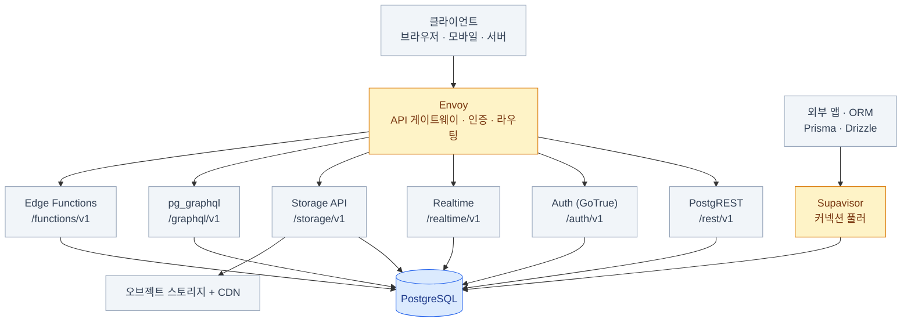
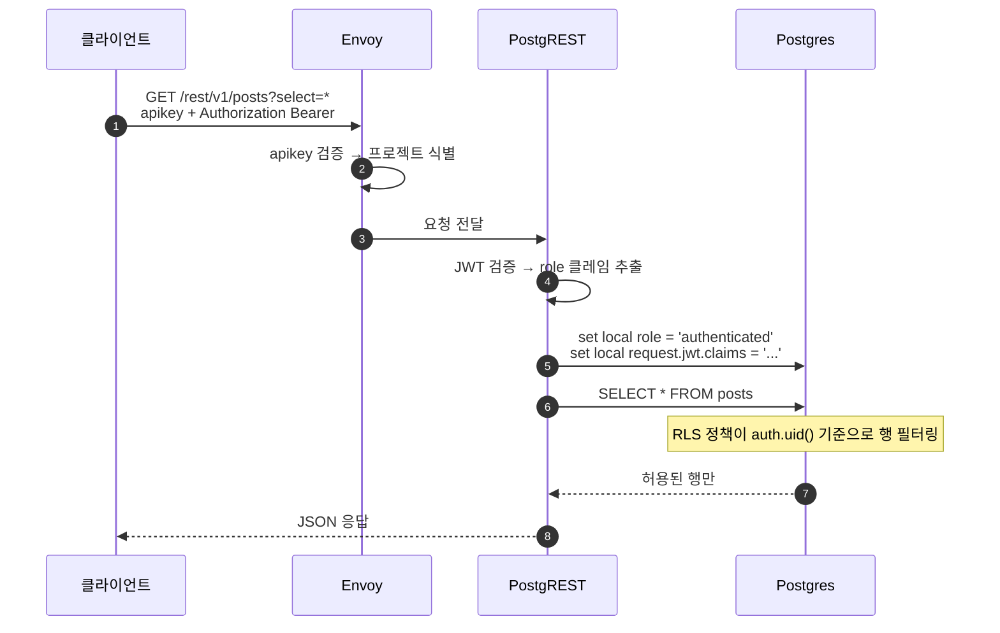
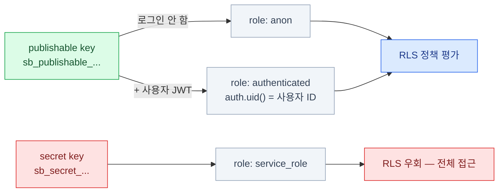

import { Tabs, TabItem, LinkCard } from '@astrojs/starlight/components';

> Envoy가 문지기, PostgREST가 API, GoTrue가 신분증 발급소, Postgres가 금고

## 전체 그림



**프로젝트 URL 하나(`https://<ref>.supabase.co`)로 전부 접근한다.**
경로가 곧 제품 구분이고, 그 뒤에는 전부 같은 Postgres가 있다.

### 요청 하나가 지나가는 길

`supabase.from('posts').select('*')`를 호출했을 때 실제로 벌어지는 일.



5번 줄이 이 문서 전체의 핵심이다.
**JWT의 내용이 Postgres 세션 변수로 옮겨지고**, 그때부터는 데이터베이스가 판정한다.

## 요청을 받는 부품들

### Envoy — API 게이트웨이

호스팅된 Supabase 프로젝트의 HTTP 트래픽이 들어오는 단일 진입점.
경로 기반 라우팅, `apikey` 헤더 검증, 속도 제한, CORS를 담당한다.

| 경로 | 목적지 |
|---|---|
| `/rest/v1/*` | PostgREST |
| `/auth/v1/*` | Auth (GoTrue) |
| `/realtime/v1/*` | Realtime |
| `/storage/v1/*` | Storage API |
| `/functions/v1/*` | Edge Functions |
| `/graphql/v1` | pg_graphql |

:::caution[함정]
과거 문서와 블로그에는 **Kong**으로 나온다. 호스팅 플랫폼은 같은 역할의 게이트웨이를
Envoy로 교체했다. 로컬 CLI와 셀프호스팅은 설치 버전과 전환 시점에 따라 Kong이 보일 수 있으므로,
설정 파일을 고칠 때는 **어느 배포 형태의 문서인지** 먼저 확인한다.
:::

### PostgREST — 테이블을 REST로

Supabase 초기 학습에서 가장 중요한 부품이다.
Postgres 스키마를 읽어 **테이블 · 뷰 · 함수를 자동으로 REST 엔드포인트로 노출**한다.
우리가 API 서버를 쓰지 않는 이유가 바로 이것이다.

```bash
# supabase-js 없이도 그냥 HTTP다
curl "https://<ref>.supabase.co/rest/v1/posts?select=id,title&status=eq.published&order=created_at.desc&limit=10" \
  -H "apikey: sb_publishable_xxx" \
  -H "Authorization: Bearer <로그인 JWT>"
```

`supabase.from().select().eq()`는 결국 **이 URL을 조립하는 빌더**다.
노출 대상은 설정된 스키마뿐이다 (기본값 `public`, `graphql_public`).

### 만들어지는 엔드포인트

| SQL 대상 | HTTP | 설명 |
|---|---|---|
| `select` | `GET /rest/v1/<table>` | 조회. 필터·정렬·페이지네이션은 쿼리스트링 |
| `insert` | `POST /rest/v1/<table>` | 본문에 객체 또는 배열 |
| `update` | `PATCH /rest/v1/<table>?filter` | 필터에 걸린 행 수정 |
| `delete` | `DELETE /rest/v1/<table>?filter` | 필터에 걸린 행 삭제 |
| `upsert` | `POST` + `Prefer: resolution=merge-duplicates` | 있으면 수정, 없으면 삽입 |
| 함수 호출 | `POST /rest/v1/rpc/<function>` | 데이터베이스 함수 실행 |

:::caution[함정]
`PATCH`/`DELETE`에 **필터가 없으면 전체 행이 대상**이 된다.
RLS가 켜져 있으면 정책에 걸린 행만 영향을 받지만, RLS가 없으면 테이블이 통째로 날아간다.
:::

## 신원과 실시간

### Auth (GoTrue) — JWT 발급기

사용자 정보를 `auth` 스키마(특히 `auth.users`)에 저장하고,
로그인에 성공하면 **access token(JWT)** 과 **refresh token**을 발급한다.
JWT에는 `sub`(사용자 UUID), `role`, `email`,
`aal`(Authenticator Assurance Level — 다단계 인증(MFA)을 몇 단계 거쳤는지), `app_metadata` 등이 담긴다.

이 JWT가 이후 모든 요청에 `Authorization: Bearer`로 실려 다니고,
**PostgREST가 그걸 풀어 Postgres 세션 변수에 넣는다.**

:::tip[핵심]
**JWT의 `sub` 클레임 = SQL의 `auth.uid()`**

이 한 줄이 [6장](/supabase/06-auth/)과 [7장](/supabase/07-rls/)을 잇는 다리다.
:::

### Realtime — WAL 구독과 브로드캐스트

Elixir/Phoenix로 만들어진 WebSocket 서버. 세 가지 기능을 제공한다.

- **Broadcast** — 클라이언트끼리 임의의 메시지를 주고받는다 (커서 위치, 채팅 등)
- **Presence** — 채널에 누가 접속해 있는지 상태를 공유한다
- **Postgres Changes** — Postgres의 논리 복제(WAL)를 읽어 INSERT/UPDATE/DELETE를 밀어준다

세 기능 모두 **채널(channel)** 이라는 같은 추상 위에 올라가고,
Postgres Changes와 private 채널에는 **RLS가 적용된다.** ([9장](/supabase/09-realtime/))

## 파일과 서버 코드

### Storage API — 메타데이터는 Postgres에

실제 파일 바이트는 오브젝트 스토리지(S3 계열)에, **메타데이터는 Postgres `storage` 스키마**에 있다.
`storage.buckets`, `storage.objects` 테이블이 실제로 존재한다.

```sql
-- 그래서 파일 권한도 결국 테이블 정책이다
create policy "자기 폴더에만 업로드"
on storage.objects for insert to authenticated
with check (
  bucket_id = 'avatars'
  and (storage.foldername(name))[1] = (select auth.uid())::text
);
```

별도 권한 시스템을 배울 필요가 없다는 게 이 설계의 이점이다. ([8장](/supabase/08-storage/))

### Edge Functions — Deno 런타임

**Deno** 기반 서버리스 함수. TypeScript를 그대로 실행하고,
전 세계 엣지 로케이션에 배포되어 사용자와 가까운 곳에서 실행된다.

용도는 웹훅 수신, 시크릿이 필요한 외부 API 호출, 이메일 발송, 관리자 작업이다.
함수 안에서는 secret key를 써서 RLS를 우회한 작업도 가능하다.

**Vercel의 Route Handler와 역할이 겹친다.** 어느 쪽에 무엇을 둘지는 [12장](/supabase/12-vercel/)에서 정리한다.
한 줄 요약: *DB에 붙어 있어야 하는 로직은 Supabase, 프론트엔드와 붙어 있어야 하는 로직은 Vercel.*

## 데이터베이스에 직접 붙는 길

### Supavisor — 커넥션 풀러

서버리스 환경에서 반드시 이해해야 하는 부품이다.

Postgres는 **연결 하나당 프로세스 하나**를 쓴다. 연결 수가 곧 메모리 비용이다.
그런데 서버리스 함수는 요청마다 새로 뜨고 죽는다 → **연결이 폭발한다.**
Supavisor가 앞단에서 연결을 모아 소수의 실제 연결로 다중화한다.

| 방식 | 포트 | 언제 쓰나 |
|---|---|---|
| Direct connection | `5432` | 상시 떠 있는 서버, 마이그레이션, `pg_dump` |
| Supavisor **session** 모드 | `5432` | IPv4만 되는 환경의 상시 서버 |
| Supavisor **transaction** 모드 | `6543` | **서버리스 / 엣지 함수** — 짧은 연결이 몰릴 때 |
| Dedicated pooler (PgBouncer) | `6543` | 유료 플랜, 고성능 프로덕션 |

:::caution[함정]
**transaction 모드는 prepared statement를 지원하지 않는다.** ORM 설정에서 꺼야 한다
(`postgres.js`는 `prepare: false`, Prisma는 연결 문자열에 `?pgbouncer=true`).
:::

### pg_meta와 Studio

**pg_meta**는 테이블 생성, 컬럼 추가, 역할 관리 같은
**DDL(Data Definition Language — 스키마 자체를 바꾸는 SQL) 작업을 REST로** 노출하는 서버이고,
**Studio**(웹 대시보드)의 실제 동작은 pg_meta 호출이다.
즉 대시보드에서 클릭으로 만든 테이블은 **결국 SQL DDL이 실행된 것**이다.

:::caution[함정]
대시보드 클릭으로 만든 변경은 **마이그레이션 파일로 자동 기록되지 않는다.**
로컬 → 마이그레이션 → 배포 흐름을 쓰지 않으면 스키마가 환경마다 갈라진다.
([14장](/supabase/14-ops/)의 주제)
:::

### 스키마 지도

| 스키마 | 내용 | API 노출 |
|---|---|---|
| `public` | **내가 만드는 테이블** | ○ (기본 노출) |
| `auth` | `users`, `sessions`, `identities`, `mfa_factors` | ✕ (헬퍼 함수만 사용) |
| `storage` | `buckets`, `objects` | ✕ (Storage API 경유) |
| `realtime` | `messages`, 구독 관리 | ✕ |
| `extensions` | 설치된 확장들 | ✕ |
| `vault` | 암호화된 시크릿 | ✕ |
| `graphql_public` | GraphQL 진입점 | ○ |

`public`이 아닌 스키마(`app`, `private` 등)를 만들어
**API에 노출하지 않는 내부 테이블**을 두는 것이 좋은 습관이다.
노출 스키마는 대시보드의 API Settings에서 관리한다.

## API 키와 Postgres 역할의 연결

이 그림이 Supabase 보안 모델의 전부다.



- **publishable key는 브라우저에 노출해도 된다.** 로그인 전에는 `anon` 역할의 GRANT와 RLS 정책 범위만 허용한다
- **secret key는 절대 클라이언트에 두지 않는다.** RLS를 통째로 우회한다
- 예전 이름인 `anon key` / `service_role key`(JWT 형태)는 **폐기 예정**이다.
  신규 프로젝트는 새 키를 쓴다

## 세 가지 접근 경로

| | Data API (PostgREST) | 직접 연결 (Postgres 프로토콜) | Edge Function |
|---|---|---|---|
| 클라이언트 | `supabase-js`, HTTP | Prisma, Drizzle, `pg` | HTTP 호출 |
| 인증 | JWT + API 키 | DB 사용자/비밀번호 | JWT 또는 커스텀 |
| **RLS 적용** | **○ 자동** | 연결 역할에 따름 (보통 우회) | 어떤 키를 쓰느냐에 따름 |
| 브라우저에서 직접 | ○ | ✕ | ○ |
| 커넥션 풀 필요 | ✕ (HTTP) | **○ (Supavisor)** | 상황에 따라 |
| 적합한 곳 | 사용자 데이터 CRUD | 관리자 도구, 배치, 복잡한 트랜잭션 | 시크릿이 필요한 로직 |

:::caution[함정]
**Prisma로 직접 연결하면서 RLS가 적용될 거라 기대하는 것**이 가장 흔한 실수다.
직접 연결은 보통 `postgres` 사용자로 붙기 때문에 **RLS가 적용되지 않는다.**
두 경로를 섞어 쓸 때는 "어느 경로에는 RLS가 없다"를 팀 전체가 알고 있어야 한다.
:::

## 이 구조에서 나오는 결론

1. **Postgres가 단일 진실 공급원이다** — 사용자도, 파일 메타데이터도, 권한 정책도 전부 한 DB 안에 있다
2. **보안의 무게중심이 DB로 내려간다** — "API 서버에서 권한 체크"가 아니라 "DB가 행 단위로 판정"이다
3. **프론트엔드가 DB와 직접 대화한다** — 중간 계층이 없으니 빠르지만, **RLS를 틀리면 곧바로 데이터 유출**이다
4. **부품을 갈아끼울 수 있다** — Data API 대신 직접 연결, Edge Function 대신 Vercel 함수. 선택지가 열려 있다

## 2장 요약

- Envoy가 문지기, PostgREST가 API, GoTrue가 신분증 발급소, **Postgres가 금고**
- 모든 부품이 **하나의 Postgres**를 공유한다 — 통합성과 위험성이 같은 곳에서 나온다
- `publishable key`(공개 가능) / `secret key`(서버 전용) **두 개만 구분하면 된다**
- 서버리스에서 직접 연결을 쓸 거면 **Supavisor transaction 모드(`6543`)** 를 기억한다
- 대시보드 클릭 변경은 마이그레이션으로 남지 않는다 — 처음부터 CLI 흐름을 익힌다

## 참고 자료

- [Supabase 아키텍처](https://supabase.com/docs/guides/getting-started/architecture) — 프로젝트를 구성하는 서비스와 요청 흐름
- [데이터베이스 연결 방식](https://supabase.com/docs/guides/database/connecting-to-postgres) — Direct, Supavisor session/transaction, Dedicated Pooler 비교
- [API 키 이해하기](https://supabase.com/docs/guides/getting-started/api-keys) — 키 종류와 Postgres 역할의 관계

<LinkCard
  title="3. 시작하기"
  description="대시보드에서 5분, 그리고 제대로 된 로컬 개발 환경 — 마이그레이션 흐름까지."
  href="/supabase/03-start/"
/>
