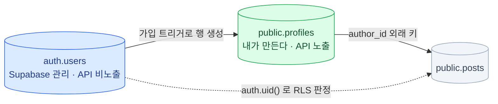

import { Tabs, TabItem, LinkCard } from '@astrojs/starlight/components';

> Supabase에서 겪는 문제의 상당수는 Supabase 문제가 아니라 스키마 설계 문제다

## 왜 Postgres를 따로 짚는가

- RLS 정책은 SQL 표현식이다. **테이블 구조가 나쁘면 정책도 나빠진다**
- 성능 문제의 대부분은 **인덱스 부재**다
- 클라이언트가 DB에 직접 쓰는 구조라 **제약 조건이 마지막 방어선**이다

이 장은 Postgres 강의가 아니라, 뒤 장들을 읽기 위한 **최소 어휘를 맞추는 자리**다.

## auth.users와 profiles 패턴

### 건드리지 않는 테이블

모든 Supabase 프로젝트는 이미 사용자 테이블을 하나 갖고 시작한다.

```sql
-- auth 스키마에 이미 존재한다 (Supabase가 관리)
auth.users (
  id                  uuid primary key,
  email               text,
  encrypted_password  text,
  email_confirmed_at  timestamptz,
  raw_user_meta_data  jsonb,   -- 사용자가 수정 가능
  raw_app_meta_data   jsonb,   -- 서버만 수정 가능
  created_at          timestamptz,
  ...
)
```

**직접 수정하지 않는다.** 컬럼을 추가하지도 않는다.
하지만 **외래 키로 참조하는 것은 정상적인 사용법**이다.

### 가장 먼저 만드는 테이블

```sql
create table public.profiles (
  id          uuid primary key references auth.users (id) on delete cascade,
  username    text unique check (char_length(username) between 3 and 30),
  full_name   text,
  avatar_url  text,
  updated_at  timestamptz default now()
);
alter table public.profiles enable row level security;

-- 회원가입 시 프로필 행을 자동으로 만들어 주는 트리거
create function public.handle_new_user()
returns trigger
language plpgsql
security definer set search_path = ''
as $$
begin
  insert into public.profiles (id, full_name)
  values (new.id, new.raw_user_meta_data ->> 'full_name');
  return new;
end;
$$;

create trigger on_auth_user_created
  after insert on auth.users
  for each row execute function public.handle_new_user();
```

### 왜 이 패턴이 필요한가

1. **`auth.users`는 API에 노출되지 않는다** — 사용자 목록을 클라이언트에서 조회할 방법이 없다.
   `profiles`는 `public` 스키마라 가능하다
2. **공개 정보와 비공개 정보를 분리한다** — 이메일과 비밀번호 해시는 `auth.users`에,
   닉네임과 아바타는 `profiles`에
3. **RLS 정책을 자유롭게 쓸 수 있다** — "프로필은 누구나 조회, 수정은 본인만"을 그냥 쓸 수 있다
4. **다른 테이블이 참조할 대상이 생긴다** — `posts.author_id → profiles.id`로 걸면
   조인 시 프로필 정보를 함께 가져올 수 있다

```sql
-- 3장에서 auth.users를 참조했던 FK를 profiles로 옮긴다
-- (5장의 중첩 조회가 이 FK를 쓴다)
alter table public.posts
  drop constraint posts_author_id_fkey,
  add foreign key (author_id) references public.profiles (id) on delete cascade;
```



**FK는 `profiles`를 향하고, 권한 판정은 `auth.uid()`를 향한다.**
이 둘이 같은 UUID이기 때문에 갈라지지 않는다.

:::caution[함정]
**트리거 실패는 가입 실패로 이어진다.** `handle_new_user()`가 예외를 던지면
`auth.users` 삽입도 롤백되어 회원가입 자체가 실패한다.
`profiles`에 `not null` 제약을 늘릴 때 이 함수도 함께 봐야 한다.
:::

## 타입 고르기

### 자주 쓰는 타입

| 타입 | 언제 쓰나 | 비고 |
|---|---|---|
| `text` | 모든 문자열 | `varchar(n)`보다 `text` + `check`가 낫다 |
| `uuid` | 사용자 ID, 외부 노출 ID | `gen_random_uuid()` |
| `bigint` | 순번이 의미 있는 ID | `generated always as identity` |
| `timestamptz` | **모든 시각** | `timestamp`(타임존 없음)는 쓰지 말 것 |
| `boolean` | 참/거짓 | `null` 허용 여부를 항상 정한다 |
| `numeric` | **금액** | `float`/`double`은 금액에 쓰면 안 된다 |
| `jsonb` | 스키마가 유동적인 부가 정보 | `json`이 아니라 `jsonb` |
| `text[]` | 태그처럼 단순한 목록 | 검색이 필요하면 별도 테이블 고려 |
| `tsvector` | 전문 검색 | `to_tsvector`로 생성, GIN 인덱스 |
| `vector` | 임베딩 | pgvector 확장 ([11장](/supabase/11-extensions/)) |

### uuid vs bigint

<Tabs>
<TabItem label="bigint (identity)">

```sql
id bigint generated always as identity primary key
```

- 인덱스가 작고 조인이 빠르다
- 순서가 있어 정렬·페이지네이션에 유리
- **URL에 노출하면 총 개수가 추측된다**
- 클라이언트가 미리 만들 수 없다

</TabItem>
<TabItem label="uuid">

```sql
id uuid primary key default gen_random_uuid()
```

- 추측 불가, 외부 노출에 안전
- 클라이언트에서 미리 생성 가능 (낙관적 UI)
- 분산 환경에서 충돌 없음
- 인덱스가 크고 랜덤 삽입이라 다소 느리다

</TabItem>
</Tabs>

**실무 기준:** 사용자·조직처럼 **외부에 노출되는 엔티티는 `uuid`**,
로그·댓글처럼 **내부에서 순서가 의미 있는 것은 `bigint`**. 섞어 써도 된다.

### timestamptz를 반드시 써야 하는 이유

```sql
-- 나쁨: 타임존 정보가 없다. "2026-08-05 09:00"이 어느 나라 9시인지 모른다
created_at timestamp default now()

-- 좋음: 항상 UTC로 저장되고, 조회 시 클라이언트 타임존으로 변환된다
created_at timestamptz not null default now()
```

Postgres의 `timestamptz`는 내부적으로 **UTC로 저장**한다.
JS의 `Date`와 왕복이 깔끔하고(`new Date(row.created_at)`),
서버가 어느 리전에 있든 사용자가 어느 나라에 있든 문제가 없다.

:::tip[핵심]
**규칙: 시각 컬럼은 예외 없이 `timestamptz not null default now()`.**
:::

## 관계와 제약

### 1:N — 글 하나에 댓글 여러 개

```sql
create table public.comments (
  id         bigint generated always as identity primary key,
  post_id    bigint not null references public.posts (id) on delete cascade,
  author_id  uuid   not null references public.profiles (id) on delete cascade,
  body       text   not null,
  created_at timestamptz not null default now()
);

-- 외래 키에는 인덱스를 직접 만들어야 한다 (Postgres가 자동 생성하지 않는다)
create index comments_post_id_idx on public.comments (post_id);
create index comments_author_id_idx on public.comments (author_id);
```

`on delete cascade` / `on delete set null` / 기본값(`restrict`) —
**"부모가 사라지면 자식은 어떻게 되어야 하는가"**를 스키마에 명시하는 것이다.
애플리케이션 코드에 두는 것보다 안전하다.

### N:M — 사용자와 팀

```sql
create table public.teams (
  id   uuid primary key default gen_random_uuid(),
  name text not null
);

create table public.team_members (
  team_id uuid not null references public.teams (id) on delete cascade,
  user_id uuid not null references public.profiles (id) on delete cascade,
  role    text not null default 'member' check (role in ('owner', 'admin', 'member')),
  primary key (team_id, user_id)      -- 복합 기본 키로 중복 가입 방지
);

create index team_members_user_id_idx on public.team_members (user_id);
```

**이 조인 테이블이 RLS에서 핵심 역할을 한다.**
"내가 속한 팀의 데이터만 보인다"는 정책이 여기를 조회한다 ([7장](/supabase/07-rls/)).

### 제약 조건 — DB가 대신 지켜주는 것

```sql
-- NOT NULL: 값이 반드시 있어야 한다
title text not null

-- UNIQUE: 중복 금지
username text unique

-- CHECK: 값의 범위/형식을 강제
price  numeric not null check (price >= 0)
status text not null check (status in ('draft', 'published', 'archived'))

-- 복합 UNIQUE: 조합이 유일해야 한다
create unique index one_vote_per_user on votes (post_id, user_id);
```

애플리케이션 검증은 **UX용**, DB 제약은 **정합성용**이다. 둘 다 필요하다.
앱 코드는 여러 벌(웹, 모바일, 배치)이지만 **DB는 하나다.**

### enum vs check vs 참조 테이블

| 방식 | 장점 | 단점 |
|---|---|---|
| `create type ... as enum` | 타입 안전, 저장 효율 | **값 추가/삭제가 마이그레이션** |
| `text` + `check (x in (...))` | 간단, 변경 쉬움 | 값 목록을 앱과 동기화해야 |
| 별도 참조 테이블 + FK | 런타임에 값 추가 가능, 부가 정보 저장 가능 | 조인 필요 |

- 값이 거의 안 바뀐다 (`draft`/`published`) → **`check` 제약**
- 값에 설명·순서·색상 같은 부가 정보가 붙는다 → **참조 테이블**
- enum은 편하지만 **값 제거가 까다롭다.** Supabase에서는 `check`를 더 자주 본다

## 인덱스

```sql
-- 기본 (B-tree) — 등호, 범위, 정렬에 쓰인다
create index posts_created_at_idx on posts (created_at desc);

-- 복합 인덱스 — 컬럼 순서가 매우 중요하다
create index posts_author_created_idx on posts (author_id, created_at desc);

-- 부분 인덱스 — 조건에 맞는 행만 색인 (작고 빠르다)
create index posts_published_idx on posts (created_at desc) where published;

-- 서비스 중단 없이 만들기 (프로덕션 큰 테이블 — 단, 트랜잭션 밖에서만)
create index concurrently posts_title_idx on posts (title);
```

**복합 인덱스는 왼쪽부터 사용된다.** `(a, b)` 인덱스는 `a` 단독 조회에도 쓰이지만
`b` 단독 조회에는 안 쓰인다.
`create index concurrently`는 쓰기를 막지 않는 대신 **트랜잭션 안에서 실행할 수 없다** —
그리고 [3장](/supabase/03-start/)의 마이그레이션 파일은 트랜잭션으로 실행되므로 **마이그레이션 안에서는 못 쓴다.**
이미 큰 프로덕션 테이블에 인덱스를 추가할 때는 SQL 에디터에서 `concurrently`로 직접 만들고,
마이그레이션에는 일반 `create index if not exists`로 기록해 이력을 맞춘다.

### 어디에 만들고 어디에 만들지 않나

**반드시 만들 곳**

- 모든 **외래 키 컬럼** (Postgres가 자동 생성하지 않는다)
- `where` 절에 자주 오는 컬럼
- `order by`에 자주 오는 컬럼
- **RLS 정책에서 비교하는 컬럼** ← Supabase에서 특히 중요

**만들면 안 되는 곳**

- 카디널리티가 낮은 컬럼 단독 (`boolean` 하나만) — 부분 인덱스로 대신한다
- 쓰기가 매우 빈번한데 조회가 거의 없는 테이블

:::tip[핵심]
대시보드 **Advisors → Performance**와 Query Performance의 Index Advisor가
실제 쿼리 로그를 보고 필요한 인덱스를 제안해 준다. 정기적으로 확인하자.
:::

## 뷰

```sql
-- 뷰: 저장된 쿼리. 조회할 때마다 실행된다
create view public.published_posts
with (security_invoker = on) as
  select p.id, p.title, p.created_at, pr.username as author
  from public.posts p
  join public.profiles pr on pr.id = p.author_id
  where p.published;

-- 머티리얼라이즈드 뷰: 결과를 실제로 저장한다. 무거운 집계에 쓴다
create materialized view public.daily_stats as
  select date_trunc('day', created_at) as day, count(*) as posts
  from public.posts group by 1;

-- concurrently 갱신은 유니크 인덱스가 있어야 가능하다
create unique index on public.daily_stats (day);
refresh materialized view concurrently public.daily_stats;
```

뷰도 **PostgREST가 API로 노출**한다 → `supabase.from('published_posts').select()`.

:::caution[함정]
**뷰의 RLS는 주의가 필요하다.** 기본적으로 뷰 소유자 권한으로 실행되어
기반 테이블의 RLS를 **우회할 수 있다.**
Postgres 15+ 에서는 `with (security_invoker = on)`으로 호출자 권한 실행이 가능하다 — **이걸 쓴다.**
:::

## 트랜잭션과 함수

### PostgREST의 한계

**요청 하나가 트랜잭션 하나다.** `supabase-js` 호출 두 번을 하나의 트랜잭션으로 묶을 수 없다.

```sql
-- 이런 두 문장을 원자적으로 처리하려면?
update accounts set balance = balance - 100 where id = 1;
update accounts set balance = balance + 100 where id = 2;
```

해법은 **데이터베이스 함수(RPC)로 묶는 것**이다.
또는 직접 연결(Prisma/Drizzle/`pg`)을 쓰는 서버 코드에서 처리한다.

:::tip[핵심]
**"돈이 걸린 로직은 클라이언트에서 여러 번 호출하지 않는다."**
이건 Supabase를 쓸 때 반드시 알아야 할 제약이다.
:::

### 데이터베이스 함수 (RPC)

```sql
create or replace function public.transfer(
  from_account bigint,
  to_account   bigint,
  amount       numeric
)
returns void
language plpgsql
security invoker            -- 호출한 사용자 권한으로 실행 (기본값, 권장)
set search_path = ''
as $$
begin
  if amount <= 0 then
    raise exception '금액은 0보다 커야 합니다';
  end if;
  update public.accounts set balance = balance - amount where id = from_account;
  update public.accounts set balance = balance + amount where id = to_account;
end;
$$;
```

```ts
// 함수 전체가 하나의 트랜잭션이다
const { error } = await supabase.rpc('transfer', {
  from_account: 1, to_account: 2, amount: 100,
})
```

### 트리거 — updated_at 자동 갱신

거의 모든 프로젝트에서 쓰게 되는 패턴이다.

```sql
create or replace function public.set_updated_at()
returns trigger
language plpgsql
as $$
begin
  new.updated_at = now();
  return new;
end;
$$;

alter table public.posts add column updated_at timestamptz not null default now();

create trigger posts_set_updated_at
  before update on public.posts
  for each row execute function public.set_updated_at();
```

클라이언트가 `updated_at`을 조작할 수 없게 되어 **신뢰할 수 있는 값**이 된다.
같은 함수를 여러 테이블의 트리거에 재사용할 수 있다.

트리거는 강력하지만 **디버깅이 어렵다.** 남용하지 말고 이런 단순 용도 위주로 쓴다.

## 4장 요약

- `auth.users`는 건드리지 않고, **`public.profiles`를 만들어 트리거로 연결**한다
- 시각은 `timestamptz`, 금액은 `numeric`, 유동 데이터는 `jsonb`
- **외래 키에는 인덱스를 직접 만든다.** RLS 비교 컬럼에도 만든다
- 제약 조건은 마지막 방어선이다 — 클라이언트가 DB에 직접 쓰는 구조라 더 중요하다
- 여러 단계를 원자적으로 처리해야 하면 **데이터베이스 함수(RPC)** 로 묶는다
- 뷰를 만들 때는 **`security_invoker = on`**을 기억한다

<LinkCard
  title="5. Data API와 supabase-js"
  description="테이블을 코드에서 다루는 법 — 되는 것과 안 되는 것의 경계, 그리고 경계를 넘는 방법."
  href="/supabase/05-data-api/"
/>
