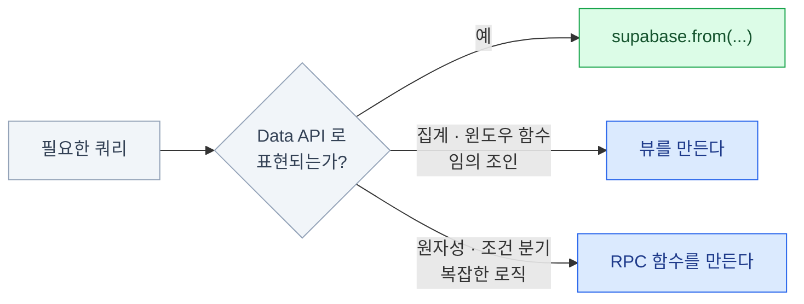

import { Tabs, TabItem, LinkCard } from '@astrojs/starlight/components';

> supabase-js는 ORM이 아니라 REST 클라이언트 + 쿼리 빌더다

## Data API의 정체

`supabase.from('posts').select('*').eq('id', 1)`은 **SQL을 실행하는 게 아니다.**
**URL을 조립해서 PostgREST에 HTTP 요청**을 보내는 것이다.

```text
GET /rest/v1/posts?select=*&id=eq.1
```

그래서 SQL의 모든 것을 할 수는 없다.
**할 수 있는 것과 없는 것의 경계를 아는 게** 이 장의 목표이고,
경계를 넘어가면 **뷰나 데이터베이스 함수(RPC)** 로 내려간다.



### 클라이언트 생성 옵션

```ts
import { createClient } from '@supabase/supabase-js'
import type { Database } from './database.types'

export const supabase = createClient<Database>(url, publishableKey, {
  auth: {
    persistSession: true,       // 브라우저: localStorage에 세션 저장 (기본 true)
    autoRefreshToken: true,     // 만료 전 자동 갱신 (기본 true)
    detectSessionInUrl: true,   // OAuth 리다이렉트의 토큰 파싱 (기본 true)
  },
  db: { schema: 'public' },     // 기본 스키마
  global: { headers: { 'x-app-version': '1.0.0' } },
})
```

- **서버(Node, Edge Function)에서는 `persistSession: false`** 로 둔다. 전역 상태 오염을 막는다
- Next.js에서는 이 함수를 직접 쓰지 않고 `@supabase/ssr`의 클라이언트를 쓴다 ([13장](/supabase/13-nextjs/))
- 다른 스키마를 쓸 때는 `supabase.schema('app').from('x')`

## 조회

### select와 필터

```ts
// 전체 컬럼
await supabase.from('posts').select()

// 특정 컬럼만 — 네트워크 비용이 줄고 타입도 정확해진다
await supabase.from('posts').select('id, title, created_at')

// 별칭
await supabase.from('posts').select('id, headline:title')

// JSON 필드 추출
await supabase.from('profiles').select('id, city:address->>city')
```

:::caution[함정]
**`select('*')`을 습관적으로 쓰지 말 것.**
필요한 컬럼만 고르면 대역폭 비용([15장](/supabase/15-perf-cost/))이 줄고,
큰 `text`/`jsonb` 컬럼을 실수로 끌고 오지 않는다.
:::

| 메서드 | SQL | 예시 |
|---|---|---|
| `.eq(c, v)` | `=` | `.eq('status', 'published')` |
| `.neq(c, v)` | `!=` | `.neq('status', 'draft')` |
| `.gt` `.gte` `.lt` `.lte` | `>` `>=` `<` `<=` | `.gte('score', 80)` |
| `.like` `.ilike` | `LIKE` / 대소문자 무시 | `.ilike('title', '%슈파%')` |
| `.is(c, null)` | `IS NULL` | `.is('deleted_at', null)` |
| `.in(c, [..])` | `IN` | `.in('id', [1, 2, 3])` |
| `.contains(c, v)` | `@>` | 배열/jsonb 포함 |
| `.containedBy(c, v)` | `<@` | 배열/jsonb 포함됨 |
| `.overlaps(c, v)` | `&&` | 배열 교집합 존재 |
| `.match({...})` | 여러 `=` 조합 | `.match({ a: 1, b: 2 })` |
| `.not(c, op, v)` | `NOT` | `.not('status', 'eq', 'draft')` |

### 복합 조건

```ts
// OR — 문자열로 표현한다 (PostgREST 문법)
await supabase.from('posts').select()
  .or('status.eq.published,author_id.eq.' + userId)

// AND는 그냥 체이닝
await supabase.from('posts').select()
  .eq('published', true)
  .gte('created_at', '2026-01-01')

// 중첩: (a AND b) OR c
await supabase.from('posts').select()
  .or('and(published.eq.true,score.gte.80),featured.eq.true')
```

`.or()` 문자열이 길어지고 읽기 어려워지면 **RPC로 옮길 때가 된 것**이다.
복잡한 조건을 문자열로 조립하는 건 유지보수 비용이 급격히 오른다.

### 정렬과 페이지네이션

```ts
// 정렬
await supabase.from('posts')
  .select()
  .order('created_at', { ascending: false })
  .order('id', { ascending: false })          // 동점 처리용 tie-breaker

// 오프셋 페이지네이션 (0-indexed, 양끝 포함)
await supabase.from('posts').select().range(0, 19)   // 1~20번째

// 커서 페이지네이션 — 깊은 페이지에서 훨씬 빠르다
await supabase.from('posts')
  .select()
  .lt('created_at', lastSeenCreatedAt)
  .order('created_at', { ascending: false })
  .limit(20)
```

- `.range()`는 내부적으로 `OFFSET`이다. **페이지가 깊어질수록 느려진다**
- 정렬 키가 유일하지 않으면 페이지 경계에서 행이 중복/누락된다 → **tie-breaker를 꼭 넣는다**
- 무한 스크롤에는 커서 방식을 쓴다

### 개수 세기

```ts
// 데이터 없이 개수만 (가장 저렴)
const { count } = await supabase
  .from('posts')
  .select('*', { count: 'exact', head: true })
  .eq('published', true)

// 데이터와 전체 개수를 함께
const { data, count } = await supabase
  .from('posts')
  .select('id, title', { count: 'exact' })
  .range(0, 19)
```

| 옵션 | 정확도 | 비용 |
|---|---|---|
| `exact` | 정확 | 전체 스캔. 큰 테이블에서 느리다 |
| `planned` | 추정치 | 매우 빠름 (쿼리 플래너 추정) |
| `estimated` | 작으면 정확, 크면 추정 | 절충안 |

수백만 행 테이블에서 `exact` 카운트를 **매 페이지마다** 부르는 건 흔한 성능 사고다.

### single과 maybeSingle

```ts
// 정확히 1행을 기대. 0행이거나 2행 이상이면 error
const { data, error } = await supabase
  .from('profiles').select().eq('id', userId).single()
// data: Profile  (배열이 아님)

// 0 또는 1행. 없으면 data === null, error === null
const { data: maybe } = await supabase
  .from('profiles').select().eq('username', name).maybeSingle()
```

:::caution[함정]
**`.single()`은 "없으면 에러"** 다. 있을 수도 없을 수도 있으면 `.maybeSingle()`을 쓴다.
이걸 혼동해서 "왜 에러가 나지?" 하는 경우가 정말 많다.
타입도 달라진다 — `single()`은 `T`, `maybeSingle()`은 `T | null`.
:::

## 관계 조회

### 기본 중첩 조회

외래 키가 걸려 있으면 중첩 조회가 된다.

```ts
// posts.author_id → profiles.id 외래 키가 있을 때
const { data } = await supabase
  .from('posts')
  .select(`
    id,
    title,
    profiles ( username, avatar_url )
  `)
```

```json
[
  { "id": 1, "title": "첫 글",
    "profiles": { "username": "alice", "avatar_url": "..." } }
]
```

반대 방향(1:N)도 된다. 이 경우 배열로 온다.

```ts
await supabase.from('profiles').select('username, posts ( id, title )')
// → { username: 'alice', posts: [ {...}, {...} ] }
```

### 다중 외래 키와 별칭

같은 테이블을 두 번 참조할 때는 **어느 외래 키인지 알려줘야 한다.**

```ts
// messages.sender_id → profiles.id, messages.receiver_id → profiles.id
const { data } = await supabase
  .from('messages')
  .select(`
    content,
    from:profiles!messages_sender_id_fkey ( username ),
    to:profiles!messages_receiver_id_fkey ( username )
  `)
```

외래 키가 하나뿐일 때는 테이블 이름만 써도 되지만,
**제약 조건 이름을 명시하는 습관을 들이면 나중에 FK가 추가돼도 안 깨진다.**

### inner join과 자식 필터

```ts
// 기본은 LEFT JOIN — 관계가 없어도 부모 행은 나온다 (자식은 null/[])
await supabase.from('posts').select('title, profiles ( username )')

// !inner — 관계가 있는 행만 (INNER JOIN)
await supabase
  .from('posts')
  .select('title, profiles!inner ( username )')
  .eq('profiles.username', 'alice')

// 자식 개수만 세기
await supabase.from('posts').select('id, title, comments ( count )')
// → { id: 1, title: '...', comments: [{ count: 12 }] }
```

:::caution[함정]
`.eq('profiles.username', ...)`처럼 자식 테이블에 필터를 걸 때
**`!inner`가 없으면 부모 행은 그대로 나오고 자식만 걸러진다.**
의도와 다른 결과가 나오는 대표적 함정이다.
:::

### 관계 조회의 한계

<Tabs>
<TabItem label="되는 것">

- 외래 키로 연결된 테이블의 중첩 조회 (여러 단계 가능)
- 자식 테이블 개수 집계 (`count`)
- 자식 테이블 기준 필터·정렬 (제한적)
- 별칭과 다중 FK 구분

</TabItem>
<TabItem label="안 되는 것">

- 임의의 `JOIN` 조건 (외래 키 없는 조인)
- 복잡한 집계 (`group by` + 여러 집계 함수)
- 윈도우 함수, CTE, 재귀 쿼리
- 서브쿼리 상관 조건

**경계를 넘으면 답은 하나다 — 뷰를 만들거나 RPC 함수를 만든다.**
억지로 여러 번 쿼리해서 JS에서 조립하는 건 N+1 문제를 자초하는 길이다.

</TabItem>
</Tabs>

## 쓰기

### insert

```ts
// 단일 삽입
const { data, error } = await supabase
  .from('posts')
  .insert({ title: '제목', body: '내용' })
  .select()          // 삽입된 행을 돌려받으려면 필요
  .single()

// 여러 건 한 번에 (하나의 트랜잭션)
await supabase.from('posts').insert([
  { title: 'A' },
  { title: 'B' },
])
```

- **`.select()`를 붙이지 않으면 `data`는 `null`** 이다. 반환이 필요 없으면 생략하는 게 더 빠르다
- 배열 삽입은 원자적이다 — 하나라도 실패하면 전부 롤백된다
- `author_id` 같은 소유자 컬럼은 클라이언트가 보내게 두지 않는다

```sql
-- 클라이언트가 author_id를 위조할 수 없게 기본값을 건다
alter table posts alter column author_id set default auth.uid();
```

### update와 delete

```ts
const { data } = await supabase
  .from('posts')
  .update({ title: '수정된 제목', published: true })
  .eq('id', 1)
  .select()

const { error } = await supabase
  .from('posts')
  .delete()
  .eq('id', 1)
```

- **필터를 빠뜨리면 테이블 전체가 대상이 된다.** RLS가 유일한 방어선이다
- 소프트 삭제를 쓴다면 `delete` 대신 `update({ deleted_at: new Date() })`

:::caution[함정]
**RLS로 막힌 `update`는 에러가 아니라 빈 결과로 온다.**
"왜 조용히 실패하지?"의 대부분이 이것이다. `data.length`를 확인하자.
:::

### upsert

```ts
// 있으면 수정, 없으면 삽입 (기본 키 기준)
await supabase.from('profiles')
  .upsert({ id: userId, username: 'alice', full_name: '앨리스' })

// 기본 키가 아닌 유니크 제약 기준으로
await supabase.from('page_views')
  .upsert(
    { page: '/home', date: '2026-08-05', views: 1 },
    { onConflict: 'page,date' },
  )

// 중복이면 무시하고 넘어가기
await supabase.from('tags')
  .upsert({ name: 'supabase' }, { ignoreDuplicates: true })
```

`onConflict`에 지정한 컬럼 조합에는 **반드시 유니크 제약이나 유니크 인덱스가 있어야 한다.**
없으면 런타임 에러가 난다.

## RPC — 데이터베이스 함수 호출

```ts
// 인자 없는 함수
const { data } = await supabase.rpc('get_stats')

// 인자 있는 함수 (이름은 SQL의 파라미터 이름과 정확히 일치해야 한다)
const { data: results } = await supabase.rpc('search_posts', {
  query: 'supabase',
  limit_count: 20,
})

// setof 를 반환하는 함수에는 필터를 이어 붙일 수 있다
const { data: filtered } = await supabase
  .rpc('get_published_posts')
  .eq('author_id', userId)
  .order('created_at', { ascending: false })
```

- RPC는 `POST /rest/v1/rpc/<name>`이다
- **함수 전체가 하나의 트랜잭션**이다 — 원자성이 필요한 로직의 답
- 읽기 전용 함수는 `{ get: true }`로 `GET` 호출도 가능하다 — 캐싱할 수 있다

## 특수 컬럼 다루기

### JSON

```ts
// 조회: -> 는 jsonb, ->> 는 text
await supabase.from('profiles').select('id, theme:settings->>theme')

// 필터: JSON 경로 비교
await supabase.from('profiles').select().eq('settings->>theme', 'dark')

// 포함 관계 (@> 연산자) — GIN 인덱스가 잘 듣는다
await supabase.from('profiles').select().contains('settings', { notifications: true })
```

```sql
create index profiles_settings_idx on profiles using gin (settings);
```

**남용 주의.** 자주 조회·필터하는 필드라면 jsonb 안에 두지 말고
**진짜 컬럼으로 승격**시키는 편이 성능과 타입 안전성 모두에서 낫다.

### 전문 검색

```sql
-- 검색용 컬럼을 생성 컬럼으로 만들어 두면 관리가 편하다
alter table posts add column fts tsvector
  generated always as (
    to_tsvector('simple', coalesce(title, '') || ' ' || coalesce(body, ''))
  ) stored;

create index posts_fts_idx on posts using gin (fts);
```

```ts
await supabase
  .from('posts')
  .select('id, title')
  .textSearch('fts', 'supabase & postgres', { type: 'websearch' })
```

한국어는 기본 형태소 분석기가 없어 `simple` 설정으로는 한계가 있다.
대안은 `pg_trgm`(부분 문자열 유사도), `pgroonga`(한국어·일본어 형태소), 외부 검색 엔진이고,
의미 기반 검색이 필요하면 **pgvector 임베딩 검색**([11장](/supabase/11-extensions/))을 고려한다.

## 에러 처리와 타입

```ts
const { data, error } = await supabase.from('posts').select()

if (error) {
  // error.code    — Postgres 에러 코드
  // error.message — 사람이 읽는 메시지
  // error.details / error.hint
  throw new Error(`글 조회 실패: ${error.message}`)
}
```

| 코드 | 의미 | 흔한 원인 |
|---|---|---|
| `23505` | unique_violation | 중복 삽입 |
| `23503` | foreign_key_violation | 없는 부모를 참조 |
| `23514` | check_violation | `check` 제약 위반 |
| `42501` | insufficient_privilege | **RLS 정책에 걸림 / 권한 없음** |
| `PGRST116` | 결과 행 개수 불일치 | `.single()`인데 0행 또는 2행 이상 |
| `PGRST301` | JWT 만료/무효 | 토큰 갱신 실패 |

```ts
import type { Database } from './database.types'

// 자주 쓰는 타입 별칭을 만들어 둔다
type Tables<T extends keyof Database['public']['Tables']> =
  Database['public']['Tables'][T]['Row']

type Post = Tables<'posts'>

// 조인 결과 타입도 추론된다
const { data } = await supabase
  .from('posts')
  .select('id, title, profiles ( username )')
// data: { id: number; title: string; profiles: { username: string } | null }[] | null
```

스키마를 바꾸면 **타입 생성을 다시 돌린다.** 안 하면 타입이 거짓말을 한다.
CI에서 "타입 파일이 최신인지" 검사하는 스텝을 넣으면 좋다 ([14장](/supabase/14-ops/)).

## 5장 요약

- Data API = PostgREST에 보내는 **HTTP**. SQL 전부가 되는 건 아니다
- 경계를 넘으면 **뷰 또는 RPC**로 내려간다
- `.single()` vs `.maybeSingle()`, `!inner`의 의미, `.select()` 없는 insert의 반환값
- RLS에 막힌 쓰기는 **에러가 아니라 빈 결과**다

**안티패턴**

- `select('*')` 습관 — 대역폭과 타입 정확도를 함께 잃는다
- 루프 안에서 쿼리 (N+1) — 중첩 select 또는 `.in()`으로 한 번에
- 매 페이지마다 `count: 'exact'`
- `.or()` 문자열로 복잡한 조건 조립 — RPC로 옮길 신호
- 소유자 컬럼(`author_id`)을 클라이언트가 보내게 두기

<LinkCard
  title="6. Auth"
  description="로그인과 신원, 그리고 JWT — RLS의 입력이 만들어지는 곳."
  href="/supabase/06-auth/"
/>
