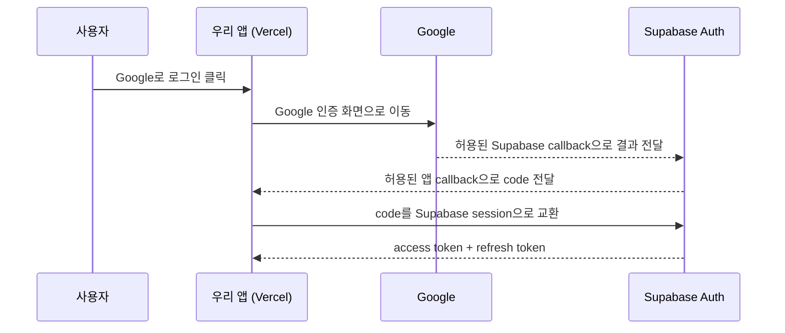

import { Steps, Card, CardGrid, LinkCard } from '@astrojs/starlight/components';

> 처음에는 로그인 하나만 끝까지 성공시키자. JWT·MFA·Hooks의 세부 원리는 [Auth 참고서](/supabase/06-auth-reference/)에서 필요할 때 찾으면 된다

## 먼저 결정할 것: 어떤 로그인을 쓸까

<CardGrid>
<Card title="이메일 + 비밀번호" icon="email">
**Google 설정은 필요 없다.** Supabase에서 이메일 로그인을 켜고 앱의 콜백 주소만 등록하면 시작할 수 있다.

프로덕션에서는 확인·재설정 메일을 안정적으로 보내기 위해 커스텀 SMTP가 필요하다.
</Card>
<Card title="Google 로그인" icon="seti:google">
Google Cloud에서 **우리 앱을 OAuth 클라이언트로 등록**해야 한다. 여기서 받은 Client ID와 Secret을 Supabase에 전달한다.

Supabase는 Google의 로그인 결과를 받아 자기 세션으로 바꾸고, 앱은 그 세션만 사용한다.
</Card>
</CardGrid>

둘을 동시에 제공해도 된다. 다만 처음부터 매직 링크·전화번호·익명·MFA까지 모두 켜지 말고,
**한 방식의 가입 → 로그인 → 로그아웃 → 보호된 데이터 조회**를 먼저 완성하는 편이 쉽다.

## Google 로그인이 네 시스템을 거치는 이유



Google은 아무 사이트에나 사용자 로그인 결과를 보내면 안 된다. 그래서 Google Cloud에
**"이 웹 앱이 요청하며, 결과는 이 Supabase 주소로만 돌려보낸다"**고 등록한다.
Supabase도 아무 웹 주소로 세션을 보내면 안 되므로 **우리 앱의 callback 주소**를 별도로 허용한다.

주소 두 개를 구분하는 것이 핵심이다.

| 등록하는 곳 | 등록할 주소 | 누가 누구에게 돌아가나 |
|---|---|---|
| Google Auth Platform → Clients | `https://<project-ref>.supabase.co/auth/v1/callback` | Google → **Supabase Auth** |
| Supabase Auth → URL Configuration | `https://example.com/auth/callback` | Supabase Auth → **우리 앱** |

:::tip[핵심]
Google Client Secret은 **Supabase에만** 넣는다. Vercel 앱에는 Supabase URL과 publishable key만 있으면
일반적인 Google 로그인 플로우가 동작한다. Google API를 로그인 외 용도로 직접 호출할 때만 별도 설계가 필요하다.
:::

## 어디에 무엇을 설정하나

| 장소 | 설정하거나 받는 것 | 왜 필요한가 | 주된 방법 |
|---|---|---|---|
| **Google Auth Platform** | Audience, Branding, 기본 scope, Web OAuth Client, Supabase callback | Google이 앱과 반환 주소를 신뢰하도록 | **콘솔에서 직접** |
| **Supabase Auth** | Site URL, Redirect URLs, Google Client ID / Secret | Google 결과를 Supabase 세션으로 바꾸고 허용된 앱으로만 반환 | 대시보드 또는 `config push` |
| **Vercel** | Supabase URL, publishable key | 배포된 앱이 Supabase 프로젝트를 찾도록 | 대시보드 또는 CLI |
| **앱 코드** | 로그인 버튼, `/auth/callback`, 세션 갱신, RLS | 로그인 시작과 code 교환, 실제 권한 판정 | 코드 |

`gcloud`가 꼭 필요한 것은 아니다. Google 공식 정책상 OAuth 클라이언트는 남용 방지를 위해
**프로그램으로 생성하거나 수정할 수 없고 Google Cloud 콘솔을 사용해야 한다.** `gcloud`는 프로젝트·IAM·API 같은
다른 Google Cloud 자원을 함께 관리할 때는 유용하지만, 이 한 단계의 대체재는 아니다.

## 가장 작은 성공 경로

### 1. 앱의 기준 주소를 먼저 적는다

예시는 다음 세 주소를 사용한다.

```text
로컬 앱 origin:       http://localhost:3000
프로덕션 앱 origin:   https://example.com
프로덕션 callback:    https://example.com/auth/callback
```

Vercel 기본 도메인으로 먼저 시험할 수도 있지만, 프로덕션에서는 최종 커스텀 도메인을 기준으로 설정한다.
프리뷰 로그인이 필요하면 뒤에서 프리뷰 주소를 추가한다.

### 2. Supabase의 앱 반환 주소를 등록한다

대시보드 **Authentication → URL Configuration**에서 설정한다.

```text
Site URL:
https://example.com

Redirect URLs:
http://localhost:3000/auth/callback
https://example.com/auth/callback
https://*-myteam.vercel.app/**      # 프리뷰 로그인이 필요할 때만
```

- **Site URL**은 `redirectTo`를 생략했을 때 돌아가는 기본 주소다
- **Redirect URLs**는 코드가 명시적으로 요청할 수 있는 반환 주소의 허용 목록이다
- 프로덕션 주소는 넓은 와일드카드 대신 정확한 callback 하나를 등록한다

이메일 로그인만 쓸 사람은 여기까지 한 뒤 **4번**으로 가면 된다.

### 3. Google 로그인을 쓸 때만 Google과 Supabase를 잇는다

<Steps>

1. **Google Auth Platform → Branding / Audience / Data Access**

   앱 이름과 지원 이메일, 외부 또는 조직 내부 사용자를 정한다. 로그인만 필요하면
   `openid`, `email`, `profile` 범위를 사용하고 Google Drive 같은 추가 권한은 요청하지 않는다.

2. **Google Auth Platform → Clients → Create client**

   애플리케이션 유형은 **Web application**으로 만든다.

   ```text
   Authorized JavaScript origins:
   http://localhost:3000
   https://example.com

   Authorized redirect URIs:
   https://<project-ref>.supabase.co/auth/v1/callback
   ```

   로컬 Supabase 스택까지 Google과 연결해 시험할 때만
   `http://127.0.0.1:54321/auth/v1/callback`도 추가한다.

3. **Client ID와 Client Secret을 Supabase에 입력**

   대시보드 **Authentication → Sign In / Providers → Google**에서 Google을 켜고 두 값을 넣는다.
   Secret은 코드, Git, 채팅에 붙여 넣지 않는다.

4. **Google의 Audience 상태를 확인**

   개발 중에는 필요한 계정으로 실제 로그인을 시험한다. 공개 출시 전에는 대상 사용자,
   브랜드 정보, 소유 도메인과 검증 상태를 다시 확인한다. 민감한 Google API scope를 추가하면
   로그인만 할 때보다 별도의 검토가 필요할 수 있다.

</Steps>

### 4. Vercel에 Supabase 공개 연결 정보를 넣는다

Supabase 대시보드 **Project Settings → API Keys**에서 URL과 publishable key를 확인한다.

```text
NEXT_PUBLIC_SUPABASE_URL=https://<project-ref>.supabase.co
NEXT_PUBLIC_SUPABASE_PUBLISHABLE_KEY=sb_publishable_...
```

두 값은 브라우저에 노출되는 공개 식별자다. 그래도 데이터가 공개되는 것은 아니다.
**실제 접근 권한은 RLS가 결정한다.** 반대로 `sb_secret_...` 키에는 절대 `NEXT_PUBLIC_`을 붙이지 않는다.

Vercel CLI가 연결돼 있다면 대화형 입력으로 등록할 수 있다.

```bash
vercel login
vercel link
vercel env add NEXT_PUBLIC_SUPABASE_URL production
vercel env add NEXT_PUBLIC_SUPABASE_PUBLISHABLE_KEY production
```

Preview와 Development에도 같은 프로젝트를 쓸 계획이라면 각 환경에 별도로 추가한다.
PR마다 Supabase Preview Branch를 쓰는 구성은 [12장](/supabase/12-vercel/)에서 다룬다.

### 5. 로그인 시작과 callback을 구현한다

```ts
// Client Component의 클릭 핸들러
await supabase.auth.signInWithOAuth({
  provider: 'google',
  options: {
    redirectTo: `${location.origin}/auth/callback?next=%2Fme`,
  },
})
```

```ts
// app/auth/callback/route.ts
export async function GET(request: Request) {
  const { searchParams, origin } = new URL(request.url)
  const code = searchParams.get('code')
  const requestedNext = searchParams.get('next')
  const next = requestedNext?.startsWith('/') && !requestedNext.startsWith('//')
    ? requestedNext
    : '/'

  if (code) {
    const supabase = await createClient()
    const { error } = await supabase.auth.exchangeCodeForSession(code)
    if (!error) return Response.redirect(`${origin}${next}`)
  }

  return Response.redirect(`${origin}/auth/error`)
}
```

Next.js에서는 브라우저·서버 클라이언트와 세션 갱신용 Proxy도 필요하다.
전체 파일 구조는 [13장](/supabase/13-nextjs/)을 따른다.

### 6. 성공 조건을 한 줄씩 확인한다

- 시크릿 창에서 Google 로그인 후 `/auth/callback`을 거쳐 원하는 페이지로 돌아온다
- Supabase **Authentication → Users**에 사용자가 생긴다
- 새로고침 뒤에도 로그인 상태가 유지되고 로그아웃이 동작한다
- 로그인한 사용자는 자기 데이터만, 로그아웃 사용자는 허용된 데이터만 본다
- 잘못된 `next=//evil.example` 값으로 외부 사이트에 이동하지 않는다
- 프로덕션과 프리뷰를 모두 쓴다면 두 환경에서 따로 시험한다

마지막 두 번째 항목까지 확인해야 Auth 설정이 끝난다. 로그인 성공만 보고 멈추면 인가가 빠진 것이다.
[7장](/supabase/07-rls/)에서 RLS 정책을 이어서 설정한다.

## 대시보드 설정을 코드로 관리하기

처음 한 번은 대시보드가 이해하기 쉽다. 같은 설정을 여러 환경에서 반복하거나 변경 이력을 남기려면
`supabase/config.toml`과 `config push`를 쓴다.

```toml
[auth]
site_url = "https://example.com"
additional_redirect_urls = [
  "http://localhost:3000/auth/callback",
  "https://example.com/auth/callback",
]

[auth.external.google]
enabled = true
client_id = "<google-client-id>"
secret = "env(SUPABASE_AUTH_EXTERNAL_GOOGLE_SECRET)"
skip_nonce_check = false
```

```bash
supabase login
supabase link --project-ref <project-ref>

# 현재 shell에만 주입하거나 안전한 비밀 저장소에서 읽는다
export SUPABASE_AUTH_EXTERNAL_GOOGLE_SECRET='<google-client-secret>'
supabase config push
```

:::caution[함정]
`supabase db push`는 **DB 마이그레이션**을 올리고, `supabase config push`는 연결된 원격 프로젝트의
**Auth 같은 프로젝트 설정**을 올린다. `config.toml`에 Secret 원문을 쓰거나 Git에 커밋하지 않는다.
:::

로컬 스택만 설정할 때도 같은 `config.toml`을 읽지만, 변경 후에는
`supabase stop && supabase start`로 Auth 컨테이너를 다시 띄워야 한다.

## AI에게 어디까지 맡길 수 있나

로그인된 CLI가 있는 개발 환경을 AI가 사용할 수 있다면 다음 작업은 잘 맡길 수 있다.

- 레포를 읽고 실제 도메인·포트에서 필요한 callback URL 계산
- `config.toml`, 로그인 버튼, callback Route Handler, Proxy와 RLS 코드 작성
- `supabase link` 뒤 `config push`, 마이그레이션 적용과 로컬 Auth 테스트
- `vercel link` 뒤 환경 변수 등록, Preview/Production 배포와 로그 확인
- 잘못된 redirect, 세션 유지, 보호된 데이터 접근을 브라우저로 검증

하지만 다음은 사람이 직접 하거나 최종 화면을 확인하는 편이 안전하다.

- Google Cloud 콘솔에서 OAuth Client 생성·수정 — 공식적으로 프로그램 생성이 막혀 있다
- Google·Supabase·Vercel 로그인, MFA, 조직과 결제 계정 선택
- Google Audience 공개, 브랜드·도메인 검증, 프로덕션 전환처럼 정책적 의미가 있는 결정
- Secret을 어디에 저장할지 결정하고 권한 범위를 승인하는 일

가장 편한 분업은 다음과 같다.

<Steps>

1. 사람이 `supabase login`, `vercel login`을 하고 각 CLI를 정확한 프로젝트에 연결한다.
2. Google 콘솔에서 Web OAuth Client를 한 번 만들고, Client Secret은 채팅이 아니라 shell 환경 변수나 Git에서 제외된 비밀 파일에 둔다.
3. AI에게 **대상 Supabase project ref, Vercel project, 프로덕션 도메인, 프리뷰 사용 여부**를 알려준다.
4. AI가 코드와 설정 diff를 만들고 CLI로 반영한 뒤, 실제 로그인 테스트의 마지막 Google 계정 선택만 사람이 수행한다.

</Steps>

AI에게 CLI를 준다는 것은 그 계정의 권한을 함께 준다는 뜻이다. 개인 전체 계정보다 프로젝트 범위가 좁은 권한을 쓰고,
프로덕션 변경 전에는 대상 프로젝트와 환경을 출력해 확인하는 습관이 좋다.

## 지금은 미뤄도 되는 것

아래는 로그인 하나가 성공한 뒤 필요에 따라 붙인다.

| 기능 | 언제 필요한가 | 읽을 곳 |
|---|---|---|
| 커스텀 SMTP·이메일 템플릿 | 이메일 확인, 매직 링크, 비밀번호 재설정을 프로덕션에서 쓸 때 | [Auth 참고서](/supabase/06-auth-reference/#이메일-기반-로그인) |
| `user_metadata`와 역할 | 프로필과 관리자·에디터 권한을 구분할 때 | [Auth 참고서](/supabase/06-auth-reference/#메타데이터와-역할) |
| MFA | 결제·관리자 기능처럼 재인증이 필요한 작업이 생길 때 | [Auth 참고서](/supabase/06-auth-reference/#mfa) |
| Auth Hooks·커스텀 클레임 | 토큰에 역할을 넣거나 자체 메일/SMS를 붙일 때 | [Auth 참고서](/supabase/06-auth-reference/#auth-hooks) |
| Admin API | 서버에서 사용자 초대·정지·삭제를 자동화할 때 | [Auth 참고서](/supabase/06-auth-reference/#admin-api) |

## 요약

- 이메일 로그인만 쓰면 **Google Cloud 설정은 필요 없다**
- Google은 앱의 신원을 확인하고 **Supabase callback만** 신뢰하도록 OAuth Client가 필요하다
- Supabase는 Google 결과를 자기 세션으로 바꾸고 **앱 callback 허용 목록**으로 반환한다
- Vercel에는 일반적으로 Supabase URL과 publishable key만 넣는다. Google Client Secret은 Supabase에 둔다
- Google OAuth Client 생성은 콘솔에서 사람이 하고, 나머지 코드·Supabase 설정·Vercel 환경 변수·검증은 AI가 많이 자동화할 수 있다
- 로그인은 인증일 뿐이다. 실제 데이터 권한은 다음 장의 RLS가 결정한다

## 참고 자료

- [Supabase Google 로그인](https://supabase.com/docs/guides/auth/social-login/auth-google) — Google Client, 두 callback, 로컬 provider와 Management API 설정
- [Supabase Redirect URLs](https://supabase.com/docs/guides/auth/redirect-urls) — Site URL, 허용 목록, Vercel 프리뷰 패턴
- [Supabase CLI `config push`](https://supabase.com/docs/reference/cli/supabase-config-push) — `config.toml`을 연결된 원격 프로젝트에 반영
- [Google OAuth 모범 사례](https://developers.google.com/identity/protocols/oauth2/resources/best-practices) — OAuth Client 수동 생성 원칙과 Secret 관리
- [Vercel CLI 환경 변수](https://vercel.com/docs/cli/env) — `env add`, `env update`, `env pull`, `env run`

<LinkCard
  title="6A. Auth 참고서"
  description="세션·JWT·로그인 방식·메타데이터·역할·MFA가 필요해졌을 때 찾아보는 심화 내용."
  href="/supabase/06-auth-reference/"
/>

<LinkCard
  title="7. RLS — Row Level Security"
  description="로그인한 사용자가 실제로 어느 행을 읽고 쓸 수 있는지 정한다."
  href="/supabase/07-rls/"
/>
