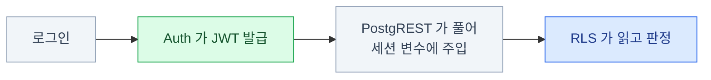
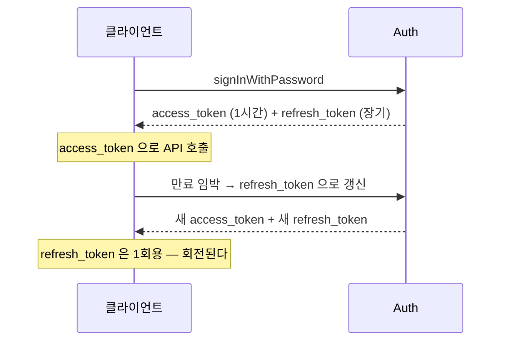
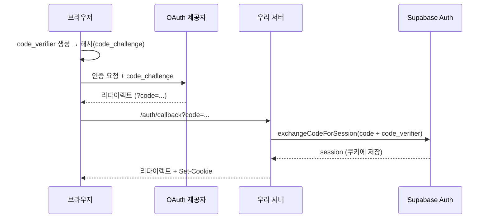

import { Tabs, TabItem, Steps, Card, CardGrid, LinkCard } from '@astrojs/starlight/components';

> Auth가 발급한 JWT가 RLS의 입력이 된다. 이 장과 다음 장은 이어서 읽어야 그림이 완성된다

## 인증과 인가는 다르다

| | 인증 (Authentication) | 인가 (Authorization) |
|---|---|---|
| 질문 | "당신이 누구인지 확인한다" | "이 데이터에 접근해도 되는지 판단한다" |
| 담당 | **Supabase Auth** | **Postgres RLS** |
| 결과물 / 입력 | JWT를 발급한다 | JWT의 클레임을 읽는다 |
| 다루는 장 | 6장 | [7장](/supabase/07-rls/) |



Auth를 직접 만들면 최소한 이만큼을 다뤄야 한다 —
비밀번호 해싱과 안전한 비교, 이메일 확인·재설정 토큰의 발급·만료·1회용 보장,
세션 저장·갱신·무효화, OAuth 제공자별 리다이렉트와 토큰 교환,
무차별 대입 방어, MFA와 기기 관리.
**이 중 하나만 틀려도 계정 탈취**로 이어진다. 직접 만들 이유가 거의 없는 영역이다.

## 신원의 저장소와 토큰

### auth.users 테이블

| 컬럼 | 설명 |
|---|---|
| `id` | uuid. **이게 곧 `auth.uid()`** 이고 모든 외래 키의 대상 |
| `email` / `phone` | 식별자 |
| `encrypted_password` | 해시된 비밀번호 (직접 볼 일 없다) |
| `email_confirmed_at` | 이메일 확인 시각. `null`이면 미확인 |
| `raw_user_meta_data` | **사용자가 수정 가능** — 이름, 아바타 등 |
| `raw_app_meta_data` | **서버만 수정 가능** — 권한, 플랜 등 |
| `role` / `aud` | 보통 `authenticated` |
| `banned_until` | 정지 처리 |

관련 테이블: `auth.sessions`, `auth.identities`(소셜 연결),
`auth.mfa_factors`, `auth.refresh_tokens`.

### JWT 구조

로그인하면 이런 토큰을 받는다.

```json
{
  "iss": "https://abcdefg.supabase.co/auth/v1",
  "sub": "8f3c1e2a-...-9b7d",
  "aud": "authenticated",
  "exp": 1785000000,
  "iat": 1784996400,
  "email": "alice@example.com",
  "role": "authenticated",
  "aal": "aal1",
  "session_id": "b1d2...",
  "app_metadata": { "provider": "email", "plan": "pro" },
  "user_metadata": { "full_name": "앨리스" }
}
```

`sub`가 사용자 ID이고 `auth.uid()`의 원천이다.
`role`은 Postgres 역할로 매핑되고, `aal`은 인증 보증 수준(MFA 시 `aal2`)이다.

:::caution[함정]
**JWT는 암호화가 아니라 서명이다.** 내용은 누구나 디코딩해서 읽을 수 있다.
따라서 **비밀 정보를 절대 넣지 않는다.** SQL에서는 `auth.jwt()`로 이 전체를 읽을 수 있다.
:::

### access token과 refresh token



- **access token** — 짧게 산다(기본 1시간). 모든 API 요청에 실린다.
  서버가 서명만 검증하면 되므로 빠르다
- **refresh token** — 길게 산다. 새 access token을 받는 데만 쓴다. **사용하면 새 것으로 교체**된다
- 클라이언트 SDK가 이 갱신을 자동으로 한다 (`autoRefreshToken`)
- **서버 환경에서는 자동 갱신이 안 되므로 미들웨어에서 명시적으로 처리**한다 ([13장](/supabase/13-nextjs/))

### 세션 생명주기

```ts
// 현재 세션 확인 (로컬 저장소에서 읽음 — 네트워크 없음)
const { data: { session } } = await supabase.auth.getSession()

// 세션 변화 구독 — 로그인/로그아웃/토큰 갱신 시 호출된다
const { data: { subscription } } = supabase.auth.onAuthStateChange(
  (event, session) => {
    // 'INITIAL_SESSION' | 'SIGNED_IN' | 'SIGNED_OUT'
    // | 'TOKEN_REFRESHED' | 'USER_UPDATED' | 'PASSWORD_RECOVERY'
    console.log(event, session?.user.id)
  },
)

subscription.unsubscribe()
```

:::caution[함정]
서버 코드(미들웨어, Server Component)에서 `getSession()`이 돌려주는 `user` 객체를
**권한 판단에 쓰면 안 된다.** 쿠키는 위조될 수 있다.
서버에서는 `getClaims()`(서명 검증) 또는 `getUser()`(Auth 서버 확인)를 쓴다.
:::

## 이메일 기반 로그인

### 가입과 확인

```ts
const { data, error } = await supabase.auth.signUp({
  email: 'alice@example.com',
  password: 'super-secret-password',
  options: {
    // raw_user_meta_data 로 들어간다 (사용자가 나중에 수정 가능)
    data: { full_name: '앨리스' },
    emailRedirectTo: 'https://example.com/auth/callback',
  },
})
```

이메일 확인이 켜져 있으면 `data.user`는 오지만 **`data.session`은 `null`** 이다.
확인 메일의 링크를 눌러야 세션이 생긴다.

```mermaid
sequenceDiagram
    participant U as 사용자
    participant App as 앱
    participant A as Auth
    participant M as 메일

    U->>App: 가입 폼 제출
    App->>A: signUp(email, password)
    A->>M: 확인 메일 발송 (토큰 포함 링크)
    A-->>App: user (session 은 null)
    App-->>U: "메일을 확인하세요"
    U->>M: 링크 클릭
    M->>A: GET /auth/v1/verify?token=...
    A-->>U: emailRedirectTo 로 리다이렉트 (code 포함)
    U->>App: /auth/callback?code=...
    App->>A: exchangeCodeForSession(code)
    A-->>App: session 발급
```



로컬 개발에서는 `http://127.0.0.1:54324`(Mailpit)에서 메일을 확인한다.
비밀번호 정책(최소 길이, 문자 조합, 유출된 비밀번호 차단)은 대시보드에서 설정한다.

```ts
// 로그인
const { data, error } = await supabase.auth.signInWithPassword({
  email: 'alice@example.com',
  password: 'super-secret-password',
})

// 로그아웃 — 기본은 현재 기기만
await supabase.auth.signOut()
await supabase.auth.signOut({ scope: 'global' })   // 모든 기기
```

로그인 실패 시 `error.message`는 의도적으로 모호하다(`Invalid login credentials`).
"이메일이 없음" vs "비밀번호 틀림"을 구분해 주면 **계정 존재 여부가 새어 나간다.**
UI에 노출할 때도 이 성질을 유지하자.

### 매직 링크와 OTP

비밀번호 없는 로그인. 이메일로 링크 또는 6자리 코드를 보낸다.

```ts
await supabase.auth.signInWithOtp({
  email: 'alice@example.com',
  options: {
    emailRedirectTo: 'https://example.com/auth/callback',
    shouldCreateUser: true,   // 없는 사용자면 새로 만들지 여부
  },
})

// OTP 코드 방식일 때 검증
const { data } = await supabase.auth.verifyOtp({
  email: 'alice@example.com',
  token: '123456',
  type: 'email',
})
```

비밀번호 관리 부담이 사라지고 재설정 플로우도 필요 없다.
대신 **이메일 도달률**에 서비스 품질이 종속된다.

:::caution[함정]
**기본 SMTP는 속도 제한이 강하다.** 프로덕션에서는 반드시 커스텀 SMTP를 붙인다.
"가입 메일이 안 와요"의 1순위 원인이다.
:::

### 비밀번호 재설정

```ts
// 1) 재설정 메일 요청
await supabase.auth.resetPasswordForEmail('alice@example.com', {
  redirectTo: 'https://example.com/account/update-password',
})

// 2) 링크를 타고 온 페이지에서 (PASSWORD_RECOVERY 세션 상태)
await supabase.auth.updateUser({ password: '새-비밀번호' })
```

`onAuthStateChange`에서 `PASSWORD_RECOVERY` 이벤트로 이 상태를 감지할 수 있다.
재설정 링크는 **1회용이고 만료 시간이 있다.**
이메일 존재 여부가 새어 나가지 않도록, 요청 결과는 항상 같은 메시지로 응답하자.

## 소셜 로그인과 PKCE

### 설정 절차

<Steps>

1. **제공자 쪽에서 앱 등록** (예: GitHub Developer Settings)

   - Authorization callback URL: `https://<ref>.supabase.co/auth/v1/callback`
   - Client ID / Client Secret 발급

2. **Supabase 대시보드 → Authentication → Sign In / Providers**

   제공자를 켜고 Client ID / Secret을 입력한다

3. **Redirect URLs 등록** (Authentication → URL Configuration)

   ```text
   https://example.com/**
   https://*-myteam.vercel.app/**       ← 프리뷰 배포용
   http://localhost:3000/**
   ```

</Steps>

:::caution[함정]
**Vercel 프리뷰 URL은 배포마다 바뀐다.** 와일드카드를 등록하지 않으면
프리뷰에서 소셜 로그인이 리다이렉트 거부로 깨진다 — [12장](/supabase/12-vercel/)에서 다시 다룬다.
:::

### 코드와 콜백

```ts
// 1) 로그인 시작 — 제공자 페이지로 리다이렉트된다
await supabase.auth.signInWithOAuth({
  provider: 'github',
  options: {
    redirectTo: `${location.origin}/auth/callback`,
    scopes: 'read:user user:email',
  },
})
```

```ts
// 2) app/auth/callback/route.ts — 돌아온 code를 세션으로 교환
export async function GET(request: Request) {
  const { searchParams, origin } = new URL(request.url)
  const code = searchParams.get('code')
  const next = searchParams.get('next') ?? '/'

  if (code) {
    const supabase = await createClient()
    const { error } = await supabase.auth.exchangeCodeForSession(code)
    if (!error) return Response.redirect(`${origin}${next}`)
  }
  return Response.redirect(`${origin}/auth/error`)
}
```

### PKCE 플로우

서버 사이드 렌더링 환경의 기본 플로우다.



- **토큰이 URL 프래그먼트에 노출되지 않는다** — implicit 플로우보다 안전하다
- 세션이 **httpOnly 쿠키**에 저장되어 서버에서도 읽을 수 있다
- `@supabase/ssr`을 쓰면 이게 기본 동작이다

## 그 밖의 로그인 방식

### 익명 로그인

가입 없이 먼저 써보게 하고 싶을 때 — 장바구니, 임시 작업물, 게스트 플레이.

```ts
// 즉시 사용자 생성 (is_anonymous = true)
const { data } = await supabase.auth.signInAnonymously()

// 나중에 정식 계정으로 승격 — 데이터가 그대로 유지된다
await supabase.auth.updateUser({ email: 'alice@example.com' })
```

```sql
-- RLS에서 익명 사용자를 구분할 수 있다
create policy "익명은 쓰기 금지"
  on documents for insert to authenticated
  with check ( (select auth.jwt() ->> 'is_anonymous')::boolean = false );
```

남용 방지를 위해 CAPTCHA(hCaptcha/Turnstile) 연동을 권장한다.

### 전화번호 인증

```ts
await supabase.auth.signInWithOtp({ phone: '+821012345678' })

const { data } = await supabase.auth.verifyOtp({
  phone: '+821012345678',
  token: '123456',
  type: 'sms',
})
```

SMS 제공자(Twilio, MessageBird, Vonage 등)를 대시보드에서 연결해야 한다.
**SMS는 비용이 들고** 남용(SMS pumping) 대비가 필요하다.
한국 서비스라면 국내 SMS 사업자를 쓰기 위해 **Send SMS Hook**으로 직접 구현하는 경우가 많다.

### SSO / SAML

```ts
await supabase.auth.signInWithSSO({ domain: 'acme-corp.com' })
```

SAML 2.0 기반으로 Okta, Azure AD, Google Workspace 등과 연동한다.
설정은 CLI 또는 관리 API로 IdP 메타데이터를 등록하는 방식이다.

**B2B SaaS를 만든다면 로드맵에 넣어둘 항목**이다. 엔터프라이즈 계약의 단골 요구사항이고,
지금 당장 필요하지 않더라도 "필요해지면 붙일 수 있다"는 걸 알아두는 정도면 충분하다.

## 메타데이터와 역할

### user_metadata vs app_metadata

<Tabs>
<TabItem label="user_metadata — 사용자가 수정 가능">

```ts
await supabase.auth.updateUser({
  data: { full_name: '새 이름' }
})
```

이름, 아바타, 테마 설정 등 **사용자 자신의 선호**를 담는다.

**권한 판단에 절대 쓰지 말 것.**

</TabItem>
<TabItem label="app_metadata — 서버만 수정 가능">

```ts
await admin.auth.admin.updateUserById(id, {
  app_metadata: { plan: 'pro' }
})
```

플랜, 역할, 조직 ID 등 **서비스가 부여하는 속성**을 담는다.

secret key로만 수정할 수 있으므로 권한 판단에 쓸 수 있다.

</TabItem>
</Tabs>

:::caution[함정]
**대표적인 보안 사고:** `user_metadata.role = 'admin'`을 RLS 정책에서 신뢰한 경우.
사용자가 스스로 `updateUser({ data: { role: 'admin' } })`를 호출하면 끝이다.
:::

### 커스텀 클레임과 RBAC

역할 기반 권한을 JWT에 심는 표준 패턴이다.

```sql
-- 1) 역할 저장 테이블 (API에 노출하지 않는 스키마 권장)
create table public.user_roles (
  user_id uuid primary key references auth.users (id) on delete cascade,
  role    text not null check (role in ('admin', 'editor', 'viewer'))
);

-- 2) 토큰 발급 시 호출되는 훅 함수
create or replace function public.custom_access_token_hook(event jsonb)
returns jsonb
language plpgsql stable
as $$
declare
  claims    jsonb := event -> 'claims';
  user_role text;
begin
  select role into user_role
  from public.user_roles
  where user_id = (event ->> 'user_id')::uuid;

  claims := jsonb_set(claims, '{user_role}', to_jsonb(coalesce(user_role, 'viewer')));
  return jsonb_set(event, '{claims}', claims);
end;
$$;
```

```sql
-- RLS 정책에서 바로 읽는다 (추가 DB 조회 없이)
create policy "관리자는 전부 볼 수 있다"
  on public.posts for select to authenticated
  using ( (select auth.jwt() ->> 'user_role') = 'admin' );
```

- **장점** — 정책 평가 시 추가 테이블 조회가 없다. 매우 빠르다
- **단점** — JWT는 발급 시점의 스냅샷이다. **역할을 바꿔도 토큰이 갱신될 때까지 반영 안 된다**
- 즉시 반영이 필요하면 역할 변경 후 세션을 무효화하거나, 테이블 조회 방식을 쓴다

:::caution[함정]
훅은 대시보드 **Authentication → Hooks**에서 `custom_access_token_hook`을 등록해야 동작한다.
등록하지 않으면 함수만 있고 아무 일도 일어나지 않는다.
:::

### Auth Hooks

토큰 발급 외에도 여러 지점에 개입할 수 있다.

| 훅 | 시점 | 용도 |
|---|---|---|
| **Custom Access Token** | JWT 발급 직전 | 커스텀 클레임 주입 |
| **Send Email** | 인증 메일 발송 시 | 자체 메일 템플릿/발송사 사용 |
| **Send SMS** | SMS 발송 시 | 국내 SMS 사업자 연동 |
| **Password Verification Attempt** | 비밀번호 검증 후 | 실패 횟수 추적, 계정 잠금 |
| **MFA Verification Attempt** | MFA 검증 후 | 추가 정책 적용 |
| **Before User Created** | 사용자 생성 직전 | 도메인 화이트리스트, 가입 차단 |

훅은 **Postgres 함수** 또는 **HTTP 엔드포인트(Edge Function)** 로 구현할 수 있다.
DB만 보면 되는 일은 Postgres 함수가, 외부 API를 호출해야 하면 HTTP가 적합하다.

### MFA

```ts
// 1) TOTP 팩터 등록 — QR 코드를 사용자에게 보여준다
const { data: factor } = await supabase.auth.mfa.enroll({ factorType: 'totp' })

// 2) 사용자가 입력한 6자리로 등록 확정
const { data: challenge } = await supabase.auth.mfa.challenge({ factorId: factor.id })
await supabase.auth.mfa.verify({
  factorId: factor.id, challengeId: challenge.id, code: '123456',
})

// 3) 이후 로그인 시 aal2로 승급
const { data: aal } = await supabase.auth.mfa.getAuthenticatorAssuranceLevel()
```

```sql
-- RLS에서 MFA를 강제할 수 있다
create policy "민감 데이터는 MFA 필수"
  on public.billing as restrictive for all to authenticated
  using ( (select auth.jwt() ->> 'aal') = 'aal2' );
```

`as restrictive`는 다른 정책과 **AND로 결합**된다 — 예외 없는 필수 조건을 걸 때 쓴다
([7장](/supabase/07-rls/)).

## 서버에서 신원 확인하기

### 서명 키의 변화

**과거 방식(대칭키, HS256)** 은 프로젝트당 JWT 시크릿 하나였다.
검증하려면 그 시크릿을 알아야 하고, 시크릿을 바꾸면 모든 사용자가 로그아웃됐다.

**현재 권장(비대칭키, ECC P-256 / RSA)** 은 Auth가 개인키로 서명하고
검증은 **공개키**로 한다. 공개키는 JWKS 엔드포인트에 공개된다.

```text
GET https://<ref>.supabase.co/auth/v1/.well-known/jwks.json
```

```ts
// 로컬에서 서명을 검증한다 — Auth 서버 왕복이 없다
const { data } = await supabase.auth.getClaims()
// data.claims.sub, data.claims.role, ...
```

**빠르고**(네트워크 없음) **안정적이며**(Auth 장애와 무관) **무중단 키 회전이 가능하다.**
서버에서 사용자 신원을 확인할 때의 기본 선택지다.

### getClaims vs getUser vs getSession

| 메서드 | 동작 | 네트워크 | 권한 판단에 사용 |
|---|---|---|---|
| `getClaims()` | JWT 서명을 로컬 검증 | 없음 (JWKS 캐시) | **○ 권장** |
| `getUser()` | Auth 서버에 사용자 조회 | **있음** | ○ (최신 정보 필요 시) |
| `getSession()` | 저장소에서 그대로 읽음 | 없음 | **✕ 서버에서는 금지** |

- 브라우저에서는 `getSession()`으로 "로그인했는지" 정도 판단해도 큰 문제가 없다
  (어차피 진짜 방어선은 서버와 RLS다)
- **서버·미들웨어에서는 `getClaims()`.** 쿠키는 위조될 수 있다
- 사용자가 정지(ban)됐는지 같은 **최신 상태**가 필요하면 `getUser()`

### Admin API

**secret key**로 만든 클라이언트에서만 쓸 수 있다.

```ts
import { createClient } from '@supabase/supabase-js'

const admin = createClient(url, process.env.SUPABASE_SECRET_KEY!, {
  auth: { autoRefreshToken: false, persistSession: false },
})

await admin.auth.admin.createUser({
  email: 'bob@example.com', password: 'temp-pass', email_confirm: true,
})
await admin.auth.admin.listUsers({ page: 1, perPage: 50 })
await admin.auth.admin.deleteUser(userId)
await admin.auth.admin.updateUserById(userId, { app_metadata: { plan: 'pro' } })
await admin.auth.admin.generateLink({ type: 'invite', email: 'carol@example.com' })
```

:::caution[함정]
**이 코드가 브라우저 번들에 들어가면 프로젝트 전체가 열린다.**
Next.js라면 `server-only` 패키지를 import해서 실수를 **컴파일 타임에** 잡자
([13장](/supabase/13-nextjs/)).
:::

## 흔한 함정

1. **Redirect URL 미등록** — 소셜 로그인 후 엉뚱한 곳으로 간다. 프리뷰 URL 와일드카드를 잊기 쉽다
2. **기본 SMTP로 프로덕션 운영** — 속도 제한에 걸려 가입 메일이 안 간다
3. **`user_metadata`를 권한 판단에 사용** — 사용자가 직접 고칠 수 있다
4. **서버에서 `getSession()`의 user를 신뢰** — 위조 가능하다
5. **`profiles` 행이 없는 사용자** — 트리거를 안 걸었거나 실패했을 때. 트리거 실패는 가입 실패로 이어진다
6. **secret key 노출** — `NEXT_PUBLIC_` 접두사 실수, 클라이언트 컴포넌트에서 import
7. **JWT 만료 시간을 길게 설정** — 로그아웃과 정지가 즉시 반영되지 않는다
8. **이메일 확인 없이 운영** — 스팸 가입과 타인 이메일 도용의 통로

## 6장 요약

- Auth는 **JWT를 발급**하고, 그 JWT가 RLS의 입력이 된다
- `auth.users`는 읽기만 하고, 앱 데이터는 `public.profiles`에 둔다
- **`user_metadata`(사용자 수정 가능) vs `app_metadata`(서버만)** 구분이 보안의 핵심
- 서버에서 신원 확인은 **`getClaims()`**, `getSession()`은 신뢰하지 않는다
- 역할 기반 권한은 **Custom Access Token Hook**으로 JWT에 심는 게 가장 빠르다
- 프로덕션 필수 체크: 커스텀 SMTP, Redirect URL 목록, 비밀번호 정책, MFA 검토

<LinkCard
  title="7. RLS — Row Level Security"
  description="이 문서에서 가장 중요한 한 장 — 자동으로 붙는 WHERE 절, 정책 패턴, 성능."
  href="/supabase/07-rls/"
/>
