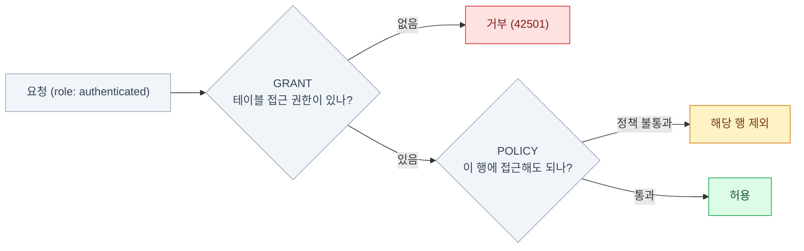

import { Tabs, TabItem, Steps, LinkCard } from '@astrojs/starlight/components';

> 테이블의 모든 쿼리에 자동으로 붙는 WHERE 절을 데이터베이스 수준에서 정의하는 기능

## RLS 한 문장 정의

RLS는 Postgres의 **네이티브 기능**이다. Supabase가 만든 게 아니다.
Supabase가 얹은 건 `auth.uid()`, `auth.jwt()` 같은 **헬퍼 함수**뿐이다.

그래서 REST로 오든, Realtime으로 오든, GraphQL로 오든 **같은 정책이 적용된다.**
권한 검사를 **애플리케이션이 아니라 데이터베이스가** 한다는 것 —
이것이 Supabase 아키텍처가 성립하는 이유다.

### RLS가 없으면 벌어지는 일

`publishable key`는 브라우저에 그대로 노출되어 있다. 누구나 이렇게 할 수 있다.

```bash
curl "https://<ref>.supabase.co/rest/v1/users_private_data?select=*" \
  -H "apikey: sb_publishable_xxxxxxxx"
```

RLS를 켜지 않은 `public` 스키마 테이블은 **인터넷 전체에 공개된 것과 같다.**
실제로 이 실수로 인한 데이터 유출 사고가 반복적으로 보고되고,
Supabase 대시보드가 RLS 미적용 테이블에 빨간 경고를 띄우는 이유가 이것이다.

:::tip[핵심]
**규칙: 테이블 생성과 `enable row level security`는 한 세트다.**
마이그레이션 파일에서 두 문장을 항상 붙여 쓴다.
:::

### 켜기와 기본 거부

```sql
alter table public.posts enable row level security;
```

이 순간부터 —

- **정책이 하나도 없으면 아무도 아무것도 못 한다** (기본 거부, deny-by-default)
- 테이블 소유자와 `bypassrls` 속성을 가진 역할만 예외
- `service_role`(secret key)은 RLS를 우회한다

**"RLS를 켰는데 데이터가 안 보여요"** — 정상이다. 정책을 아직 안 만든 것이다.

```sql
-- 테이블 소유자에게도 RLS를 강제한다
alter table public.posts force row level security;
```

### 권한(GRANT)과 정책(POLICY)은 다른 층이다

둘 다 통과해야 접근할 수 있다.



Supabase는 기본적으로 `public` 스키마 테이블에 모든 권한을 GRANT해 둔다
(RLS를 안 켠 테이블에 `anon`이 쓰기까지 가능한 이유가 이것이다).

```sql
grant all on public.posts to anon, authenticated;
```

:::caution[함정]
직접 만든 스키마(`app` 등)를 쓸 때는 **GRANT를 직접 해줘야 한다.**
잊으면 정책이 맞아도 거부된다.
:::

## 정책 문법

```sql
create policy "본인 프로필만 조회"          -- 이름 (사람이 읽을 설명)
  on public.profiles                        -- 대상 테이블
  for select                                -- 대상 연산: select|insert|update|delete|all
  to authenticated                          -- 대상 역할: anon|authenticated|...
  using ( (select auth.uid()) = id );       -- 조건식 (boolean)
```

- 정책은 **여러 개를 쌓을 수 있다.** 기본은 OR 결합(permissive)이다
- 이름은 자유지만 **"누가 무엇을 할 수 있는지"가 드러나게** 쓰는 게 좋다
- `to`를 생략하면 모든 역할이 대상이 된다 → **성능과 명확성 모두를 위해 항상 명시하자**

### using vs with check

가장 자주 헷갈리는 지점이다.

| | `using` | `with check` |
|---|---|---|
| 무엇을 본다 | **기존 행**을 볼 수 있는가 | **새 값**이 허용되는가 |
| `select` | 결과에 포함할지 | — |
| `insert` | — | 삽입하려는 행이 조건에 맞는지 |
| `update` | 수정 대상으로 삼을지 | **수정 후의 값**이 조건에 맞는지 |
| `delete` | 삭제 대상으로 삼을지 | — |

```sql
create policy "본인 글만 수정"
  on public.posts for update to authenticated
  using ( (select auth.uid()) = author_id )        -- 내 글만 수정 대상
  with check ( (select auth.uid()) = author_id );  -- 남의 글로 바꿔치기 금지
```

:::caution[함정]
`with check`를 빠뜨리면 **자기 글의 `author_id`를 남의 것으로 바꿀 수 있다.**
`update` 정책에는 거의 항상 둘 다 필요하다.
:::

### 연산별 4종 세트

```sql
-- SELECT: using만
create policy "조회" on profiles for select to authenticated
  using ( (select auth.uid()) = user_id );

-- INSERT: with check만
create policy "생성" on profiles for insert to authenticated
  with check ( (select auth.uid()) = user_id );

-- UPDATE: 둘 다
create policy "수정" on profiles for update to authenticated
  using ( (select auth.uid()) = user_id )
  with check ( (select auth.uid()) = user_id );

-- DELETE: using만
create policy "삭제" on profiles for delete to authenticated
  using ( (select auth.uid()) = user_id );
```

**`UPDATE`를 수행하려면 대응하는 `SELECT` 정책이 필요하다.** 수정할 행을 먼저 찾아야 하기 때문이다.

### 헬퍼 함수

```sql
select auth.uid();     -- 현재 요청자의 사용자 ID (로그인 안 했으면 null)
select auth.jwt();     -- JWT 전체를 jsonb로

-- 자주 쓰는 추출들
(select auth.jwt() ->> 'email')
(select auth.jwt() ->> 'aal')                        -- 'aal1' | 'aal2'
(select auth.jwt() -> 'app_metadata' ->> 'plan')
```

SQL에서 `null = 값`은 `true`가 아니라 `null`이고,
정책의 `using`/`with check`에서 `null`은 거짓 취급이다.
그래서 로그인하지 않은 요청은 **닫히는 쪽으로** 실패한다.
그래도 가드를 명시하면 의도가 드러나고 인덱스 활용 판단에도 유리하다.

```sql
using ( auth.uid() is not null and auth.uid() = user_id )
```

## 정책 패턴

### 패턴 1 — 소유자만

"내 데이터는 나만 본다". 가장 기본이다.

```sql
alter table public.notes enable row level security;

create policy "소유자 전용"
  on public.notes for all
  to authenticated
  using ( (select auth.uid()) = user_id )
  with check ( (select auth.uid()) = user_id );

-- 필수: 정책이 비교하는 컬럼에 인덱스
create index notes_user_id_idx on public.notes (user_id);

-- 권장: 클라이언트가 user_id를 위조할 수 없게 기본값 고정
alter table public.notes alter column user_id set default auth.uid();
```

### 패턴 2 — 공개 읽기 + 소유자 쓰기

블로그, 게시판의 표준 형태다.

```sql
-- 읽기: 발행된 글은 로그인 없이도 보인다
create policy "공개 글 읽기"
  on public.posts for select
  to anon, authenticated
  using ( published = true );

-- 읽기: 본인 글은 미발행이어도 보인다
create policy "내 글 읽기"
  on public.posts for select
  to authenticated
  using ( (select auth.uid()) = author_id );

-- 쓰기: 본인 글만
create policy "내 글 쓰기"
  on public.posts for insert to authenticated
  with check ( (select auth.uid()) = author_id );

create policy "내 글 수정/삭제"
  on public.posts for update to authenticated
  using ( (select auth.uid()) = author_id )
  with check ( (select auth.uid()) = author_id );
```

`select` 정책 두 개는 **OR로 합쳐진다** — "발행됐거나 내 글이면 보인다".

### 패턴 3 — 팀·조직 멤버십

멀티테넌트 SaaS의 핵심 패턴이다. **쓰는 방식에 따라 성능이 크게 갈린다.**

<Tabs>
<TabItem label="느린 형태">

```sql
create policy "느린 정책" on documents for select to authenticated
  using (
    exists (
      select 1 from team_members tm
      where tm.team_id = documents.team_id and tm.user_id = auth.uid()
    )
  );
```

매 행마다 서브쿼리가 재실행되고 조인이 유발된다.

</TabItem>
<TabItem label="빠른 형태">

```sql
create policy "빠른 정책" on documents for select to authenticated
  using (
    team_id in (
      select team_id from public.team_members
      where user_id = (select auth.uid())
    )
  );
```

내 팀 목록을 한 번만 계산해서 `IN`으로 비교한다.
`(select auth.uid())` 형태로 감싸면 결과가 캐시되어 행마다 재평가되지 않는다.

</TabItem>
</Tabs>

공식 문서 벤치마크 기준 **조인을 `IN` 서브쿼리로 바꾸는 것만으로 큰 개선**이 보고된다.

### 패턴 4 — 역할 기반 (RBAC)

<Tabs>
<TabItem label="A. JWT 클레임 — 빠름">

```sql
create policy "관리자 전체 접근"
  on posts for all to authenticated
  using ( (select auth.jwt() ->> 'user_role') = 'admin' );
```

- 추가 조회 없음 → 가장 빠르다
- [6장의 Custom Access Token Hook](/supabase/06-auth/#커스텀-클레임과-rbac)이 필요하다
- **역할 변경이 토큰 갱신 후에 반영된다**

</TabItem>
<TabItem label="B. 테이블 조회 — 즉시 반영">

```sql
create policy "관리자 전체 접근"
  on posts for all to authenticated
  using (
    (select auth.uid()) in (
      select user_id from public.user_roles where role = 'admin'
    )
  );
```

- 역할 변경이 즉시 반영된다
- 매 쿼리마다 조회하므로 **인덱스가 필수**다

</TabItem>
</Tabs>

**실무 절충:** 자주 안 바뀌는 굵직한 역할은 JWT로, 세밀한 권한은 테이블로.

### 패턴 5 — 가시성 범위

```sql
create policy "가시성 규칙"
  on public.photos for select to authenticated
  using (
    visibility = 'public'
    or owner_id = (select auth.uid())
    or (
      visibility = 'friends'
      and owner_id in (
        select friend_id from public.friendships
        where user_id = (select auth.uid()) and status = 'accepted'
      )
    )
  );

create index photos_visibility_idx on public.photos (visibility);
create index photos_owner_idx on public.photos (owner_id);
create index friendships_user_status_idx
  on public.friendships (user_id, status) include (friend_id);
```

정책이 이 정도로 길어지면 **`security definer` 헬퍼 함수로 추출**할 때가 됐다는 신호다.

## 정책을 조합하고 추출하기

### permissive vs restrictive

```sql
-- permissive (기본): 여러 정책이 OR로 결합된다
create policy "A" on t for select using ( cond_a );
create policy "B" on t for select using ( cond_b );
-- 결과: cond_a OR cond_b

-- restrictive: AND로 결합된다. 예외 없는 필수 조건
create policy "삭제된 것은 절대 안 보임"
  on t as restrictive for select to authenticated
  using ( deleted_at is null );
```

restrictive 정책의 용도는 "MFA 없으면 무조건 차단", "테넌트 격리는 예외 없음",
"삭제된 행은 절대 노출 금지"처럼 **나중에 정책이 추가되어도 뚫리면 안 되는 조건**이다.

:::caution[함정]
**restrictive 정책만 있으면 아무것도 통과하지 못한다.** permissive 정책이 최소 하나 필요하다.
:::

### security definer 헬퍼 함수

정책이 참조하는 테이블 자체에 RLS가 걸려 있으면 무한 재귀가 생길 수 있다.

```sql
create schema if not exists private;

create or replace function private.is_team_member(target_team uuid)
returns boolean
language sql
security definer      -- 함수 소유자 권한으로 실행 → team_members의 RLS 우회
stable                -- 같은 쿼리 안에서 결과 캐시
set search_path = ''  -- 스키마 하이재킹 방지 (필수)
as $$
  select exists (
    select 1 from public.team_members
    where team_id = target_team and user_id = auth.uid()
  );
$$;

create policy "팀 문서 조회"
  on public.documents for select to authenticated
  using ( private.is_team_member(team_id) );
```

:::caution[함정]
`security definer` 함수는 강력하다. **`search_path = ''`를 반드시 설정**하고,
`public`이 아닌 스키마에 두고, `execute` 권한을 필요한 역할에만 부여한다.
설정을 빠뜨리면 스키마 하이재킹 공격의 통로가 된다.
:::

## 성능

RLS 정책은 **모든 쿼리에 붙는 조건식**이다. 여기가 느리면 전부 느리다.

### 함수를 select로 감싸기

```sql
-- 느림: 행마다 auth.uid()가 재평가된다
using ( auth.uid() = user_id )

-- 빠름: 쿼리당 한 번만 평가되고 결과가 캐시된다
using ( (select auth.uid()) = user_id )
```

Postgres 플래너가 `(select ...)`를 **InitPlan**으로 처리해 한 번만 실행한다.
공식 문서 벤치마크에서 특히 `security definer` 함수와 결합할 때 극적인 차이가 보고된다.

:::tip[핵심]
**모든 `auth.uid()`, `auth.jwt()` 호출을 `(select ...)`로 감싸는 것을 규칙으로 삼자.**

```sql
using ( (select auth.uid()) = user_id )
using ( (select auth.jwt() ->> 'user_role') = 'admin' )
```
:::

### 인덱스와 명시적 필터

```sql
-- 정책이 비교하는 컬럼에는 반드시 인덱스
create index notes_user_id_idx on public.notes using btree (user_id);
```

```ts
// 정책이 어차피 걸러주더라도, 클라이언트에서 같은 조건을 한 번 더 준다
const { data } = await supabase
  .from('notes')
  .select()
  .eq('user_id', userId)     // ← 이 한 줄이 플래너에게 큰 힌트가 된다
```

인덱스 유무의 차이는 공식 벤치마크에서 **99% 이상**으로 보고된다.
명시적 필터 추가만으로도 큰 개선이 보고되는데, RLS 조건은 플래너가 늦게 적용하는 경우가 있기 때문이다.

**정책은 보안이고, 명시적 필터는 성능이다.** 둘은 중복이 아니라 역할이 다르다.

### 성능 체크리스트

<Steps>

1. `auth.uid()` / `auth.jwt()`를 **`(select ...)`로 감싼다**

2. 정책이 비교하는 **모든 컬럼에 인덱스**를 만든다

3. **`to` 절로 대상 역할을 명시**한다 — 해당 역할이 아니면 정책 평가 자체를 건너뛴다

4. 조인 대신 **`in (select ...)`** 형태를 쓴다

5. 복잡한 로직은 **`security definer` + `stable` 함수**로 추출한다

6. 클라이언트 쿼리에도 **같은 필터를 명시적으로** 넣는다

</Steps>

## 우회 경로 점검

정책을 아무리 잘 써도 옆문이 열려 있으면 소용없다.

| 우회 경로 | 대응 |
|---|---|
| **secret key 노출** | 클라이언트 번들에 절대 금지. `server-only` 사용 |
| **RLS 미적용 테이블** | Advisors의 보안 경고를 정기 확인 |
| **뷰가 기반 테이블 RLS를 우회** | `with (security_invoker = on)` 지정 |
| **`security definer` 함수 남용** | 꼭 필요할 때만, `search_path = ''`, 권한 최소화 |
| **직접 DB 연결(Prisma 등)** | 기본적으로 RLS가 적용되지 않음을 인지하고 앱에서 검증 |
| **노출 스키마 설정 실수** | API Settings의 exposed schemas 확인 |
| **`anon`에 과도한 GRANT** | 필요한 테이블·연산에만 부여 |

## 테스트하는 법

```sql
-- SQL 에디터에서 특정 사용자인 척 해보기
begin;
  select set_config('request.jwt.claims',
    '{"sub":"8f3c1e2a-0000-0000-0000-000000000001","role":"authenticated"}', true);
  set local role authenticated;

  select * from public.posts;      -- 이 사용자에게 보이는 것만 나온다
rollback;
```

`rollback`으로 감싸면 상태가 남지 않는다.
**pgTAP**으로 정책 테스트를 자동화할 수 있다 — `supabase test db` ([14장](/supabase/14-ops/)).

최소한 이 세 케이스는 수동으로라도 확인하자.

1. 로그인 안 한 사용자(`anon`)로 조회
2. 다른 사용자의 데이터 조회·수정 시도
3. 소유자 컬럼을 남의 ID로 바꾸는 `update` 시도

## 7장 요약

**개념**

- RLS = **자동으로 붙는 WHERE 절**. Postgres 네이티브 기능이다
- `using`(기존 행) / `with check`(새 값) 구분이 핵심
- permissive는 OR, restrictive는 AND

**새 테이블을 만들 때마다 확인할 것**

- [ ] `enable row level security`를 **같은 마이그레이션에** 넣었는가
- [ ] `select` / `insert` / `update` / `delete` 정책을 각각 정했는가
- [ ] `update` 정책에 `with check`가 있는가
- [ ] 정책이 비교하는 컬럼에 **인덱스**가 있는가
- [ ] `auth.uid()`를 `(select auth.uid())`로 감쌌는가
- [ ] `to`로 대상 역할을 명시했는가
- [ ] 소유자 컬럼에 `default auth.uid()`를 걸었는가

<LinkCard
  title="8. Storage"
  description="파일도 결국 테이블이다 — 경로 설계가 곧 권한 설계."
  href="/supabase/08-storage/"
/>
