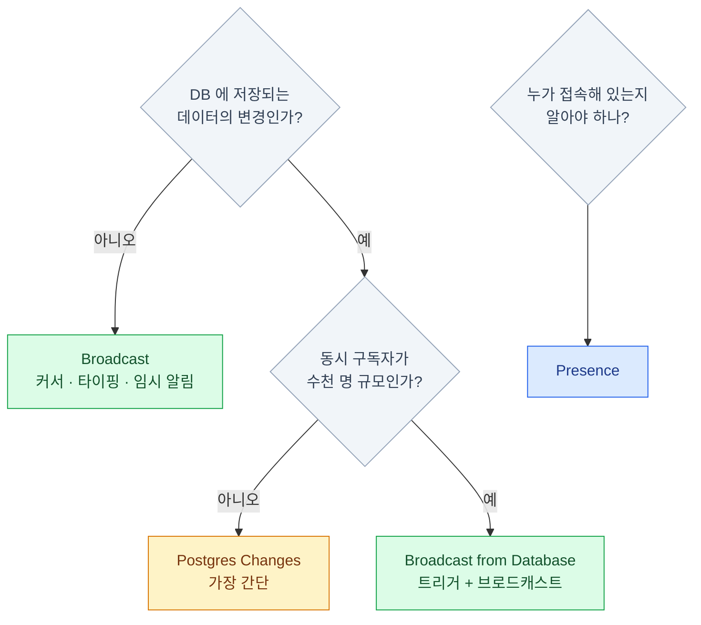

import { Tabs, TabItem, LinkCard } from '@astrojs/starlight/components';

> "실시간 = Postgres Changes"라는 오해에서 시작하는 문제가 많다

## 실시간은 하나가 아니라 셋이다

| 기능 | 하는 일 | 대표 용례 |
|---|---|---|
| **Broadcast** | 클라이언트끼리 임의 메시지 전달 | 커서 위치, 타이핑 표시, 알림 |
| **Presence** | 채널 참여자의 상태 공유 | 접속자 목록, 온라인 표시 |
| **Postgres Changes** | DB 변경을 구독 | 데이터 자동 갱신 |

셋 다 **채널(channel)** 이라는 같은 추상 위에서 동작한다.
흔한 오해는 "실시간 = Postgres Changes"인데,
**실제로는 Broadcast가 더 자주 정답이다.** Postgres Changes는 편하지만 확장성 한계가 뚜렷하다.

### 채널이라는 공통 추상

```ts
// 채널 = 클라이언트들이 모이는 방
const channel = supabase.channel('room-1')

channel
  .on('broadcast', { event: 'cursor' }, payload => { /* ... */ })
  .on('presence', { event: 'sync' }, () => { /* ... */ })
  .on('postgres_changes', { event: 'INSERT', schema: 'public', table: 'messages' },
      payload => { /* ... */ })
  .subscribe((status) => {
    // 'SUBSCRIBED' | 'CHANNEL_ERROR' | 'TIMED_OUT' | 'CLOSED'
  })

// 정리 — 컴포넌트 언마운트 시 반드시
supabase.removeChannel(channel)
```

:::caution[함정]
**`removeChannel`을 빠뜨리면 구독이 누적된다.**
React StrictMode에서 이벤트가 두 번씩 오는 현상으로 가장 먼저 드러난다.
채널 이름으로 `'realtime'`은 쓸 수 없다(예약어).
:::

## 저장하지 않는 실시간

### Broadcast

DB를 거치지 않고 클라이언트끼리 직접 메시지를 주고받는다.

```ts
const channel = supabase.channel('room-1')

channel
  .on('broadcast', { event: 'cursor' }, ({ payload }) => {
    drawCursor(payload.userId, payload.x, payload.y)
  })
  .subscribe(status => {
    if (status !== 'SUBSCRIBED') return
    channel.send({
      type: 'broadcast',
      event: 'cursor',
      payload: { userId: me.id, x: 100, y: 200 },
    })
  })
```

- **DB에 저장되지 않는다** → 가장 빠르고 가장 저렴하다
- 저장이 필요하면 저장은 별도로 하고, 알림만 Broadcast로 보낸다
- 커서, 마우스 이동처럼 **초당 수십 건**이 오가는 데이터에 적합하다

```ts
// 내가 보낸 메시지도 내가 받기
supabase.channel('room-2', { config: { broadcast: { self: true } } })

// 서버 수신 확인 후 Promise resolve
supabase.channel('room-3', { config: { broadcast: { ack: true } } })

// 구독 없이 HTTP로 한 방 보내기 (서버 코드에서 유용)
const channel = supabase.channel('notifications')
await channel.httpSend('new-order', { orderId: 123 })
supabase.removeChannel(channel)
```

`httpSend`는 WebSocket 연결을 맺지 않는다.
**서버리스 함수에서 알림만 쏘고 끝낼 때** 적합하다.

### Presence

"지금 이 방에 누가 있는가".

```ts
const channel = supabase.channel('room-1', {
  config: { presence: { key: user.id } },
})

channel
  .on('presence', { event: 'sync' }, () => {
    const state = channel.presenceState()
    // { 'user-1': [{ name: '앨리스', online_at: '...' }], ... }
    setOnlineUsers(Object.keys(state))
  })
  .on('presence', { event: 'join' }, ({ newPresences }) => { /* 입장 */ })
  .on('presence', { event: 'leave' }, ({ leftPresences }) => { /* 퇴장 */ })
  .subscribe(async status => {
    if (status !== 'SUBSCRIBED') return
    await channel.track({ name: user.name, online_at: new Date().toISOString() })
  })
```

- 연결이 끊기면 **자동으로 leave 처리**된다 — 직접 관리할 필요가 없다
- 상태는 서버 메모리에 있고 DB에 저장되지 않는다
- 참여자가 많은 채널에서는 동기화 트래픽이 커진다 — 수백 명 이상이면 설계를 재검토한다

## Postgres Changes

### publication 등록

DB 변경을 밀어주려면 **먼저 publication에 테이블을 등록**해야 한다.

```sql
-- 이 한 줄이 없으면 아무 이벤트도 오지 않는다
alter publication supabase_realtime add table public.messages;

-- UPDATE/DELETE에서 이전 값(old record)까지 받고 싶다면
alter table public.messages replica identity full;
```

:::caution[함정]
**"구독은 되는데 이벤트가 안 와요"의 1순위 원인**이 이 설정 누락이다.
대시보드 **Database → Publications**에서 토글로도 가능하다.
`replica identity full`은 WAL(Write-Ahead Log — Postgres가 모든 변경을 먼저 기록하는 로그,
변경 구독도 이걸 읽는다) 크기를 키우므로 정말 필요할 때만 켠다.
:::

### 구독과 필터

```ts
supabase
  .channel('room-messages')
  .on('postgres_changes', {
    event: 'INSERT',                      // 'INSERT' | 'UPDATE' | 'DELETE' | '*'
    schema: 'public',
    table: 'messages',
    filter: 'room_id=eq.42',              // 서버 측 필터 — 불필요한 트래픽 차단
    select: ['id', 'body', 'user_id'],    // 전송할 컬럼 축소 (PK는 항상 포함)
  }, ({ eventType, new: newRow, old: oldRow }) => {
    if (eventType === 'INSERT') appendMessage(newRow)
  })
  .subscribe()
```

- 필터 연산자: `eq` `neq` `lt` `lte` `gt` `gte` `in` `like` `ilike` `match` `is` 등
- `not.` 접두사로 부정, 쉼표로 AND 결합 — `'amount=gt.100,status=eq.open'`
- **DELETE 이벤트는 필터할 수 없다.** `replica identity full`로 이전 값을 더 받을 수는 있지만,
  Realtime이 DELETE를 구독 필터와 RLS로 안전하게 판정할 수 없기 때문이다

### RLS는 그대로 적용된다

구독했다고 다 보이는 게 아니다. 해당 역할에 `select` 권한과 정책이 있어야 한다.

```sql
alter table public.messages enable row level security;

create policy "방 참여자만 조회"
  on public.messages for select to authenticated
  using ( room_id in (
    select room_id from public.room_members where user_id = (select auth.uid())
  ) );

grant select on public.messages to authenticated;
```

:::caution[함정]
**DELETE에는 RLS가 적용되지 않는다.** 삭제된 행에 접근 권한이 있었는지 확인할 방법이 없기 때문이다.
RLS가 켜져 있고 `replica identity full`이면 DELETE의 old record에는 **기본 키만** 담긴다.
:::

## Broadcast from Database

DB 변경을 트리거로 감지해서 **Broadcast로** 내보낸다. 두 방식의 장점을 합치는 패턴이다.

```sql
create or replace function public.messages_changed()
returns trigger
security definer set search_path = ''
language plpgsql
as $$
begin
  perform realtime.broadcast_changes(
    'room:' || coalesce(new.room_id, old.room_id)::text,  -- topic
    tg_op, tg_op,                                         -- event, operation
    tg_table_name, tg_table_schema,
    new, old
  );
  return null;
end;
$$;

create trigger messages_broadcast
  after insert or update or delete on public.messages
  for each row execute function public.messages_changed();
```

```ts
supabase.channel('room:42', { config: { private: true } })
  .on('broadcast', { event: 'INSERT' }, ({ payload }) => append(payload.record))
  .subscribe()
```

## 무엇을 언제 쓰나



**시작은 Postgres Changes로 해도 된다.** 가장 코드가 적다.
규모가 커지면 Broadcast from Database로 옮기는 것이 정석 경로다.

### 확장성의 차이

<Tabs>
<TabItem label="Postgres Changes">

- 변경 하나가 발생하면 **구독자 각각에 대해 권한 검사를 수행**한다
- 구독자 100명이면 검사 100번. 1000명이면 1000번
- 처리량이 **쓰기 횟수가 아니라 구독자 수에 비례**해서 늘어난다
- 순서 보장을 위해 단일 스레드로 처리된다 → **컴퓨트를 키워도 크게 나아지지 않는다**

</TabItem>
<TabItem label="Broadcast">

- 메시지 하나를 받아 **구독자 전체에 팬아웃**한다
- 권한 검사는 구독 시점에 한 번
- 구독자가 늘어도 팬아웃 비용만 는다

</TabItem>
</Tabs>

:::tip[핵심]
공식 문서 기준 — **같은 변경을 동시 구독하는 사용자가 약 3,000명을 넘으면 Broadcast로 전환**을 권장한다.
:::

## private 채널과 인가

```ts
const channel = supabase.channel('room:42', { config: { private: true } })
```

```sql
-- realtime.messages 테이블에 RLS 정책을 건다
create policy "방 참여자만 구독 가능"
  on realtime.messages for select to authenticated
  using ( exists (
    select 1 from public.room_members
    where user_id = (select auth.uid())
      and 'room:' || room_id::text = realtime.topic()
  ) );

-- 전송 권한은 insert 정책으로
create policy "방 참여자만 전송 가능"
  on realtime.messages for insert to authenticated
  with check ( exists (
    select 1 from public.room_members
    where user_id = (select auth.uid())
      and 'room:' || room_id::text = realtime.topic()
  ) );
```

:::caution[함정]
`private: false`(기본)인 채널은 **채널 이름만 알면 누구나 구독**할 수 있다.
민감한 내용을 다루는 채널은 반드시 `private: true` + 정책을 건다.
:::

## 실전 — 낙관적 UI와 재연결

```ts
// 1) 내가 보낸 메시지는 즉시 화면에 (서버 응답을 기다리지 않음)
function sendMessage(body: string) {
  const temp = { id: `temp-${crypto.randomUUID()}`, body, pending: true }
  setMessages(prev => [...prev, temp])

  supabase.from('messages').insert({ body }).select().single()
    .then(({ data, error }) => {
      if (error) return setMessages(prev => prev.filter(m => m.id !== temp.id))
      setMessages(prev => prev.map(m => (m.id === temp.id ? data : m)))
    })
}

// 2) 재연결 시 놓친 메시지 보충 — 구독만으로는 공백이 생긴다
channel.subscribe(async status => {
  if (status === 'SUBSCRIBED') {
    const { data } = await supabase
      .from('messages').select()
      .gt('created_at', lastSeenAt).order('created_at')
    mergeMessages(data ?? [])
  }
})
```

:::tip[핵심]
**실시간 구독은 "놓치지 않음"을 보장하지 않는다.**
연결이 끊긴 동안의 변경은 오지 않는다. 재연결 시 보충 조회를 반드시 넣자.
:::

## 함정 모음

1. **publication에 테이블 추가를 안 함** — 이벤트가 하나도 안 온다
2. **`removeChannel` 누락** — 구독 누적, 메모리 누수, 중복 이벤트
3. **RLS 정책 없이 구독** — 조용히 아무것도 안 온다
4. **DELETE 이벤트에 필터를 걸려고 함** — 지원되지 않는다
5. **old record가 비어 있음** — `replica identity full` 미설정
6. **재연결 시 공백** — 보충 조회 로직 없음
7. **구독자 수천 명에 Postgres Changes** — 지연이 급증한다
8. **public 채널에 민감 정보 브로드캐스트** — 채널명만 알면 누구나 듣는다
9. **모든 변경을 통째로 구독** (`table` 미지정) — 불필요한 트래픽과 비용

## 9장 요약

- **Broadcast**(임의 메시지) · **Presence**(접속 상태) · **Postgres Changes**(DB 변경) 세 가지
- Postgres Changes는 **publication 등록 + RLS 정책**이 전제다
- 확장성이 필요하면 **트리거 + `realtime.broadcast_changes()`** 로 전환한다
- 민감한 채널은 **`private: true`** + `realtime.messages` 정책
- 구독은 **유실 가능**하다 — 재연결 시 보충 조회를 항상 넣는다
- 채널 정리(`removeChannel`)를 잊지 않는다

## 참고 자료

- [Postgres Changes](https://supabase.com/docs/guides/realtime/postgres-changes) — 필터·컬럼 선택·DELETE 제약과 확장성
- [데이터베이스 변경 구독](https://supabase.com/docs/guides/realtime/subscribing-to-database-changes) — Broadcast 권장 패턴과 `realtime.broadcast_changes()`
- [Realtime Authorization](https://supabase.com/docs/guides/realtime/authorization) — private 채널과 `realtime.messages` 정책

<LinkCard
  title="10. Edge Functions"
  description="서버 코드가 필요한 순간 — 시크릿이 필요한 코드의 자리."
  href="/supabase/10-edge-functions/"
/>
