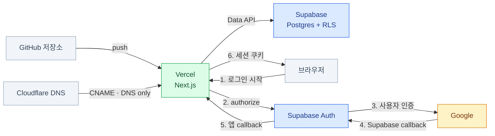

import { Steps, LinkCard } from '@astrojs/starlight/components';

> 첫 배포는 서버 하나를 올리는 일이 아니라 **서로 다른 제어판의 계약을 맞추는 일**이다

로컬에서 잘 되던 앱을 인터넷에 공개할 때는 코드만 배포되지 않는다. 데이터베이스 스키마,
브라우저에 공개할 키, OAuth 콜백, 실행 리전, DNS와 절대 URL 기준점까지 함께 옮겨야 한다.
이 장은 Next.js + Supabase 앱을 Vercel에 배포하고 Google 로그인과 Cloudflare DNS를 붙이는
한 번의 전체 흐름을 다룬다.

## 먼저 그릴 지도

다섯 시스템이 있지만 책임은 겹치지 않는다.

| 시스템 | 맡는 것 | 이 시스템에 넣지 않는 것 |
|---|---|---|
| GitHub | 코드와 마이그레이션 파일 | 운영 시크릿 |
| Supabase | Postgres·RLS·Storage·사용자 세션 | Google 동의 화면, 앱 빌드 |
| Google | 사용자 인증과 동의 | 앱의 최종 복귀 경로 허용 판단 |
| Vercel | Next.js 빌드·함수·프리뷰·TLS | 영속 데이터 |
| Cloudflare | 도메인의 DNS 레코드 | 이 구성에서는 앱 실행과 CDN |



순서를 바꾸면 되돌아갈 일이 생긴다. Supabase 프로젝트 참조 ID가 있어야 Google 콜백을 만들 수 있고,
최종 도메인이 생기면 Vercel 환경 변수와 Supabase Auth URL을 다시 고쳐야 한다.

## 가장 헷갈리는 것 — URL 세 종류

OAuth 설정 화면마다 `redirect`, `callback`, `site URL`이라는 비슷한 말을 쓴다.
주소를 외우지 말고 **누가 누구에게 돌려보내는가**로 구분한다.

| 설정 위치 | 예시 | 뜻 |
|---|---|---|
| Google의 승인된 리디렉션 URI | `https://<ref>.supabase.co/auth/v1/callback` | Google → **Supabase Auth** |
| Supabase Redirect URLs | `https://app.example.com/auth/callback` | Supabase Auth → **우리 앱** |
| Supabase Site URL | `https://app.example.com` | `redirectTo`가 없을 때의 기본 복귀점 |
| Vercel의 사이트 URL 환경 변수 | `https://app.example.com` | canonical·OG·sitemap 같은 **절대 URL의 기준점** |

:::caution[가장 흔한 오해]
Google의 승인된 리디렉션 URI에 우리 앱의 `/auth/callback`을 넣는 것이 아니다.
Google이 인증 결과를 주는 상대는 Supabase다. 우리 앱으로 돌아오는 주소는 그다음 단계인
Supabase Redirect URLs가 통제한다.
:::

## 의존 순서대로 배포하기

### 0. 콘솔을 열기 전에 코드를 준비한다

배포 버튼을 누르기 전에 다음이 코드에 있어야 한다.

- 필요한 환경 변수의 이름만 적은 `.env.example`과 누락 시 알아볼 수 있는 오류
- `supabase/migrations/` 아래 재현 가능한 스키마, RLS 정책, 함수와 Storage 설정
- `signInWithOAuth`가 가리키는 PKCE 콜백 라우트와 `exchangeCodeForSession`
- 로그인 후 `next` 값을 앱 내부 경로로만 제한하는 오픈 리디렉션 방어
- 요청의 실제 호스트를 쓰는 callback origin과 배포별 URL을 고려한 `metadataBase`
- 프로덕션에서 노출하면 안 되는 개발·프로토타입 라우트 차단
- 빈 프로덕션 DB에서도 깨지지 않는 홈과 탐색 화면

운영 키를 코드에 넣지 않는다. 브라우저에서 쓰는 publishable 키는 공개 전제지만,
secret/service-role 키와 DB 비밀번호는 공개 변수가 아니다.

### 1. Supabase Cloud에 상태를 먼저 만든다

<Steps>

1. 사용자의 위치보다 **DB를 호출하는 서버 함수와 가까운 리전**에 프로젝트를 만든다.
   리전은 나중에 바꾸기 어려우므로 먼저 결정한다.

2. 로컬 프로젝트를 연결하고 적용 대상을 미리 본다.

   ```bash
   supabase login
   supabase link --project-ref <project-ref>
   supabase migration list --linked
   supabase db push --linked --dry-run
   ```

3. 예상한 마이그레이션만 보이면 적용하고 다시 목록을 확인한다.

   ```bash
   supabase db push --linked
   supabase migration list --linked
   ```

4. Dashboard에서 테이블·함수·RLS·Storage 버킷을 확인한다. 마이그레이션 성공 메시지만으로
   애플리케이션에 필요한 모든 객체가 있다는 사실까지 증명되지는 않는다.

</Steps>

`db push`는 기본적으로 마이그레이션만 적용한다. 프로덕션에는 `--include-seed`를 붙이지 않는다.
로컬 테스트 계정과 약한 비밀번호가 들어 있는 seed라면 그대로 보안 사고가 된다. 운영 초기 데이터는
별도의 멱등한 스크립트나 관리자 흐름으로 만든다.

:::caution[멈춘 것처럼 보이는 `db push`]
CLI가 출력 없이 기다리면 네트워크 장애라고 단정하지 말고 DB 비밀번호 입력을 기다리는지 확인한다.
비밀번호는 gitignored 환경 파일이나 비밀번호 관리자로 다루고, 명령 기록에 평문으로 남기지 않는다.
:::

### 2. Google과 Supabase Auth를 잇는다

**Google Auth Platform**

1. 앱의 Audience를 정한다. 일반 Google 사용자를 받을 서비스는 **External**이다.
2. 테스트 중에는 실제로 로그인할 계정을 Test users에 넣는다. 공개 준비가 끝나면 Audience에서
   게시 상태를 전환한다.
3. 기본 신원 확인에 필요한 최소 scope만 쓴다. 현재 Supabase 가이드는 `openid`,
   `userinfo.email`, `userinfo.profile`을 요구한다. 다른 Google API scope를 습관처럼 더하지 않는다.
4. OAuth client 유형을 **Web application**으로 만들고 승인된 리디렉션 URI에 다음을 정확히 넣는다.

   ```text
   https://<project-ref>.supabase.co/auth/v1/callback
   ```

   scheme, 대소문자, 경로와 마지막 `/`까지 다르면 `redirect_uri_mismatch`가 난다.

`signInWithOAuth` 리디렉션만 쓰고 Google JS SDK나 One Tap을 쓰지 않는 앱은 브라우저가 Google SDK를
직접 호출하지 않는다. `timeline`은 그래서 승인된 JavaScript 원본을 비워도 동작했다. 현재 Supabase
가이드에 따라 앱 origin을 등록하더라도, 여기에 경로나 Supabase callback을 넣지는 않는다.

**Supabase Dashboard**

Authentication의 Google provider에 같은 Client ID와 Client Secret을 넣고 활성화한다.
화면에 표시되는 Callback URL이 Google에 등록한 값과 정확히 같은지 눈으로 대조한다.

URL Configuration은 다음처럼 나눈다.

```text
Site URL
https://app.example.com

Redirect URLs
https://app.example.com/auth/callback
https://*-<vercel-team-slug>.vercel.app/**
http://localhost:3000/**                  # 클라우드 Auth로 로컬 OAuth를 시험할 때만
```

프로덕션 콜백은 정확한 경로를 쓰고, `**` 와일드카드는 주소가 계속 바뀌는 프리뷰와 로컬에만 쓴다.
Vercel의 팀·계정 slug와 실제 프리뷰 URL 모양을 보고 패턴을 만든다.

### 3. Vercel에 실행 환경을 만든다

GitHub 저장소를 import하고 프레임워크가 올바르게 감지됐는지 확인한다. 빌드 설정은 실패 원인이
확실할 때만 바꾼다.

**환경 변수**

프로젝트가 쓰는 정확한 변수 이름을 기준으로 환경별 범위를 정한다.

| 값 | Production | Preview | Development | 공개 여부 |
|---|---:|---:|---:|---|
| Supabase Project URL | ✓ | ✓ | 필요에 따라 | 공개 |
| Supabase publishable/anon key | ✓ | ✓ | 필요에 따라 | 공개 전제 |
| 사이트 canonical URL | ✓ | — | — | 공개 |
| Supabase secret/service-role key | 앱이 정말 요구할 때만 | 보통 별도 값 | 보통 별도 값 | **비밀** |
| DB 비밀번호 | 마이그레이션 경로에만 | — | 로컬 CLI | **비밀** |

Next.js의 `NEXT_PUBLIC_` 값은 브라우저 번들에 들어간다. publishable 키에는 맞지만 secret 키에는
절대 붙이지 않는다. 사이트 URL은 Production에만 고정하고, Preview는 Vercel이 제공하는 배포 URL로
폴백하게 해야 OG와 callback이 현재 프리뷰를 가리킨다.

환경 변수를 추가하거나 바꾼 뒤에는 **새 배포가 필요하다.** 이미 만들어진 배포에는 소급되지 않는다.

**함수와 DB 리전**

함수는 사용자보다 데이터 소스에 가깝게 둔다. 정적 파일은 전 세계 CDN에 있지만, 서버 컴포넌트와
Route Handler가 DB를 세 번 순차 호출하면 함수↔DB 왕복도 세 번 발생한다.

```text
Supabase: ap-northeast-2 (Seoul)
Vercel Functions: icn1 (Seoul)
```

위 조합은 한국 서비스의 예다. Vercel Functions의 기본 리전은 `iad1`이므로 대시보드 기본값을
그대로 믿지 않는다. 배포 후 응답의 `x-vercel-id` 헤더나 함수 로그로 실제 리전을 확인한다.

### 4. Cloudflare DNS로 커스텀 도메인을 붙인다

<Steps>

1. **Vercel 프로젝트에 도메인을 먼저 추가한다.** Vercel이 프로젝트에 제시한 CNAME 대상을 복사한다.

2. Cloudflare DNS에 서브도메인 CNAME을 만든다.

   ```text
   Type: CNAME
   Name: app
   Target: <Vercel Domains 화면이 제시한 고유 대상>
   Proxy status: DNS only (회색 구름)
   ```

   위 예시는 서브도메인이다. 루트 도메인은 A 레코드나 CNAME flattening을 쓸 수 있으므로,
   레코드 값을 외워 쓰지 말고 현재 Vercel Domains 화면이 제시한 유형과 대상을 그대로 따른다.

3. Vercel Domains 화면이 `Valid Configuration`과 인증서 발급 완료를 표시할 때까지 확인한다.
   DNS 조회 결과도 Vercel이 제시한 대상과 맞는지 본다.

4. 새 도메인을 절대 URL의 기준으로 승격한다.

   - Vercel Production의 사이트 URL 환경 변수 변경 → **재배포**
   - Supabase Site URL 변경
   - Supabase의 정확한 프로덕션 `/auth/callback` Redirect URL 추가
   - Google Branding의 홈페이지·승인 도메인 갱신

5. 이전 `*.vercel.app` 프리뷰 패턴은 지우지 않는다. 프리뷰 로그인 검증에 계속 필요하다.

</Steps>

Cloudflare의 주황 구름은 DNS 기능이 아니라 Cloudflare가 HTTP 트래픽 중간에 들어오는 **리버스 프록시**다.
Vercel도 이미 CDN·TLS·보호 계층을 제공하므로 둘을 겹치면 인증서 검증, 실제 클라이언트 IP,
지역 판정과 캐시 무효화가 복잡해진다. Vercel도 외부 프록시 중첩을 권장하지 않으므로 이 구성은
DNS only로 시작한다. Cloudflare WAF 같은 명확한 요구가 생겨 프록시를 켜려면 Vercel의 프록시·ACME
요구와 Cloudflare SSL 모드를 별도 설계한다.

:::tip[도메인이 바뀌어도 그대로인 주소]
Supabase 기본 도메인을 쓰는 한 Google의 승인된 리디렉션 URI
`https://<ref>.supabase.co/auth/v1/callback`은 바뀌지 않는다. 바뀌는 것은 Supabase → 앱 복귀 주소와
앱이 생성하는 절대 URL이다.
:::

## 5. 배포 완료를 사용자 흐름으로 증명한다

시크릿 창과 두 개의 서로 다른 계정으로 확인한다.

| 영역 | 검증 |
|---|---|
| DNS·TLS | 커스텀 도메인 HTTPS 응답, Vercel 도메인 상태 |
| 실행 위치 | 동적 응답의 `x-vercel-id` 또는 함수 로그에서 DB와 가까운 리전 |
| 스키마 | 핵심 테이블·RPC·RLS·Storage 버킷 존재 |
| OAuth | Google 선택 → Supabase callback → 앱 callback → 세션 쿠키 → 보호 페이지 |
| 권한 | 사용자 A의 비공개 데이터를 사용자 B와 익명이 읽지 못함 |
| 파일 | 실제 브라우저 업로드와 다시 읽기, MIME·크기 정책 |
| 프리뷰 | 프리뷰 URL에서도 로그인 후 같은 프리뷰로 복귀 |
| 절대 URL | OG 이미지, canonical, `robots.txt`, `sitemap.xml`이 새 도메인 사용 |
| 운영 | 최초 관리자 승격, 초기 콘텐츠, 로그와 오류 확인 경로 |

페이지가 200이라는 사실은 Auth·RLS·Storage가 맞다는 증거가 아니다. 로컬에서 크롤러가 접근하지 못한
OG 카드나 실제 OAuth provider 흐름은 공개 URL에서 마지막으로 확인해야 한다.

## 증상으로 찾는 잘못된 제어판

| 증상 | 먼저 볼 곳 |
|---|---|
| Google의 `redirect_uri_mismatch` | Google OAuth client의 **Supabase callback** 정확성 |
| 로그인 후 localhost나 엉뚱한 앱으로 감 | Supabase Site URL과 코드의 `redirectTo` |
| 프로덕션만 되고 프리뷰 로그인 실패 | Supabase Redirect URLs의 Vercel 와일드카드 |
| `*.vercel.app`은 되는데 커스텀 도메인만 실패 | Cloudflare CNAME·proxy 상태, Vercel Domains |
| 커스텀 도메인에서 OAuth만 예전 주소로 복귀 | Supabase Site/Redirect URL, Vercel 사이트 URL 재배포 |
| 환경 변수를 바꿨는데 HTML·OG가 그대로 | 새 Vercel 배포를 만들었는지 |
| 배포 DB가 비어 있음 | 정상일 수 있다. `db push`는 seed를 자동 배포하지 않음 |
| 다른 사용자 데이터가 보임 | RLS 활성화·정책과 secret/service-role 사용 경로 |
| Cloudflare를 켠 뒤 redirect loop | Proxy 상태와 SSL mode. 우선 DNS only로 원인 격리 |

## 사례 — `timeline`의 첫 배포

[`mechurak/timeline` issue #8](https://github.com/mechurak/timeline/issues/8)은 이 순서를 실제로
진행하며 체크리스트와 막힌 지점을 함께 남긴 기록이다.

| 선택 | 결과와 이유 |
|---|---|
| Supabase `ap-northeast-2` + Vercel `icn1` | 순차 DB 왕복이 많은 앱이라 같은 도시에 배치 |
| 7개 migration만 `db push` | 로컬 seed 계정은 배포하지 않고 운영 DB를 빈 상태로 시작 |
| Google → Supabase → Next.js PKCE callback | callback 두 종류를 분리하고 세션을 쿠키에 저장 |
| `NEXT_PUBLIC_SITE_URL`은 Production만 | 프리뷰 OG와 OAuth가 프리뷰 주소를 유지 |
| Cloudflare CNAME, DNS only | `timeline.upggu.com`을 Vercel에 직접 연결 |
| 도메인 연결 뒤 재검증 | OG·robots/sitemap·OAuth 복귀가 새 도메인 기준으로 통과 |

이 사례의 프로젝트 ID, 환경 변수 이름, 관리자 SQL을 그대로 복사하지 않는다. 재사용할 것은
**의존 순서, URL의 소유자, 비밀의 경계, 리전 배치, 배포 후 검증표**다.

## 참고 자료

- [Supabase Database Migrations](https://supabase.com/docs/guides/deployment/database-migrations) — `link`, `db push`, 선택적 seed 배포
- [Supabase Login with Google](https://supabase.com/docs/guides/auth/social-login/auth-google) — Google callback, 최소 scope, PKCE callback
- [Supabase Redirect URLs](https://supabase.com/docs/guides/auth/redirect-urls) — Site URL, 정확한 프로덕션 URL과 Vercel 프리뷰 와일드카드
- [Google OAuth web server applications](https://developers.google.com/identity/protocols/oauth2/web-server) — 승인된 redirect URI의 정확한 일치 조건
- [Google Auth Platform Audience](https://support.google.com/cloud/answer/15549945) — External/Internal, Testing/In production과 test users
- [Vercel Regions](https://vercel.com/docs/regions) — 기본 `iad1`, `icn1`, 데이터 소스와 함수 리전 배치
- [Vercel Environment Variables](https://vercel.com/docs/environment-variables) — Production·Preview·Development 범위와 새 배포 적용
- [Vercel Custom Domain](https://vercel.com/docs/domains/set-up-custom-domain) — 외부 DNS에서 Vercel이 제시한 레코드 연결
- [Vercel의 외부 프록시 안내](https://vercel.com/kb/guide/can-i-use-a-proxy-on-top-of-my-vercel-deployment) — TLS 검증·IP·캐시·지원 범위의 주의점
- [Cloudflare Proxy status](https://developers.cloudflare.com/dns/proxy-status/) — Proxied와 DNS only의 실제 트래픽 차이
- [`timeline` issue #8](https://github.com/mechurak/timeline/issues/8) — 첫 배포 결정·실행·검증 기록

<LinkCard
  title="13. Next.js 실전 통합"
  description="Next.js App Router에서 Supabase Auth 세션과 서버·브라우저 클라이언트를 잇는다."
  href="/supabase/13-nextjs/"
/>
