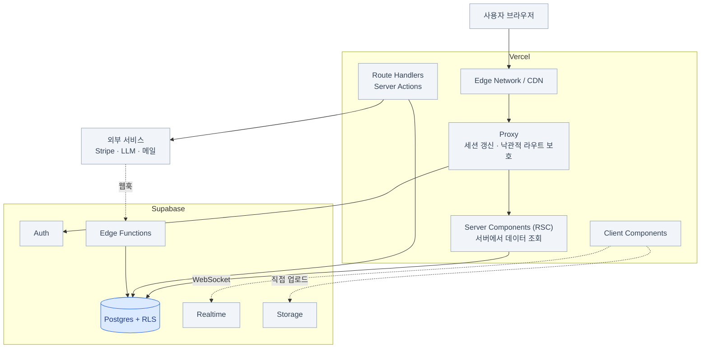
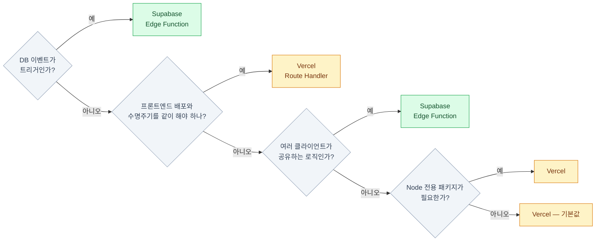
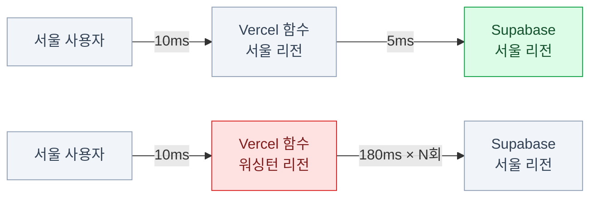
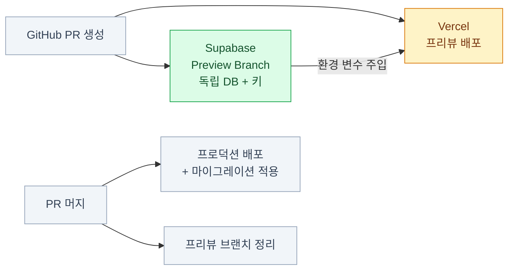
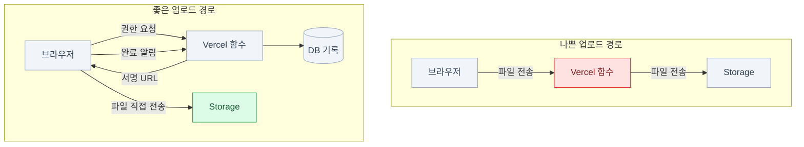

import { Tabs, TabItem, Card, CardGrid, LinkCard } from '@astrojs/starlight/components';

> Vercel은 지워도 데이터가 안 사라진다. Supabase를 지우면 사라진다

## 둘은 경쟁 관계가 아니다

두 회사 모두 "백엔드도 됩니다"라고 말하기 때문에 생기는 혼란이다.
Vercel에는 Functions, 파트너 Postgres/Redis, Blob, Cron이 있고,
Supabase에는 Edge Functions, Cron, Queues, Storage, Vector가 있다.

하지만 본질은 명확하게 다르다.

**Vercel은 코드를 실행하는 회사이고, Supabase는 상태를 보관하는 회사다.**

| Vercel = 실행 계층 | Supabase = 상태 계층 |
|---|---|
| 프론트엔드 빌드와 배포 | 데이터 (Postgres) |
| 렌더링 (SSR/SSG/ISR/스트리밍) | 사용자 신원 (Auth) |
| CDN과 엣지 캐싱 | 파일 (Storage) |
| 요청 단위로 짧게 사는 서버 코드 | 실시간 연결 (Realtime) |
| 프리뷰 배포와 팀 협업 | 권한 규칙 (RLS) |

표의 렌더링 약어는 **페이지를 언제 그리느냐**의 차이다 —
SSR(Server-Side Rendering)은 요청마다 서버에서, SSG(Static Site Generation)는 빌드 때 미리,
ISR(Incremental Static Regeneration)은 정적 페이지를 주기마다 다시 그린다.

:::tip[핵심]
**Vercel은 지워도 데이터가 안 사라진다. Supabase를 지우면 사라진다.**
이 비대칭이 모든 판단의 출발점이다.
:::

### 각자 잘하는 것

<CardGrid>
<Card title="Vercel" icon="rocket">
**프레임워크 통합** — Next.js를 만든 회사다. App Router, Server Components(RSC), 스트리밍이 최적화되어 있다.

**글로벌 CDN** — 정적 자산과 캐시된 페이지를 사용자 가까이에서 서빙.

**프리뷰 배포** — PR마다 고유 URL. 코드 리뷰의 절반이 여기서 끝난다.

**이미지 최적화 · Proxy · 관측성 · 빌드 파이프라인.**
</Card>
<Card title="Supabase" icon="seti:db">
**영속 데이터** — 관계형, 트랜잭션, 제약, 인덱스가 있는 진짜 데이터베이스.

**행 단위 권한(RLS)** — 접근 경로가 늘어나도 규칙은 한 곳에만 존재한다.

**완결된 인증** — 소셜, MFA, SSO, 세션 관리까지 제품으로 제공.

**상태 있는 연결(Realtime)** — WebSocket은 서버리스 함수가 잘 못 하는 영역이다.

**DB 내장 기능** — cron, 큐, 벡터 검색, 외부 데이터 연동.
</Card>
</CardGrid>

WebSocket과 영속 연결은 서버리스와 근본적으로 궁합이 나쁘다.
Realtime을 Supabase가 맡는 건 취향이 아니라 **구조적 필연**이다.

### 겹치는 영역 지도

| 기능 | Vercel | Supabase | 판단 |
|---|---|---|---|
| 서버 함수 | Route Handler / Server Action | Edge Functions | **상황에 따라** (아래에서 상세히) |
| 스케줄 작업 | Vercel Cron | pg_cron | DB 작업이면 Supabase |
| 큐 | Vercel Queues | pgmq | DB 트랜잭션과 묶이면 Supabase |
| 파일 저장 | Blob | Storage | **권한이 필요하면 Supabase** |
| KV 캐시 | 파트너 Redis | (Postgres/외부) | 세션 캐시는 Vercel 쪽 |
| 이미지 최적화 | `next/image` | Storage 변환 | **한 쪽만 쓴다** (중복 과금) |
| 인증 | (직접 구현) | Auth | **Supabase** |
| DB | 파트너 Postgres | Postgres | **Supabase** (통합 이점) |

:::caution[함정]
**원칙: 하나의 책임에 두 시스템을 동시에 쓰지 않는다.**
특히 이미지 최적화와 캐시가 그렇다 — 양쪽 다 켜두면 양쪽에 과금된다.
:::

## 표준 아키텍처와 요청 흐름



### 요청 흐름 3종

| 흐름 | 경로 | 장점 |
|---|---|---|
| **1. 서버 렌더링 조회** | 브라우저 → Vercel(RSC) → Supabase REST → Postgres(RLS) | 초기 로딩이 빠르고 SEO에 유리. 쿠키의 JWT가 그대로 전달된다 |
| **2. 클라이언트 직접 조회** | 브라우저 → Supabase REST → Postgres(RLS) | **Vercel을 아예 거치지 않는다.** 함수 실행 비용이 0 |
| **3. 서버 액션 / Route Handler** | 브라우저 → Vercel 함수 → (Supabase + 외부 API) | 시크릿을 쓸 수 있고 여러 작업을 조율할 수 있다 |

**세 가지를 다 쓰는 게 정상이다.** 하나로 통일하려 하지 말 것.
페이지 첫 화면은 1번, 무한 스크롤은 2번, 결제는 3번 — 이런 식으로 섞인다.

## 서버 로직을 어디에 둘까

### 결정 트리



**기본값은 Vercel이다.** 이미 그 레포에서 개발하고 배포하고 있기 때문이다.
Supabase Edge Function은 **"이유가 있을 때"** 선택한다.

### 비교표

| | Vercel Route Handler | Supabase Edge Function |
|---|---|---|
| 런타임 | Node.js 또는 Edge | Deno |
| 배포 단위 | **프론트엔드와 함께** | 독립 |
| 코드 위치 | 같은 레포, 같은 타입 | `supabase/functions/` |
| 타입 공유 | ○ (같은 프로젝트) | 별도 관리 필요 |
| DB 근접성 | 리전 설정에 따름 | 기본은 사용자 근접, **DB 작업이면 리전 지정 필요** |
| 프리뷰 배포 | **PR마다 자동** | 브랜치 연동 필요 |
| DB 웹훅 대상 | 가능하지만 우회적 | **자연스러움** |
| Node 패키지 | **전부 사용 가능** | 제한적 |
| 시크릿 관리 | Vercel 환경 변수 | `supabase secrets` |

### 사례별 배치

| 하는 일 | 배치 | 이유 |
|---|---|---|
| 상품 목록 페이지 렌더링 | **Vercel RSC** | 렌더링과 조회가 붙어 있다 |
| 무한 스크롤 추가 로딩 | **브라우저 → Supabase 직접** | Vercel 함수 비용 절약 |
| 결제 세션 생성 | **Vercel Route Handler** | Stripe 시크릿 + 프론트 흐름과 결합 |
| Stripe 웹훅 수신 | **Supabase Edge Function** | 프론트 배포와 무관하게 살아야 |
| 회원가입 시 프로필 생성 | **Postgres 트리거** | DB 안에서 원자적으로 |
| 가입 환영 메일 | **Supabase Edge Function** | DB 이벤트가 트리거 |
| 채팅 메시지 수신 | **Supabase Realtime** | WebSocket은 서버리스가 못 한다 |
| 이미지 업로드 | **브라우저 → Storage 직접** | Vercel 함수 본문 크기 제한 회피 |
| 야간 집계 배치 | **pg_cron** | DB 안에서 완결 |
| OG 이미지 생성 | **Vercel** | 프레임워크 기능 |

## 데이터 접근 경로 선택

<Tabs>
<TabItem label="Data API (PostgREST)">

```ts
supabase.from('posts').select()
```

- HTTP라서 **커넥션 풀 걱정이 없다**
- **RLS가 자동 적용**된다
- 브라우저에서도 동일하게 사용
- 복잡한 쿼리는 RPC로 내려간다

**적합한 곳:** 사용자가 자기 데이터를 다루는 모든 경로.

</TabItem>
<TabItem label="직접 연결 (Prisma/Drizzle)">

```ts
db.select().from(posts)
```

- 익숙한 ORM, 마이그레이션 도구
- 복잡한 쿼리와 트랜잭션이 자유롭다
- **Supavisor transaction 모드(`6543`) 필수**
- **RLS가 적용되지 않는다** (기본적으로)

**적합한 곳:** 관리자 도구, 배치, 복잡한 리포트.

</TabItem>
</Tabs>

:::caution[함정]
둘을 섞을 때는 "**어느 경로에는 RLS가 없다**"를 팀 전체가 알고 있어야 한다.
"Prisma로 짰는데 다른 사용자 데이터가 보여요"는 버그가 아니라 설계의 결과다.
:::

## 리전 · 캐싱 · 환경 변수 · 프리뷰

### 리전 배치



**함수와 DB가 멀면 왕복마다 대가를 치른다.** 한 페이지에 쿼리 5개면 5배로 곱해진다.

```json
{ "functions": { "app/api/**/*.ts": { "maxDuration": 30 } }, "regions": ["icn1"] }
```

**Edge 런타임은 사용자에게는 가깝지만 DB에서는 멀 수 있다.**
DB를 많이 읽는 라우트는 Node 런타임 + DB 리전이 낫다.
Supabase Edge Function도 기본은 사용자와 가까운 리전에서 실행되므로,
DB 왕복이 많은 함수는 호출할 때 Database 리전을 명시한다.

### 캐싱 역할 분담

| 담당 | 무엇을 |
|---|---|
| **Vercel** | 정적 자산과 빌드 결과물(CDN), ISR/`revalidate` 페이지 캐시, Data Cache와 태그 무효화 |
| **Supabase** | Storage 파일의 CDN 캐시(`cacheControl`), 이미지 변환 결과 캐시 |

:::caution[함정]
1. 사용자별로 다른 데이터(RLS 결과)를 **페이지 캐시에 넣으면 안 된다** — 다른 사람에게 노출된다
2. 인증이 필요한 라우트에는 동적 렌더링을 **명시**한다 ([13장](/supabase/13-nextjs/))
:::

### 환경 변수와 프리뷰 배포

```bash
# Vercel — 클라이언트에도 노출 (브라우저 번들 포함)
NEXT_PUBLIC_SUPABASE_URL=https://<ref>.supabase.co
NEXT_PUBLIC_SUPABASE_PUBLISHABLE_KEY=sb_publishable_xxx

# Vercel — 서버 전용
SUPABASE_SECRET_KEY=sb_secret_xxx
STRIPE_SECRET_KEY=sk_live_xxx
DATABASE_URL=postgres://...pooler.supabase.com:6543/postgres   # 직접 연결용

# Supabase — Edge Function 전용
supabase secrets set RESEND_API_KEY=re_xxx
```

**`NEXT_PUBLIC_` 접두사 = 공개**라고 외운다. 여기 secret이 들어가면 즉시 사고다.

Vercel과 Supabase를 잇는 방법은 두 가지다 —
**Vercel Marketplace 네이티브 통합**(리소스를 Vercel 안에서 관리, 통합 청구)과
**수동 연결**(Supabase에서 프로젝트를 만들고 키를 환경 변수에 붙여넣기).
팀이 이미 Supabase 대시보드를 쓰고 있다면 후자가 자연스럽다.

### 프리뷰 브랜치 매핑



- **각 PR이 자체 DB를 갖는다** — 스키마 변경을 안전하게 테스트할 수 있다
- 프리뷰 브랜치는 **데이터를 복사하지 않는다.** 시드 파일로 채워야 한다
- 프리뷰 브랜치는 시간당 과금된다 — 오래된 브랜치를 정리한다

### Redirect URL과 프리뷰 문제

프리뷰 배포에서 소셜 로그인이 깨지는 대표적 원인이다.
Vercel 프리뷰 URL은 배포마다 바뀌는데(`myapp-git-feat-x-team.vercel.app`),
Supabase의 Redirect URL 허용 목록에 없으면 로그인 후 리다이렉트가 거부된다.

```text
# 해결 1: 와일드카드 등록
https://*-myteam.vercel.app/**
https://myapp-*.vercel.app/**
```

```ts
// 해결 2: 콜백에서 원래 주소로 되돌리기
const origin = request.headers.get('origin')
const forwardedHost = request.headers.get('x-forwarded-host')   // Vercel이 붙여준다
const redirectBase = process.env.NODE_ENV === 'development'
  ? origin
  : `https://${forwardedHost}`
```

**해결 3:** 프리뷰에도 고정 도메인을 할당한다 (브랜치별 별칭 도메인).

### 실전 적용: `timeline` issue #8 첫 배포

[`mechurak/timeline`의 issue #8](https://github.com/mechurak/timeline/issues/8)은
로컬 Supabase와 Next.js 앱을 Supabase Cloud·Vercel·Google OAuth로 옮기는 사례다.
2026-08-13 기준 코드를 함께 보면 배포 전에 필요한 애플리케이션 작업은 이미 상당 부분 준비되어 있다.

| 코드에 준비된 것 | 배포 환경에서 남은 것 |
|---|---|
| `loginWithGoogle`과 PKCE `/auth/callback` | Google Cloud OAuth 클라이언트와 Supabase Google provider 등록 |
| `safeNextPath`로 오픈 리디렉션 차단 | Site URL과 프로덕션·프리뷰 Redirect URLs 등록 |
| 7개 DB 마이그레이션과 비공개 `item-images` 버킷 생성 SQL | 연결된 프로젝트에 마이그레이션 적용·검증 |
| 요청별 Supabase 서버 클라이언트와 Next.js Proxy | Vercel에 URL·publishable key·사이트 URL 주입 |
| 로컬 전용 seed 계정과 fixture | 운영자 계정 승격과 초기 공개 콘텐츠 생성 |

진행 순서는 다음처럼 잡는다.

1. **Supabase 프로젝트를 서울 리전에 만든다.** DB 비밀번호는 비밀번호 관리자에 보관한다.
2. **프로젝트를 연결하고 스키마만 먼저 올린다.**

   ```bash
   supabase login
   supabase link --project-ref <project-ref>
   supabase migration list --linked
   npx @dotenvx/dotenvx run -f .env.supabase -- supabase db push --linked --dry-run
   npx @dotenvx/dotenvx run -f .env.supabase -- supabase db push --linked
   supabase migration list --linked
   ```

   `.env.supabase`에는 `SUPABASE_DB_PASSWORD`만 두고 Git에서 제외한다.
   `--include-seed`는 사용하지 않는다. 이 프로젝트의 `seed.sql`에는 로컬 테스트 계정이 있기 때문이다.
   Storage 버킷 생성 SQL은 마이그레이션에 들어 있으므로 일반 `db push`에 포함된다.

3. **원격 상태를 확인한다.** Dashboard의 Table Editor·SQL Editor·Storage에서
   마이그레이션 이력, 앱 테이블과 RPC, 비공개 `item-images` 버킷을 확인한다.
   원격이 빈 데이터로 시작하는 것은 정상이다.
4. **호스팅 Auth를 설정한다.** Site URL은 최종 서비스 주소, Redirect URLs는
   프로덕션 `/auth/callback`과 Vercel 프리뷰 패턴으로 둔다. Google Cloud에는
   `https://<project-ref>.supabase.co/auth/v1/callback`을 등록하고 같은 Client ID·Secret을
   Supabase의 Google provider에 입력한다. 자세한 구분은 [6장](/supabase/06-auth/#소셜-로그인과-pkce)에 있다.
5. **Vercel 환경을 연결한다.** 이 저장소의 현재 변수 이름에 맞춰 다음을 설정한다.

   ```text
   NEXT_PUBLIC_SUPABASE_URL=https://<project-ref>.supabase.co
   NEXT_PUBLIC_SUPABASE_ANON_KEY=<publishable 또는 레거시 anon key>
   NEXT_PUBLIC_SITE_URL=https://<production-domain>  # Production에만
   ```

   `NEXT_PUBLIC_SUPABASE_ANON_KEY`라는 변수 이름을 쓰더라도 값은 공개 전제의 publishable/anon 키다.
   secret/service-role 키와 DB 비밀번호는 **Vercel 앱 런타임에** 넣지 않는다. Vercel 함수 리전은
   Supabase와 같은 서울 `icn1`로 맞춘다.
6. **첫 로그인을 운영 절차로 연결한다.** Google로 본인 계정을 먼저 생성해야
   `auth.users` 트리거가 `profiles` 행을 만든다. 그다음 SQL Editor에서 해당 프로필만
   운영자로 승격하고, 앱에서 초기 공개 콘텐츠를 만든다.
7. **시크릿 창에서 전체 흐름을 시험한다.** Google 가입 → `/me`, 이미지 업로드,
   공개·링크 공유, 신고와 관리자 처리, OG 카드, `robots.txt`와 `sitemap.xml`까지 확인한다.

:::caution[이 사례에서 바로 고칠 로컬 설정]
현재 `timeline/supabase/config.toml`의 `site_url`은 `http://127.0.0.1:3000`인데
`additional_redirect_urls`는 `https://127.0.0.1:3000`으로 프로토콜이 다르다.
로컬 Google OAuth를 시험하려면 이를 `http://127.0.0.1:3000/auth/callback` 또는 의도한
로컬 와일드카드로 맞추고 Supabase 로컬 스택을 재시작한다. 이 로컬 URL을 호스팅 프로젝트에
`config push`하지는 않는다.
:::

## 비용 관점의 판단

| Vercel의 비용 동인 | Supabase의 비용 동인 |
|---|---|
| 함수 실행 시간과 호출 수 | 컴퓨트 크기 (상시 과금) |
| 대역폭 (전송량) | 대역폭 (egress) |
| 이미지 최적화 횟수 | 스토리지 용량 |
| 빌드 시간 | MAU(Monthly Active Users — 월간 활성 사용자), 브랜치 시간 |

**돈이 되는 판단들** —

- **클라이언트에서 Supabase로 직접 조회**하면 Vercel 함수 비용이 0이다
- 반대로 **모든 조회를 RSC로 하면** Vercel 함수 실행 시간이 늘어난다
- 이미지 최적화는 **한 쪽에서만** 한다
- 파일은 브라우저에서 Storage로 **직접** 올린다 — Vercel 대역폭을 소비하지 않는다



나쁜 경로의 문제는 요청 본문 크기 제한, 함수 실행 시간 제한, **양쪽 대역폭 이중 과금**이다.
좋은 경로에서 서버는 **권한 판단과 기록만** 하고 바이트는 지나가지 않는다.

## Vercel 없이 쓰는 경우

Supabase는 Vercel 전용이 아니다.

- **Cloudflare Pages / Workers** — 엣지 실행, 저렴한 대역폭
- **Netlify** — Vercel과 유사한 모델
- **Fly.io / Railway / Render** — 상시 실행 서버.
  **커넥션 풀을 직접 관리**할 수 있어 ORM 직접 연결에 유리하다
- **모바일 앱** — 프론트엔드가 아예 없다. Supabase가 유일한 백엔드
- **정적 사이트 + 클라이언트 전용** — Astro/Vite SPA가 브라우저에서 직접 호출

**상시 실행 서버를 쓴다면** 서버리스 특유의 제약(커넥션 폭발, 콜드 스타트, WebSocket 불가)이 사라진다.
그 경우 Supabase를 "그냥 관리형 Postgres"로만 써도 충분히 합리적이다.

## 안티패턴

1. **모든 조회를 Vercel 함수로 프록시** — 지연 시간과 비용이 두 배
2. **secret key로 서버에서 전부 처리하고 RLS를 안 씀** — 권한 로직이 앱 코드로 흩어진다
3. **함수 리전과 DB 리전이 대륙 단위로 다름** — 가장 흔한 성능 문제
4. **Prisma 직접 연결에 RLS를 기대** — 적용되지 않는다
5. **프리뷰와 프로덕션이 같은 DB** — 프리뷰에서 프로덕션 데이터를 지운다
6. **프리뷰 URL을 Redirect 목록에 안 넣음** — 로그인 테스트가 불가능해진다
7. **파일을 Vercel 함수로 중계** — 크기 제한과 이중 과금
8. **`next/image`와 Storage 변환을 동시에** — 양쪽에 과금
9. **사용자별 데이터를 ISR 캐시에 저장** — 데이터 유출
10. **Direct host(`db.<ref>.supabase.co:5432`)로 서버리스 배포** — 커넥션 고갈

## 12장 요약

- **Vercel = 실행, Supabase = 상태.** 이 한 줄이 대부분의 판단을 해결한다
- 서버 로직의 **기본값은 Vercel**, DB 이벤트가 트리거이거나 프론트 배포와 분리돼야 하면 Supabase
- 사용자 데이터 CRUD는 **Data API + RLS**, 관리자·배치는 직접 연결
- **리전을 맞춘다.** 함수와 DB가 멀면 모든 쿼리에 세금이 붙는다
- 파일과 실시간은 **브라우저 ↔ Supabase 직접 연결**이 정답이다
- 프리뷰 환경은 **별도 브랜치**로 분리하고, Redirect URL 와일드카드를 잊지 않는다

## 참고 자료

- [Edge Function 리전 호출](https://supabase.com/docs/guides/functions/regional-invocation) — 사용자 근접 기본값과 Database 리전 지정
- [Supabase Branching](https://supabase.com/docs/guides/deployment/branching) — Preview/Persistent Branch와 데이터·키 격리
- [Supabase Redirect URLs](https://supabase.com/docs/guides/auth/redirect-urls) — Vercel 프리뷰 와일드카드와 정확한 프로덕션 콜백
- [Vercel Functions 리전](https://vercel.com/docs/functions/configuring-functions/region) — 함수와 데이터 소스의 리전 배치
- [`timeline` 배포 issue #8](https://github.com/mechurak/timeline/issues/8) — Supabase Cloud, Vercel, Google OAuth 첫 배포 체크리스트

<LinkCard
  title="13. Next.js 실전 통합"
  description="Next.js 16 App Router + @supabase/ssr — 클라이언트 4종, Proxy, 캐싱 함정."
  href="/supabase/13-nextjs/"
/>
