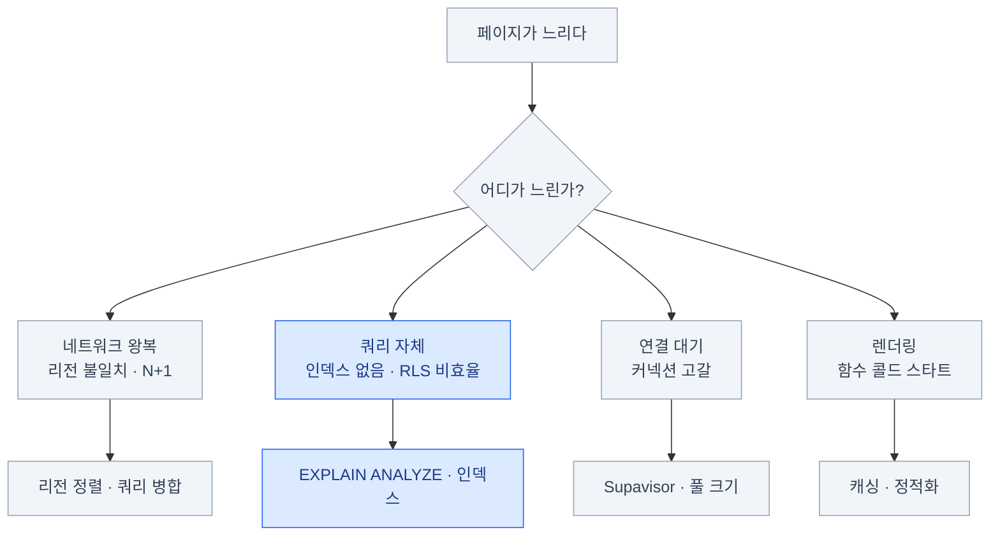

import { Tabs, TabItem, LinkCard } from '@astrojs/starlight/components';

> 컴퓨트를 키우기 전에 쿼리를 본다. 잘못된 쿼리는 인스턴스를 4배로 키워도 4배 느린 그대로다

## 성능 문제의 지도



**대부분은 쿼리다.** 그리고 그 대부분은 **인덱스 부재**다.

## 진단

### EXPLAIN ANALYZE

```sql
explain (analyze, buffers, format text)
select * from posts
where author_id = '8f3c1e2a-...' and published
order by created_at desc
limit 20;
```

```text
Limit  (cost=0.43..8.12 rows=20 width=128) (actual time=0.021..0.045 rows=20 loops=1)
  ->  Index Scan using posts_author_created_idx on posts
        (actual time=0.019..0.038 rows=20 loops=1)
        Index Cond: (author_id = '8f3c1e2a-...')
        Filter: published
Planning Time: 0.15 ms
Execution Time: 0.07 ms
```

볼 것 세 가지 —

- **`Seq Scan`이 큰 테이블에 나오면** → 인덱스가 없거나 안 쓰이고 있다
- **`rows` 추정치와 `actual rows`가 크게 다르면** → 통계가 낡았다 (`analyze` 실행)
- **`Execution Time`이 특정 노드에 몰려 있으면** 그게 범인이다

### 인덱스로 해결되는 것들

```sql
-- 조회 패턴을 그대로 반영한 복합 인덱스
create index posts_author_created_idx on posts (author_id, created_at desc);

-- 부분 인덱스 — 발행된 글만 조회한다면 훨씬 작다
create index posts_published_idx on posts (created_at desc) where published;

-- 커버링 인덱스 — 인덱스만 읽고 테이블을 안 봐도 되게
create index posts_list_idx on posts (author_id, created_at desc) include (title);
```

```sql
-- 사용되지 않는 인덱스 찾기
select relname, indexrelname, idx_scan
from pg_stat_user_indexes
where idx_scan = 0
order by relname;
```

쓰이지 않는 인덱스는 **쓰기를 느리게 하고 디스크만 차지한다.** 정기적으로 정리하자.

## RLS 성능 재점검

[7장](/supabase/07-rls/)에서 다뤘지만 성능 문제의 단골이므로 다시 짚는다.

```sql
create policy "조회"
  on public.notes
  for select
  to authenticated                              -- ① 역할 명시
  using ( (select auth.uid()) = user_id );      -- ② select로 감싸기

create index notes_user_id_idx on public.notes (user_id);   -- ③ 인덱스
```

- **① 역할 명시** — 대상이 아닌 역할은 정책 평가를 건너뛴다
- **② `(select ...)` 감싸기** — 행마다 재평가되지 않고 한 번만 계산된다
- **③ 인덱스** — 공식 벤치마크에서 가장 큰 개선폭이 보고된 항목

여기에 **클라이언트 쿼리의 명시적 필터**(`.eq('user_id', id)`)를 더하면 플래너가 더 잘 판단한다.

## N+1과 페이지네이션

```ts
// 나쁨: 글 20개 → 쿼리 21번
const { data: posts } = await supabase.from('posts').select('id, title, author_id')
for (const p of posts!) {
  const { data: author } = await supabase
    .from('profiles').select('username').eq('id', p.author_id).single()
}

// 좋음: 중첩 select로 한 번에
const { data } = await supabase
  .from('posts')
  .select('id, title, profiles ( username, avatar_url )')

// 또는: ID를 모아 한 번에
const ids = [...new Set(posts!.map(p => p.author_id))]
const { data: authors } = await supabase
  .from('profiles').select('id, username').in('id', ids)
```

:::caution[함정]
**서버리스에서 N+1은 특히 비싸다.** 각 왕복이 함수 실행 시간이고, 그게 곧 비용이다.
DB와 함수가 다른 리전이면 여기에 왕복 지연까지 곱해진다.
:::

```ts
// 오프셋: 100페이지째면 앞의 2000행을 세면서 건너뛴다
await supabase.from('posts').select().range(2000, 2019)

// 커서: 인덱스로 바로 점프한다. 깊이와 무관하게 일정한 속도
// c = 마지막 행의 { ts, id }. 정렬 키가 유일하지 않으니 (created_at, id) 복합 커서
await supabase.from('posts')
  .select()
  .or(`created_at.lt.${c.ts},and(created_at.eq.${c.ts},id.lt.${c.id})`)
  .order('created_at', { ascending: false })
  .order('id', { ascending: false })      // tie-breaker
  .limit(20)
```

- **무한 스크롤 = 커서**, **페이지 번호 UI = 오프셋**(깊이를 제한하자)
- 총 개수가 꼭 필요한가? `count: 'exact'`는 전체 스캔이다
- 정렬 키가 유일하지 않으면 **페이지 경계에서 행이 중복되거나 누락된다**

## 커넥션 관리

**증상:** `remaining connection slots are reserved` / 간헐적 타임아웃.
**원인:** 서버리스 함수가 direct connection(`5432`)을 각자 열고 있다.

```bash
# 서버리스/엣지: Supavisor transaction 모드
# 호스트는 aws-0-<region> 처럼 숫자 세그먼트가 붙는다 — 실제 값은 대시보드 Connect에서 복사
DATABASE_URL="postgres://postgres.<ref>:<pw>@aws-0-<region>.pooler.supabase.com:6543/postgres"
```

```ts
// Drizzle + postgres.js — transaction 모드에서는 prepared statement를 끈다
const client = postgres(process.env.DATABASE_URL!, { prepare: false, max: 1 })

// Prisma는 URL 끝에 ?pgbouncer=true&connection_limit=1 을 붙여 처리한다 — Prisma 전용 파라미터다
```

- **Data API(PostgREST)를 쓰면 이 문제 자체가 없다** — HTTP이기 때문이다
- 마이그레이션은 direct connection(`5432`)으로 — 풀러를 거치면 일부 DDL이 실패할 수 있다
- 현재 연결 상태: `select count(*), state from pg_stat_activity group by state;`

## 컴퓨트와 캐싱

| 인스턴스 | 대략의 성격 |
|---|---|
| **Free / Micro** | 학습·프로토타입. 프로덕션에는 여유가 없다 |
| **Small / Medium** | 소규모 프로덕션 |
| **Large 이상** | 트래픽이 있는 서비스 |
| **4XL~16XL** | 대규모 |

컴퓨트 크기가 곧 **메모리·CPU·최대 커넥션 수**를 결정한다.
Pro/Team 플랜은 월 $10 컴퓨트 크레딧을 포함한다(Micro 1개 분량).

:::caution[함정]
**컴퓨트를 키우기 전에 인덱스와 쿼리를 먼저 본다.**
잘못된 쿼리는 인스턴스를 4배로 키워도 4배 느린 그대로다.

그리고 디스크는 별도로 늘어난다 — **디스크가 꽉 차면 DB가 읽기 전용이 된다.** 알림을 걸어두자.
:::

캐싱은 네 층으로 나뉜다.

```ts
// 1. Next.js 캐시 (공개 데이터)
export const revalidate = 60

// 2. HTTP 캐시 (Storage / 공개 API)
await supabase.storage.from('avatars').upload(path, file, { cacheControl: '31536000' })
```

```sql
-- 3. 머티리얼라이즈드 뷰 (무거운 집계)
create materialized view daily_stats as select ...;
create unique index on daily_stats (day);   -- concurrently 갱신의 전제 조건
select cron.schedule('refresh', '*/10 * * * *',
  $$ refresh materialized view concurrently daily_stats $$);
```

4번째는 애플리케이션 캐시(Redis 등)다.

:::caution[함정]
**절대 캐시하면 안 되는 것: RLS로 필터링된 사용자별 데이터.**
공유 캐시에 들어가면 다른 사람에게 노출된다.
:::

## 비용 구조

### 무엇에 돈이 나가나

| Supabase 항목 | 성격 | 통제 방법 |
|---|---|---|
| 컴퓨트 | 시간당 상시 과금 | 적정 크기 선택 |
| **대역폭(egress)** | 전송량 비례 | **쿼리 최적화** |
| 디스크 | 용량 비례 | 오래된 데이터 정리 |
| 스토리지 | 용량 + 전송 | 고아 파일 정리, CDN 캐시 |
| MAU | 활성 사용자 수 | 통제 어려움 |
| 브랜치 | 시간당 | 오래된 브랜치 정리 |

Vercel 쪽은 함수 실행 시간, 호출 수, 대역폭, 이미지 최적화, 빌드 시간이다.

### 대역폭이 조용한 킬러

`select('*')` 하나가 만드는 차이 —

```ts
// 100만 행 × 2KB = 2GB 전송
await supabase.from('posts').select('*')

// 100만 행 × 100B = 100MB 전송 (20배 차이)
await supabase.from('posts').select('id, title')
```

**대역폭을 줄이는 실전 방법**

1. **필요한 컬럼만 select** — 가장 효과가 크다
2. 큰 `text`/`jsonb` 컬럼을 목록 조회에서 제외 (상세 조회에서만)
3. 페이지 크기를 줄인다 (`limit`)
4. 이미지는 **변환된 크기**로 서빙 (원본을 그대로 내려주지 않는다)
5. Storage에 긴 `cacheControl` — CDN 히트는 대역폭에 안 잡힌다
6. Realtime에서 `select`로 컬럼 축소, `filter`로 이벤트 축소

### 절감 체크리스트

- [ ] `select('*')`를 목록 조회에서 제거했는가
- [ ] `count: 'exact'`를 꼭 필요한 곳에만 쓰는가
- [ ] 이미지 최적화를 **한 쪽에서만** 하는가 (Vercel 또는 Supabase)
- [ ] 파일 업로드가 Vercel 함수를 통과하지 않는가
- [ ] 클라이언트에서 직접 조회할 수 있는 것을 RSC로 프록시하고 있지 않은가
- [ ] 사용하지 않는 프리뷰 브랜치를 정리했는가
- [ ] 오래된 로그·이벤트 테이블에 정리 배치(pg_cron)가 있는가
- [ ] 고아 Storage 파일을 정리하는가
- [ ] Realtime 구독이 필요한 테이블·컬럼만 대상으로 하는가
- [ ] 개발용 프로젝트가 유료 플랜에 방치되어 있지 않은가

## 확장 한계

**Supabase(Postgres)의 구조적 한계**

- **쓰기는 단일 프라이머리**다. 쓰기 확장은 수직 확장(더 큰 인스턴스)이 기본
- Postgres Changes는 구독자 수에 비례해 부하가 는다 (약 3,000 동시 구독이 전환 기준)
- Edge Function은 실행 시간 제한이 있다 — 장시간 작업에 부적합
- 멀티 리전 쓰기는 지원되지 않는다 (읽기 복제본은 별도)

:::tip[핵심]
**하지만 오해하지 말 것:** 잘 튜닝된 단일 Postgres는 생각보다 훨씬 멀리 간다.
대부분의 서비스는 **한계에 닿기 전에 잘못된 쿼리로 먼저 죽는다.**
:::

### 읽기 부하 분산

<Tabs>
<TabItem label="순서를 지킨다">

1. **쿼리 최적화** — 인덱스, N+1 제거, 필요한 컬럼만
2. **캐싱** — Next.js 캐시, 머티리얼라이즈드 뷰, CDN
3. **Read Replica** — 읽기 전용 복제본을 추가 (유료 애드온)
4. **데이터 분리** — 시계열·로그성 데이터를 별도 저장소로

1단계를 건너뛰고 3단계로 가면 **비싼 인스턴스 두 대가 똑같이 느려진다.**

Read Replica는 **복제 지연**이 있으므로
"방금 쓴 것을 바로 읽는" 경로에는 쓰지 않는다.

</TabItem>
<TabItem label="쓰기 부하 대응">

```ts
// 배치 삽입 — 1000번의 요청 대신 1번
await supabase.from('events').insert(batchOfRows)
```

- **큐를 통한 완충** — pgmq에 넣고 워커가 천천히 처리
- **파티셔닝** — 시계열 테이블을 월 단위로 나눠 오래된 파티션을 통째로 삭제
- **불필요한 쓰기 제거** — 조회수 카운터를 매 요청마다 `update`하지 않는다
- **인덱스 다이어트** — 인덱스가 많을수록 쓰기가 느리다

</TabItem>
</Tabs>

### 언제 벗어나야 하나

**부분 이탈(권장)** — 로그·이벤트는 전용 분석 저장소로, 전문 검색은 검색 엔진으로,
대용량 미디어는 전용 CDN으로. **핵심 트랜잭션 데이터는 Postgres에 남긴다.**

**전체 이탈(드묾)** — 쓰기가 단일 Postgres 한계를 넘거나,
멀티 리전 쓰기가 필수거나, 규제상 셀프호스팅이 필수일 때.

전체 이탈이 필요하더라도 **`pg_dump`로 나갈 수 있다**는 게 [1장](/supabase/01-why/)에서 말한 가치다.
그리고 셀프호스팅은 "이탈"이 아니라 같은 스택의 다른 운영 형태다.

## 15장 요약

- 성능 문제의 대부분은 **인덱스 부재**다. `explain analyze`로 확인하고 인덱스를 만든다
- RLS 기본형: **역할 명시 + `(select auth.uid())` + 인덱스**
- 서버리스면 **Supavisor transaction(`6543`)**, Data API를 쓰면 이 고민이 없다
- 비용의 조용한 킬러는 **대역폭**이다 — `select('*')`를 없애는 것만으로 크게 준다
- **컴퓨트를 키우기 전에 쿼리를 본다**
- 한계는 실재하지만, **대부분의 서비스는 그 근처에도 못 간다**

<LinkCard
  title="16. 실전 패턴과 안티패턴"
  description="배운 것을 조합하기 — 멀티테넌트, 채팅, 결제, RAG, 그리고 안티패턴 총정리."
  href="/supabase/16-patterns/"
/>
