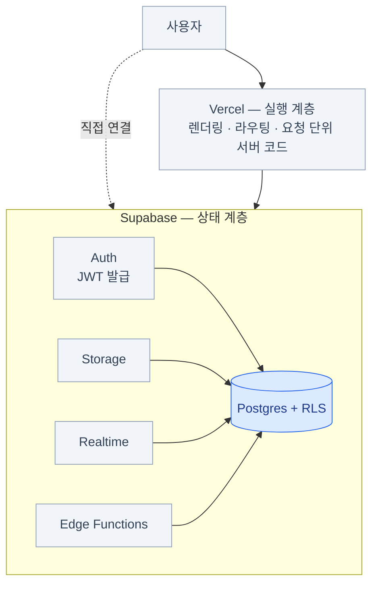

import { Steps, Card, CardGrid, LinkCard } from '@astrojs/starlight/components';

> 위임한다는 건 책임이 사라지는 게 아니라 위치가 바뀌는 것이다

## 전체 그림 되짚기

**한 문장:** Auth가 발급한 JWT를 Postgres의 RLS가 해석해서 행 단위로 접근을 판정한다.
나머지는 전부 그 위에 얹힌 편의 기능이다.

## 꼭 기억할 10가지

1. **Supabase를 배우는 건 Postgres를 배우는 것이다**
2. **테이블 생성과 `enable row level security`는 한 세트다**
3. `publishable key`는 공개해도 되고, **`secret key`는 절대 안 된다**
4. `auth.uid()`는 **JWT의 `sub`** 이고, RLS의 입력이다
5. `user_metadata`는 사용자가 고칠 수 있다 — **권한 판단에 쓰지 않는다**
6. **RLS 성능 3종:** 역할 명시 · `(select auth.uid())` · 인덱스
7. **Vercel은 실행, Supabase는 상태.** 리전은 맞춘다
8. 스키마의 진실은 **`supabase/migrations/`**, 대시보드가 아니다
9. 서버에서 신원 확인은 **`getClaims()`**, `getSession()`은 신뢰하지 않는다
10. **원자성이 필요하면 RPC로 묶는다**

## 장별 한 줄 요약

| 장 | 한 줄 |
|---|---|
| [1](/supabase/01-why/) 왜 Supabase | BaaS는 포장이고 알맹이는 **Postgres**다. 나갈 길이 있다는 게 차별점 |
| [2](/supabase/02-architecture/) 아키텍처 | 모든 부품이 **하나의 Postgres**를 공유한다. 키는 두 개면 된다 |
| [3](/supabase/03-start/) 시작하기 | 대시보드는 탐색용. 진실은 `migrations/`. `db reset`이 통과해야 커밋 |
| [4](/supabase/04-postgres/) Postgres | `profiles` 패턴 · `timestamptz` · **외래 키에는 인덱스를 직접** |
| [5](/supabase/05-data-api/) Data API | SQL이 아니라 **HTTP**다. 경계를 넘으면 뷰 또는 RPC |
| [6](/supabase/06-auth/) Auth | JWT를 발급한다. **`app_metadata`만 권한 판단에 쓴다** |
| [7](/supabase/07-rls/) RLS | 자동으로 붙는 **WHERE 절**. `using`(기존 행) / `with check`(새 값) |
| [8](/supabase/08-storage/) Storage | 파일도 테이블이다. **경로 설계가 곧 권한 설계** |
| [9](/supabase/09-realtime/) Realtime | 셋이다. 규모가 커지면 **Broadcast from Database**로 |
| [10](/supabase/10-edge-functions/) Edge Functions | 시크릿이 필요한 코드의 자리. **함수 URL은 공개되어 있다** |
| [11](/supabase/11-extensions/) 확장 | 인프라를 늘리지 않고 기능이 는다. pgvector · pg_cron · pgmq |
| [12](/supabase/12-vercel/) 역할 배분 | **Vercel은 실행, Supabase는 상태.** 리전을 맞춘다 |
| [13](/supabase/13-nextjs/) Next.js | `@supabase/ssr` + 클라이언트 4종. Proxy는 UX, 방어선은 RLS |
| [14](/supabase/14-ops/) 운영 | `db reset`이 재현성을 보증한다. **복구해 본 적 있어야 백업** |
| [15](/supabase/15-perf-cost/) 성능·비용 | 인덱스가 대부분을 푼다. 조용한 킬러는 **대역폭** |
| [16](/supabase/16-patterns/) 실전 패턴 | 헬퍼 함수로 정책을 추출한다. 웹훅은 멱등하게 |

## 첫 프로젝트 시작 순서

<Steps>

1. `supabase init` → `supabase start` — **로컬 스택부터 띄운다**

2. 첫 마이그레이션에 **`profiles` 테이블 + 트리거 + RLS**를 작성한다

3. `supabase db reset`으로 재현성 확인

4. `supabase gen types typescript --local`을 `package.json` 스크립트로 등록

5. Next.js에 `@supabase/ssr` 클라이언트 4종(브라우저/서버/Proxy/관리자) 세팅

6. **로그인 → 보호된 페이지 → 데이터 CRUD** 한 사이클을 끝까지 만들어 본다

7. 원격 프로젝트 생성 → `supabase link` → CI에서 `db push`

8. Vercel 연결, 환경 변수 3종 세팅, Redirect URL 등록

9. **Security Advisor 경고 0개** 확인

10. 배포

</Steps>

6번을 건너뛰고 기능을 넓히지 말 것. 한 사이클이 완결되면 나머지는 반복이다.

## 학습 로드맵

<CardGrid>
<Card title="1주차 — 감 잡기" icon="rocket">
프로젝트 생성, 테이블 만들기, `supabase-js`로 CRUD,
이메일 로그인, RLS 기본 정책 4종.

→ [1](/supabase/01-why/)–[7장](/supabase/07-rls/)
</Card>
<Card title="1개월차 — 실전 구조" icon="setting">
로컬 개발 + 마이그레이션 흐름 정착, Next.js SSR 통합,
Storage, Realtime, Edge Function 하나 배포, CI 구성.

→ [8](/supabase/08-storage/)–[14장](/supabase/14-ops/)
</Card>
<Card title="3개월차 — 운영 감각" icon="approve-check">
`explain analyze`로 쿼리 튜닝, RLS 성능 최적화, 브랜칭 워크플로,
비용 모니터링, 백업·복구 리허설, 멀티테넌트 설계.

→ [15](/supabase/15-perf-cost/)–[16장](/supabase/16-patterns/) + 실제 트래픽 경험
</Card>
</CardGrid>

## 자주 받는 질문

**Prisma나 Drizzle을 같이 써도 되나?**
된다. 다만 직접 연결에는 RLS가 적용되지 않으니, **서버 전용 경로**로 한정하고
사용자 데이터 접근은 Data API로 하는 조합이 안전하다.

**RLS가 너무 어렵다. 그냥 서버에서 처리하면 안 되나?**
가능하다. 하지만 그러면 **모든 접근 경로에 검증 코드를 복제**해야 한다.
경로가 하나뿐(서버 API만)이라면 합리적인 선택일 수 있다.

**Free 플랜으로 서비스를 운영해도 되나?**
1주일 비활동 시 일시정지되고 자동 백업이 없다. **실사용자가 있으면 최소 Pro**를 권한다.

**셀프호스팅이 현실적인가?**
가능하지만 Postgres 운영 경험이 필요하다. 대부분의 팀에는 관리형이 더 저렴하다.

## 참고 자료

<CardGrid>
<Card title="공식" icon="open-book">
[supabase.com/docs](https://supabase.com/docs) — 이 문서의 기준

[supabase.com/blog](https://supabase.com/blog) — 신기능·릴리스

[github.com/supabase/supabase](https://github.com/supabase/supabase)

Discord / GitHub Discussions
</Card>
<Card title="같이 보면 좋은 것" icon="document">
**[PostgREST 문서](https://postgrest.org/en/stable/)** — Data API의 실체를 이해하는 데 도움된다

**[Postgres 공식 문서](https://www.postgresql.org/docs/current/)** — RLS, 인덱스, `explain` 부분

**[Next.js 문서](https://nextjs.org/docs/app)** — App Router의 캐싱과 동적 렌더링
</Card>
</CardGrid>

:::caution[함정]
Supabase도 빠르게 움직인다. API 키 형식, 호스팅 게이트웨이, SSR 패키지가 최근 몇 년 사이 바뀌었다.
**검색으로 찾은 글의 날짜를 먼저 본다** — [0장의 대조표](/supabase/00-intro/#2026년-8월-기준--바뀐-것들)를 기준으로.
:::

## 마지막으로

Supabase의 가치는 "백엔드를 안 만들어도 된다"가 아니라
"**백엔드의 반복되는 부분을 데이터베이스에 위임하고 정말 중요한 로직에 집중할 수 있다**"는 데 있다.

- 위임한다는 건 **책임이 사라지는 게 아니라 위치가 바뀌는 것**이다
- 그 새 위치가 **RLS 정책과 마이그레이션 파일**이다

:::tip[핵심]
그러니 테이블을 만들 때마다 물어보자 —
**"이 데이터는 누가 볼 수 있는가?"**

이 질문에 SQL 한 줄로 답할 수 있다면, 이 문서의 목적은 달성된 것이다.
:::

<LinkCard
  title="개요로 돌아가기"
  description="전체 구성과 읽는 법을 다시 본다."
  href="/supabase/"
/>
