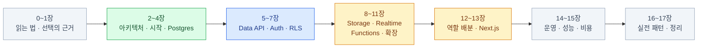

import { Card, CardGrid, LinkCard } from '@astrojs/starlight/components';

> 새 API를 배우는 게 아니라, 이미 있는 데이터베이스를 네트워크 너머로 안전하게 여는 법을 배운다

웹 개발 경험은 있지만 Supabase는 처음인 사람,
Firebase나 직접 만든 Express/Nest 백엔드를 써봐서 비교 지점이 보이는 사람,
Next.js와 Vercel 조합을 쓰고 있거나 쓸 계획인 사람을 위한 자료다.

**공식 문서(supabase.com/docs) 2026년 8월 기준**으로 쓰였다.
SQL을 아주 잘 알 필요는 없다 — 필요한 만큼은 [4장](/supabase/04-postgres/)에서 다시 짚는다.

## 구성

Supabase는 제품이 많아 보이지만, 실제로는 **Postgres 한 대와 그 위에 얹힌 서버들**이다.
그래서 순서도 "데이터베이스에서 바깥으로" 나가는 방향을 따른다.

| 장 | 주제 | 층 |
|---|---|---|
| [0](/supabase/00-intro/)–[1](/supabase/01-why/) | 읽는 법 · 왜 Supabase인가 | — |
| [2](/supabase/02-architecture/)–[4](/supabase/04-postgres/) | 아키텍처 · 로컬 개발 환경 · Postgres 최소 지식 | 기반 |
| [5](/supabase/05-data-api/)–[7](/supabase/07-rls/) | Data API · Auth · RLS | **핵심** |
| [8](/supabase/08-storage/)–[11](/supabase/11-extensions/) | Storage · Realtime · Edge Functions · 확장 | 주변 제품 |
| [12](/supabase/12-vercel/)–[13](/supabase/13-nextjs/) | Vercel과의 역할 배분 · Next.js 통합 | 애플리케이션 |
| [14](/supabase/14-ops/)–[15](/supabase/15-perf-cost/) | 마이그레이션 · 브랜칭 · 성능 · 비용 | 운영 |
| [16](/supabase/16-patterns/)–[17](/supabase/17-wrapup/) | 실전 패턴 · 안티패턴 · 정리 | — |

## 전체를 관통하는 한 문장

이 문서에는 처음부터 끝까지 따라다니는 문장이 하나 있다 —

**Auth가 발급한 JWT를 Postgres의 RLS가 해석해서 행 단위로 접근을 판정한다.**

나머지는 전부 그 위에 얹힌 편의 기능이다.
Storage의 파일 권한도, Realtime의 구독 권한도, GraphQL 엔드포인트도 같은 판정을 거친다.
그래서 [6장(Auth)](/supabase/06-auth/)과 [7장(RLS)](/supabase/07-rls/)을 이어서 읽으면
Supabase의 절반은 끝난다.

여기서 나오는 가장 큰 사고방식의 전환은 이것이다 —
`if (user.id !== post.authorId) throw` 같은 **애플리케이션 코드가 SQL 정책으로 내려간다.**

## 읽는 법

<CardGrid>
<Card title="표시 약속" icon="information">
`:::tip` 박스는 **핵심 원칙**,
`:::caution` 박스는 **자주 겪는 함정**이다.
</Card>
<Card title="가장 중요한 세 장" icon="star">
[7장 RLS](/supabase/07-rls/) ·
[12장 역할 배분](/supabase/12-vercel/) ·
[14장 운영](/supabase/14-ops/).
급하면 이 셋만 읽어도 된다.
</Card>
<Card title="손을 움직일 것" icon="rocket">
Docker와 Supabase CLI를 깔고 `supabase start`로
로컬 스택을 하나 띄워둔 상태를 전제로 쓰였다.
Free 플랜만으로도 거의 전부 실습할 수 있다.
</Card>
<Card title="다루지 않는 것" icon="close">
Postgres 튜닝 심화(vacuum, WAL 파라미터),
셀프호스팅 운영, 모바일 SDK 상세.
AI/벡터는 "이런 게 있다" 수준까지만.
</Card>
</CardGrid>

:::caution[함정]
검색으로 찾은 글이 `anon key` · `service_role key`(JWT 형태) · `Kong` 게이트웨이 ·
`@supabase/auth-helpers-nextjs` · `getSession()`으로 서버 권한 판단을 쓰고 있다면
**한 세대 이전 자료**다. 동작은 하지만 새로 배울 것은 그쪽이 아니다 —
[0장의 대조표](/supabase/00-intro/#2026년-8월-기준--바뀐-것들)를 먼저 볼 것.
:::

<LinkCard
  title="0. 시작하기 전에"
  description="이 문서를 어떻게 읽을 것인가 — 대상 독자, 미리 잡아둘 멘탈 모델, 실습 환경 준비."
  href="/supabase/00-intro/"
/>
