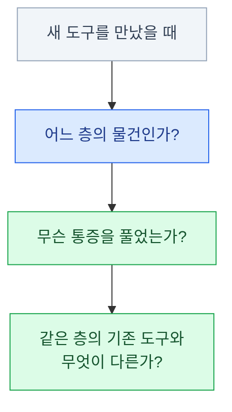

import { Card, CardGrid, LinkCard } from '@astrojs/starlight/components';
import TermIntro from '../../../components/docs/TermIntro.astro';

> 웹 개발이 어려운 이유의 절반은 기술이 아니라 **단어의 홍수**다

<TermIntro
  terms={[
    ['스택', 'Tech Stack', '한 서비스를 만드는 데 쓰이는 기술들의 묶음. "Next.js + Supabase + Vercel"처럼 층층이 쌓인다고 해서 스택(더미)이라 부른다.'],
    ['프레임워크', 'Framework', '앱의 뼈대를 미리 짜 놓은 것. 내 코드가 프레임워크를 호출하는 게 아니라 **프레임워크가 내 코드를 호출한다** — 라이브러리와의 차이가 이것이다.'],
    ['도구 사슬', 'Toolchain', '코드를 작성해서 실행 가능한 결과물로 만들기까지 거치는 도구들의 연쇄. 패키지 매니저 → 컴파일러 → 번들러 → … 이 덱 4~7장의 주제다.'],
  ]}
/>

## 이 덱은 누구를 위한 것인가

- 프로그래밍은 할 줄 아는데 **웹 생태계의 지도가 없는** 사람 — 백엔드·임베디드·타 언어 출신 포함
- 튜토리얼은 따라 했지만 `package.json`, `vite.config.ts`, `pnpm-lock.yaml`이
  각각 **무슨 역할인지 설명하라면 막히는** 사람
- "왜 npm 말고 pnpm을 쓰라는 거지?", "Vite가 뭐길래 다들 그 위에 얹혀 있지?" 같은
  **왜 질문이 쌓여 있는** 사람

전제하지 않는 것: 웹 개발 경험, 프론트엔드 지식.
전제하는 것: 아무 언어로든 프로그램을 짜 봤고, 터미널을 무서워하지 않는다.

### 다루는 것과 다루지 않는 것

<CardGrid>
<Card title="다룬다" icon="approve-check">
브라우저에 주소를 치면 일어나는 일 전부.
요즘 많이 쓰이는 스택과 **각 도구가 풀려던 문제**.
JavaScript 프로젝트의 도구 사슬 — 런타임 · 패키지 매니저 · 번들러 · Vite.
코드 품질 장치와 모노레포.
배포의 형태들과 그 트레이드오프.
</Card>
<Card title="다루지 않는다" icon="close">
HTML/CSS/JavaScript 문법.
특정 프레임워크의 사용법 (→ [프론트엔드 덱](/frontend/)).
DB 설계와 인증 구현 (→ [Supabase 덱](/supabase/)).
UI 컴포넌트와 테마 (→ [shadcn/ui 덱](/shadcn/)).
네트워크 프로토콜 심화 (HTTP/3, TCP 튜닝).
</Card>
</CardGrid>

## 미리 잡아두면 좋은 멘탈 모델

### 1. 웹은 "요청과 응답"의 연쇄다

아무리 화려한 서비스도 결국 **브라우저가 무언가를 요청하고, 어딘가가 응답하는 일**의
반복이다. 그 "어딘가"가 CDN인지, 서버인지, DB까지 내려가는지가 속도와 비용을 결정한다.
1장에서 이 길을 끝까지 따라간다.

### 2. 도구는 통증에서 나온다

웹 생태계의 도구가 유난히 많고 자주 바뀌는 건 사실이다. 하지만 살아남은 도구는
전부 **실제로 아팠던 문제**를 풀었기 때문에 살아남았다.
"또 새 도구야?"가 아니라 "이번엔 무슨 통증을 풀었대?"로 물으면 피로가 줄어든다.

### 3. 층을 구분하면 절반은 끝난다

React와 Next.js는 경쟁 관계가 아니고, Vite와 pnpm은 서로 대체재가 아니다.
각 도구는 **자기 층**이 있다 — UI 라이브러리 / 프레임워크 / 번들러 / 패키지 매니저 / 런타임.
비교는 같은 층 안에서만 성립한다. 3장의 지형도가 이 층을 그린다.

:::tip[핵심]
이 세 질문 — **어느 층인가, 무슨 통증인가, 무엇이 다른가** — 만 습관이 되면
내년에 어떤 도구가 나와도 지도의 빈칸을 채우듯 배울 수 있다.
:::

## 이 덱의 기준 시점

**2026년 8월** 기준이다. 이 생태계에서는 기준 시점이 없는 글은 못 믿는다.

| 항목 | 지금 | 낡은 정보 (검색 결과에 많이 남아 있음) |
|---|---|---|
| Node.js | **24 LTS** (26이 10월에 LTS 예정) | 16/18 기준 글 |
| 패키지 매니저 | 이 덱의 권장 기본값은 **pnpm 11** | "yarn이 npm보다 빠르다" 논쟁 |
| 빌드 도구 | **Vite 8** — Rolldown(Rust) 기본 | webpack 설정 튜토리얼 |
| 린트/포맷 | ESLint 10 + Prettier, **Biome 2**도 선택지 | `.eslintrc` (ESLint 10에서 제거) |
| 타입 | **TypeScript 6**가 기본 선택 | "TS 도입할까 말까" 논쟁 |

:::caution[함정]
웹 개발 자료의 유통기한은 짧다. 튜토리얼을 볼 땐 **작성 시점부터 확인**하는 습관을 들인다.
2~3년 전 글이면 명령어 하나하나가 지금과 다를 수 있다.
:::

## 0장 요약

- 대상은 **프로그래밍은 아는데 웹 생태계 지도가 없는 사람**이다
- 멘탈 모델 셋: **요청과 응답의 연쇄 / 도구는 통증에서 / 층을 구분하라**
- 새 도구를 만나면 묻는다 — 어느 층인가, 무슨 통증을 풀었는가, 기존 것과 무엇이 다른가
- 기준 시점은 2026년 8월. 자료를 볼 땐 작성 시점부터 확인한다

## 참고 자료

- [Node.js 릴리스 현황](https://nodejs.org/en/about/previous-releases) — Node 24 LTS와 Node 26 Current 상태
- [Vite 8 발표](https://vite.dev/blog/announcing-vite8) — Rolldown 통합과 지원 Node 버전
- [ESLint 10 발표](https://eslint.org/blog/2026/02/eslint-v10.0.0-released/) — flat config 전환과 구 설정 제거
- [TypeScript 6.0 릴리스 노트](https://www.typescriptlang.org/docs/handbook/release-notes/typescript-6-0.html) — 현재 타입스크립트 기준

<LinkCard
  title="1. 요청의 일생"
  description="브라우저에 주소를 입력하면 응답이 오기까지 — 웹 전체를 한 장에 담는 그림."
  href="/web/01-request/"
/>
