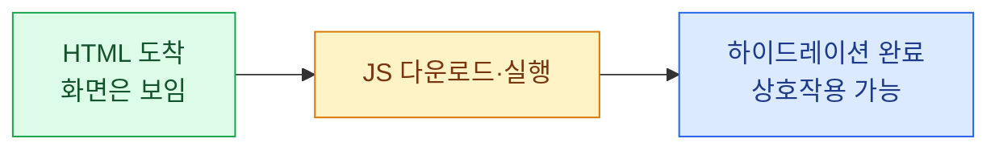
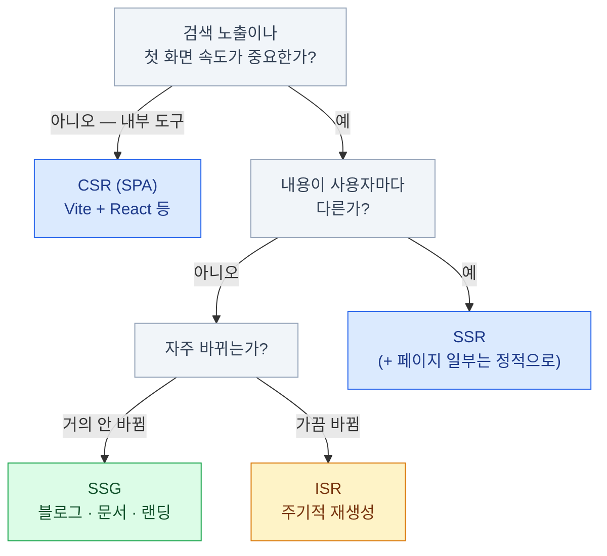

import { Tabs, TabItem, LinkCard } from '@astrojs/starlight/components';
import TermIntro from '../../../components/docs/TermIntro.astro';

> HTML을 **누가, 언제** 만드느냐 — 렌더링 전략은 이 한 문장이 전부다

<TermIntro
  terms={[
    ['CSR', 'Client-Side Rendering', '브라우저가 JS로 화면을 전부 그리는 방식. 서버는 거의 빈 HTML만 준다.'],
    ['SSR', 'Server-Side Rendering', '요청이 올 때마다 서버가 완성된 HTML을 만들어 주는 방식.'],
    ['SSG', 'Static Site Generation', '빌드 시점에 HTML을 미리 다 만들어 두고 CDN에서 나눠 주는 방식.'],
    ['SPA', 'Single-Page Application', '첫 문서 로드 뒤 화면 전환을 브라우저 JS가 처리하는 앱. 첫 화면은 CSR일 수도, 서버 렌더링일 수도 있다.'],
    ['하이드레이션', 'Hydration', '서버가 보낸 정적 HTML에 브라우저에서 JS를 붙여 클릭·입력이 살아나게 하는 과정. "마른 HTML에 물을 준다"는 비유다.'],
  ]}
/>

## 문제 설정 — 왜 갈래가 생겼는가

1장의 마지막 단계(⑧~⑨)를 확대하면 질문이 하나 나온다.
브라우저가 받는 HTML은 **완성품인가, 빈 껍데기인가?**

원래 웹은 전부 완성품이었다(서버가 페이지마다 HTML을 만들어 주는 전통 방식).
그러다 앱처럼 매끄러운 상호작용을 원하게 되면서 JS가 화면을 전부 그리는 SPA가 유행했고,
그 대가(첫 화면 지연, 검색 노출 문제)가 아파지자 다시 서버로 돌아오는 흐름이 생겼다.
지금의 프레임워크들은 이 갈래를 **라우트·데이터·컴포넌트 경계에서 섞어 쓰게** 해 준다.

## 세 갈래 길

<Tabs>
<TabItem label="CSR — 브라우저가 그린다">

```text
서버 응답:  <div id="root"></div> + app.js (수백 KB~수 MB)
브라우저:   JS 다운로드 → 파싱 → 실행 → API 호출 → 그제서야 화면
```

- **장점** — 서버가 단순하다(정적 파일만 주면 끝). 화면 전환이 빠르고 앱 같다
- **대가** — 첫 화면 전에 JS 실행과 데이터 요청이 필요해질 수 있다. 검색 엔진도 JS를 렌더할 수 있지만 발견·색인 비용이 커져 SEO가 불리할 수 있다
- **맞는 곳** — 로그인 뒤에서만 쓰는 내부 도구, 관리자 화면. 첫 로딩과 SEO가 안 중요한 곳

</TabItem>
<TabItem label="SSR — 서버가 매번 그린다">

```text
서버 응답:  완성된 HTML (요청 순간의 데이터 포함)
브라우저:   즉시 표시 → JS 로드 → 하이드레이션 → 상호작용 가능
```

- **장점** — 첫 화면이 빠르고 크롤러가 내용을 본다. 요청 순간의 최신 데이터를 담는다
- **대가** — 요청마다 서버가 일한다(비용). 서버 인프라가 필요하다
- **맞는 곳** — 사용자마다 다른 페이지 — 대시보드, 피드, 검색 결과

</TabItem>
<TabItem label="SSG — 빌드 때 미리 그린다">

```text
빌드 시점:  모든 페이지의 HTML을 미리 생성
서버 응답:  CDN이 파일을 그대로 서빙 (1장의 "가장 빠른 경로")
```

- **장점** — 가장 빠르고 가장 싸다. 서버가 죽을 일도 없다
- **대가** — 내용을 바꾸려면 다시 빌드해야 한다. HTML 자체에 요청별 사용자 데이터를 담을 수는 없다
- **맞는 곳** — 블로그, 문서, 랜딩 페이지. **지금 읽는 이 사이트가 SSG다**

</TabItem>
</Tabs>

:::tip[핵심]
셋 중 무엇이 우월한 게 아니다. 축은 두 개다 —
**내용이 얼마나 자주 바뀌는가**, **사용자마다 다른가**.
안 바뀌고 모두 같으면 SSG, 자주 바뀌고 사용자마다 다르면 SSR,
로그인 뒤 도구면 CSR. 그리고 요즘 프레임워크는 이걸 **페이지마다 다르게** 고른다.
:::

## 갈래 사이의 절충들

### ISR — 정적인데 가끔 새로 굽기

SSG의 "다시 빌드해야 바뀐다"가 아픈 지점에서 나온 절충이 ISR(Incremental Static Regeneration,
증분 정적 재생성)이다. 정적 페이지를 서빙하되 **일정 주기로 뒤에서 다시 생성**한다.
상품 목록처럼 "몇 분 늦어도 되는" 페이지에 맞는다.

### 하이드레이션 — SSR의 숨은 비용

SSR이 보낸 HTML은 **보이기만 하고 아직 동작하지 않는다.** JS가 로드되어 이벤트를 붙이는
하이드레이션이 끝나야 클릭이 먹는다. "화면은 떴는데 버튼이 안 눌리는" 구간이 이것이다.
이 비용을 줄이려는 시도들 — 필요한 부분만 하이드레이션(아일랜드), 서버 컴포넌트 — 이
최근 프레임워크 경쟁의 중심이다.



### 서버 컴포넌트 — 갈래의 최신 진화

React 서버 컴포넌트(RSC)는 "컴포넌트 단위로 서버/브라우저 실행 위치를 고른다"는 접근이다.
서버에서만 도는 컴포넌트는 JS가 브라우저로 아예 안 간다.
이 덱에서는 이름만 알아 두면 된다 — 본편은 [프론트엔드 덱 2장](/frontend/02-rsc/)이다.

## 결정 트리



:::caution[함정]
"SPA는 한물갔다"는 말도, "무조건 SSR"이라는 말도 틀렸다.
사내 관리자 도구를 SSR 프레임워크로 만드는 것은 **비용만 내고 이득이 없는** 흔한 과잉이다.
반대로 공개 서비스의 첫 화면을 CSR로 만들면 SEO와 첫 로딩에서 대가를 치른다.
:::

## 2장 요약

- 렌더링 전략은 한 문장 — **HTML을 누가 언제 만드는가** (브라우저 / 서버가 매번 / 빌드 때 미리)
- 고르는 축은 둘 — **자주 바뀌는가, 사용자마다 다른가**
- SSR에는 하이드레이션이라는 숨은 비용이 있다 — 보이는 것과 동작하는 것 사이의 틈
- ISR·서버 컴포넌트는 갈래 사이의 절충이다 — 요즘 프레임워크는 페이지마다 다르게 고른다
- 내부 도구에 SSR은 과잉, 공개 서비스에 CSR은 부족 — **용도가 전략을 정한다**

<LinkCard
  title="3. 기술 스택 지형도"
  description="요즘 뭘 많이 쓰는가 — 층별 지도와 대표 조합 세 가지."
  href="/web/03-landscape/"
/>
