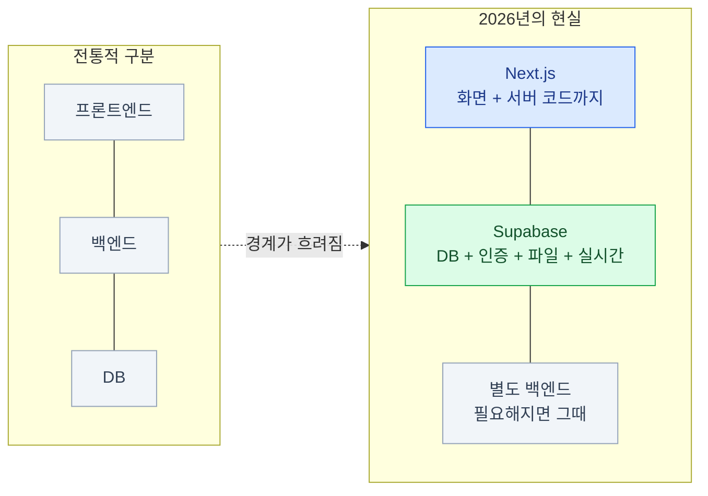

import { Card, CardGrid, LinkCard } from '@astrojs/starlight/components';
import TermIntro from '../../../components/docs/TermIntro.astro';

> 도구 이름을 외우지 말고 **층**을 외운다 — 이름은 바뀌어도 층은 안 바뀐다

<TermIntro
  terms={[
    ['메타 프레임워크', 'Meta-framework', 'React·Vue 같은 UI 라이브러리 위에 라우팅·서버 렌더링·빌드를 얹어 "앱을 만들 수 있는 완성형"으로 만든 것. Next.js, Nuxt, SvelteKit이 여기다.'],
    ['BaaS', 'Backend as a Service', 'DB·인증·파일 저장 같은 백엔드 기능을 만들어 두고 서비스로 파는 것. Supabase, Firebase. 백엔드 코드를 안 짜고도 백엔드를 갖게 된다.'],
    ['풀스택', 'Full-stack', '프론트엔드와 백엔드를 한 사람·한 코드베이스가 다루는 것. 요즘 스택은 경계가 흐려서 한 프레임워크가 양쪽을 겸하는 일이 많다.'],
  ]}
/>

## 층별 지도

웹 서비스 하나를 만드는 데 필요한 결정을 층으로 자르면 이렇다.

| 층 | 무엇을 정하는가 | 대표 선택지 (2026, 순위표가 아닌 예시) |
|---|---|---|
| UI 라이브러리 | 화면을 어떻게 그리고 갱신하는가 | **React**, Vue, Svelte, Angular |
| 메타 프레임워크 | 라우팅·렌더링 전략·서버 코드 | **Next.js**, Nuxt, SvelteKit, Astro, React Router |
| 스타일 | 생김새를 어떤 문법으로 기술하는가 | **Tailwind CSS**, CSS Modules, vanilla-extract |
| 컴포넌트 | 버튼·모달을 어디서 가져오는가 | **shadcn/ui**, MUI, Ant Design, Mantine |
| 언어 | — | **TypeScript** (사실상 결정 끝) |
| 백엔드 | 비즈니스 로직·API 서버 | 메타 프레임워크 겸용, **NestJS**, Hono, Express, 타 언어(Spring·Go·Django) |
| DB | 데이터를 어디에 어떻게 담는가 | **Postgres**, MySQL, SQLite, MongoDB |
| BaaS | 백엔드를 얼마나 사서 쓰는가 | **Supabase**, Firebase, Convex |
| 배포 | 어디서 돌리는가 | **Vercel**, Cloudflare, Netlify, Railway/Fly.io, AWS |

굵은 것들은 이 덱이 예시로 삼는 한 조합이다 —
**TypeScript + React + Next.js + Tailwind + shadcn/ui + Supabase(Postgres) + Vercel.**
이 레포의 [프론트엔드 덱](/frontend/)과 [Supabase 덱](/supabase/)이 정확히 이 조합을 다룬다.

:::tip[핵심]
층이 다르면 경쟁하지 않는다. "React vs Next.js"는 성립하지 않는 비교다(층이 다르다).
"Next.js vs SvelteKit"은 성립한다(같은 층이다). 도구 이름이 쏟아질 때
**먼저 층에 꽂아 넣으면** 지형이 한눈에 들어온다.
:::

## 경계가 흐리다 — 현대 스택의 특징

교과서의 3계층(프론트 / 백 / DB)이 그대로 안 지켜지는 게 요즘 스택의 특징이다.

- **메타 프레임워크는 프론트만이 아니다.** Next.js는 서버에서 코드를 실행하고 API도 만든다.
  간단한 서비스는 이것만으로 백엔드까지 끝난다
- **BaaS는 DB만이 아니다.** Supabase는 인증·파일 저장·실시간 구독까지 준다.
  원래 백엔드가 하던 일의 절반을 가져갔다
- **그래서 별도 백엔드는 "필요해지면" 등장한다.** 복잡한 로직, 상시 프로세스(웹소켓·배치·큐),
  외부 시스템 연동 — 앞의 둘로 안 되는 틈이 벌어질 때 그 사이를 메운다

## 대표 조합 세 가지

만드는 것에 따라 정답 조합이 다르다.

<CardGrid>
<Card title="① 공개 서비스" icon="rocket">
**Next.js + Supabase + Vercel.**
SEO가 필요하고, 인증·DB가 필요하고, 빨리 내놓아야 한다.
한 사람이 풀스택으로 굴릴 수 있는 조합의 현재 표준.
</Card>
<Card title="② 사내 도구 · 관리자" icon="setting">
**Vite + React(SPA) + 사내 API.**
SEO 무관, 로그인 뒤에서만 쓴다.
메타 프레임워크의 서버 렌더링이 필요 없어 구조가 단순해진다.
</Card>
<Card title="③ 콘텐츠 사이트" icon="document">
**Astro (+ 마크다운).**
블로그·문서·랜딩. 거의 전부 정적(SSG)이고 JS를 최소로 내보낸다.
지금 읽는 이 사이트가 이 조합이다.
</Card>
</CardGrid>

세 조합의 공통분모가 눈에 띌 것이다 — **TypeScript, 그리고 Vite 계열 빌드 도구.**
프레임워크는 갈려도 그 아래 도구 사슬은 수렴하고 있다. 그게 4~7장의 주제다.

## 무엇이 "많이 쓰인다"를 믿을 것인가

- **State of JS / Stack Overflow 설문** — 매년의 사용률·만족도 추이. 절대값보다 **추세**를 본다
- **npm 주간 다운로드** — 실사용의 대리 지표. 다만 CI가 부풀린다
- **채용 공고** — "배울 가치"의 가장 현실적인 지표

:::caution[함정]
유행 지표는 **신규 프로젝트의 선택**과 **시장의 총량**을 섞어 보여 준다.
지금 새로 시작하는 프로젝트에서 인기가 없어도 기존 코드베이스가 거대한 기술
(jQuery, Angular, webpack…)은 오래 남는다. "안 뜬다"와 "죽었다"는 다른 말이다.
:::

## 이 지도에서 다루지 않는 대륙

이름만 남긴다 — 필요해질 때 찾아볼 수 있게.

| 대륙 | 대표 이름 | 언제 만나게 되나 |
|---|---|---|
| 모바일 | React Native, Flutter | 앱 스토어에 올려야 할 때 |
| 데스크톱 | Electron, Tauri | 설치형 앱이 필요할 때 |
| CMS | WordPress, Sanity, Payload | 비개발자가 콘텐츠를 편집해야 할 때 |
| 실시간·게임 | WebSocket, WebRTC, WebGL | 채팅·통화·3D가 필요할 때 |
| AI 통합 | Vercel AI SDK, LangChain | LLM 기능을 붙일 때 |

## 3장 요약

- 도구는 **층**에 꽂아서 이해한다 — 층이 다르면 경쟁 관계가 아니다
- 2026년의 기본값: **TypeScript + React + Next.js + Tailwind + Supabase + Vercel**
- 경계가 흐리다 — 메타 프레임워크가 서버까지, BaaS가 백엔드의 절반을 가져갔고,
  별도 백엔드는 **필요해지면** 등장한다
- 용도별 대표 조합 셋 — 공개 서비스 / 사내 도구(SPA) / 콘텐츠 사이트(Astro)
- 프레임워크는 갈려도 도구 사슬은 수렴한다 — 다음 네 장이 그 도구 사슬이다

<LinkCard
  title="4. 런타임 — JavaScript가 도는 곳"
  description="브라우저 밖의 JavaScript — Node.js는 무엇이고 Bun·Deno·엣지는 왜 나왔는가."
  href="/web/04-runtime/"
/>
