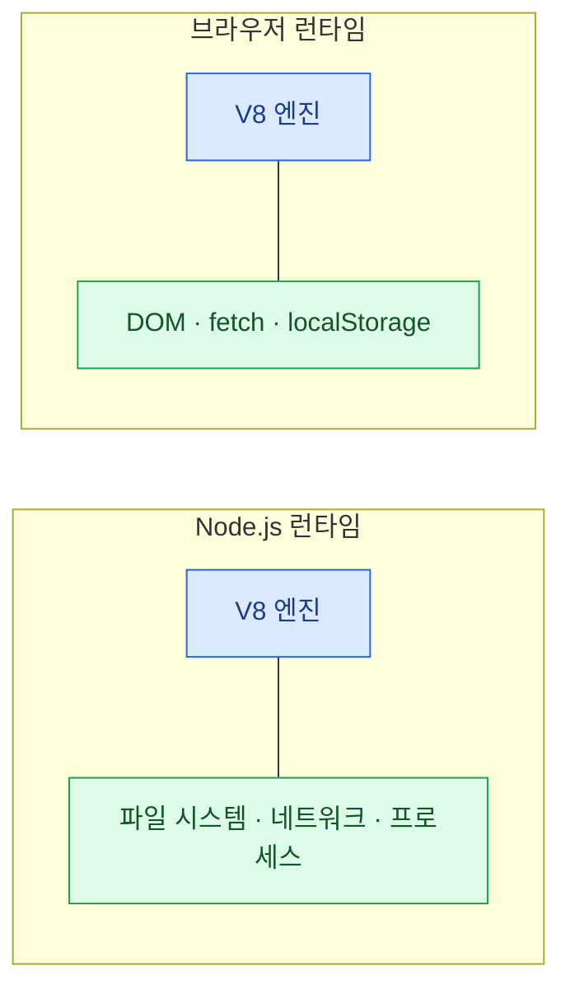

import { Tabs, TabItem, LinkCard } from '@astrojs/starlight/components';
import TermIntro from '../../../components/docs/TermIntro.astro';

> "JavaScript를 실행한다"는 말에는 항상 **어디서**가 붙어야 한다

<TermIntro
  terms={[
    ['런타임', 'Runtime', 'JS 코드를 실제로 실행해 주는 환경. 엔진(연산) + API(파일·네트워크 접근)의 묶음이다. 브라우저도 런타임이고 Node.js도 런타임이다.'],
    ['엔진', 'JavaScript Engine', 'JS 문법을 해석·실행하는 핵심부. Chrome과 Node.js의 V8이 대표. 엔진만으로는 파일 하나 못 읽는다 — 그건 런타임이 주는 API의 몫이다.'],
    ['LTS', 'Long-Term Support', '장기 지원 버전. 서버에 올리는 건 이걸 쓴다. 2026년 8월 기준 Node.js의 활성 LTS는 24다.'],
    ['ESM / CJS', 'ES Modules / CommonJS', 'JS의 두 모듈 문법. `import`/`export`가 ESM(표준), `require`/`module.exports`가 CJS(Node의 옛 방식). 공존이 오래 이어져 고통의 근원이었다.'],
  ]}
/>

## 런타임 = 엔진 + API

JavaScript는 원래 브라우저 안의 언어였다. 2009년 Node.js가 Chrome의 V8 엔진을 떼어다
**파일·네트워크 API를 붙여** 서버에서도 돌게 만들었다 — 이게 런타임의 구조를 그대로 보여 준다.



같은 언어라도 **런타임이 다르면 쓸 수 있는 API가 다르다.**
브라우저 코드는 파일을 못 읽고, Node 코드는 `document`가 없다.
"이 코드는 어디서 도는가"라는 질문이 웹 개발 내내 따라다니는 이유가 이것이다.

## 왜 서버까지 JavaScript인가

- **한 언어로 풀스택** — 프론트와 백을 오가며 언어를 바꾸지 않는다. 타입·검증 로직을 공유한다
- **생태계** — npm은 세계에서 가장 큰 패키지 저장소다. 웬만한 건 이미 누가 만들어 놨다
- **비동기에 강하다** — 웹 서버 일의 대부분은 "기다리기"(DB·외부 API)다.
  Node의 이벤트 루프는 기다리는 동안 다른 요청을 처리한다

물론 서버를 꼭 JS로 짤 필요는 없다(3장의 백엔드 층 — Spring·Go·Django도 건재하다).
다만 **도구 사슬은 예외가 없다** — 어느 스택이든 프론트가 있으면 Node 계열 런타임 위에서
빌드 도구가 돈다. 서버는 안 써도 도구로는 반드시 만난다.

## 런타임 지형 — Node와 도전자들

<Tabs>
<TabItem label="Node.js — 기본값">

여전히 기본값이고, 도전자들 덕에 좋아지는 중이다.

- **짝수 버전이 LTS**다. 2026년 8월 기준 활성 LTS는 **24** (26이 10월 LTS 예정)
- 최근 몇 년 사이 내장이 두꺼워졌다 — **TypeScript 직접 실행**(타입만 벗겨서),
  내장 테스트 러너, `fetch` 내장
- 고민 없으면 이것. 자료·호환성·배포처 전부 최대

</TabItem>
<TabItem label="Bun — 속도와 올인원">

"런타임 + 패키지 매니저 + 번들러 + 테스트 러너를 하나로, 전부 빠르게"가 기치다.

- Zig로 작성, 시작 속도와 `bun install`이 체감 나게 빠르다
- Node API 호환을 목표로 해서 기존 프로젝트도 대체로 돈다
- 2025년 말 **Anthropic이 인수**했고, Claude Code CLI가 Bun으로 돈다 —
  "실험작" 단계는 확실히 지났다

</TabItem>
<TabItem label="Deno — 보안과 표준">

Node 원작자가 Node의 설계 후회를 고쳐 만든 런타임.

- 기본이 **샌드박스** — 파일·네트워크 접근에 명시적 허가가 필요하다
- TypeScript를 처음부터 1급으로 지원
- Deno 2부터 npm 호환이 붙어 실용성이 올라왔다

</TabItem>
<TabItem label="엣지 런타임">

CDN 엣지(1장)에서 코드를 돌리는 초경량 런타임 — Cloudflare Workers가 대표.

- 프로세스가 아니라 **V8 isolate** 단위로 떠서 시작이 ms 단위다
- 대신 Node API 전체가 없다 — 표준 Web API(fetch 등) 중심의 제한된 환경
- "사용자와 가까운 곳에서 가볍게" — 리다이렉트, A/B 분기, 간단한 API에 맞는다

</TabItem>
</Tabs>

:::tip[핵심]
선택 기준은 단순하다 — **기본값은 Node LTS.**
도구 속도가 병목이면 Bun을, 지연 시간이 생명이면 엣지를 검토한다.
경쟁 덕분에 Node 자체가 빨라지고 있어서, "갈아타야 하나" 고민의 대가는 계속 줄고 있다.
:::

## TypeScript — 이제 선택지가 아니라 기본값

TypeScript는 JavaScript에 **타입 표기를 얹은** 언어다. 컴파일하면 타입이 사라지고
그냥 JS가 된다 — 런타임에는 아무 흔적이 없다.

```ts
function total(items: { price: number }[]): number {
  return items.reduce((sum, i) => sum + i.price, 0);
}
// 실행될 때는 타입이 전부 지워진 순수 JS다
```

여기서 중요한 역할 분리 하나 —

| 작업 | 하는 일 | 누가 하나 | 속도 |
|---|---|---|---|
| **타입 검사** | 타입이 맞는지 검증 | `tsc --noEmit` (에디터가 상시 수행) | 느리다 |
| **타입 제거** | 타입 표기만 벗겨 JS로 | 빌드 도구(esbuild·SWC), Node 자체 | 매우 빠르다 |

빌드 도구들은 **검사 없이 벗기기만** 한다. 그래서 빌드는 빨리 통과했는데 타입 에러가
남아 있을 수 있다 — 검사는 에디터와 CI의 `tsc`가 담당한다는 분업을 알아야
"빌드는 됐는데 왜 빨간 줄이냐"에 안 놀란다.

## 모듈 — import가 두 종류였던 이유

JS에는 모듈 문법이 없던 시절이 길었다. Node가 자체 규격(CJS, `require`)을 먼저 만들었고,
한참 뒤에 언어 표준(ESM, `import`)이 나왔다. 그 결과 생태계에 두 문법이 공존하게 됐다.

```js
// CJS — Node의 옛 방식. 오래된 패키지와 설정 파일에 남아 있다
const express = require('express');

// ESM — 언어 표준. 새로 쓰는 코드는 전부 이쪽
import express from 'express';
```

- 새 코드는 **무조건 ESM**이다. `package.json`에 `"type": "module"`을 두는 게 요즘 기본
- 최근 Node는 `require()`로 ESM을 불러오는 것까지 지원해서 경계의 고통이 많이 줄었다
- 이 공존이 번들러가 필요한 이유 중 하나이기도 하다 — 6장에서 다시 만난다

:::caution[함정]
`SyntaxError: Cannot use import statement outside a module` —
웹 개발 입문자가 가장 먼저 만나는 벽이 대개 이 에러다. 코드가 틀린 게 아니라
**이 파일이 ESM인지 CJS인지 런타임이 다르게 판정**한 것이다.
`package.json`의 `"type"` 필드나 확장자(`.mjs`/`.cjs`)가 판정 기준이다.
:::

## 4장 요약

- 런타임 = **엔진 + API.** 같은 JS라도 런타임이 다르면 쓸 수 있는 것이 다르다
- 기본값은 **Node LTS(현재 24)**. Bun은 속도·올인원, Deno는 보안·표준, 엣지는 초저지연
- 서버를 JS로 안 짜도 **도구 사슬로는 반드시 Node 계열을 만난다**
- TypeScript는 기본값 — **검사(tsc)와 제거(빌드 도구)는 분업**이다
- 모듈은 ESM이 표준. CJS는 유산이며, 관련 에러는 코드가 아니라 **판정**의 문제다

<LinkCard
  title="5. 패키지 매니저 — 왜 pnpm인가"
  description="node_modules에 무슨 일이 있었길래 — npm의 구조적 문제와 pnpm의 해법."
  href="/web/05-package/"
/>
