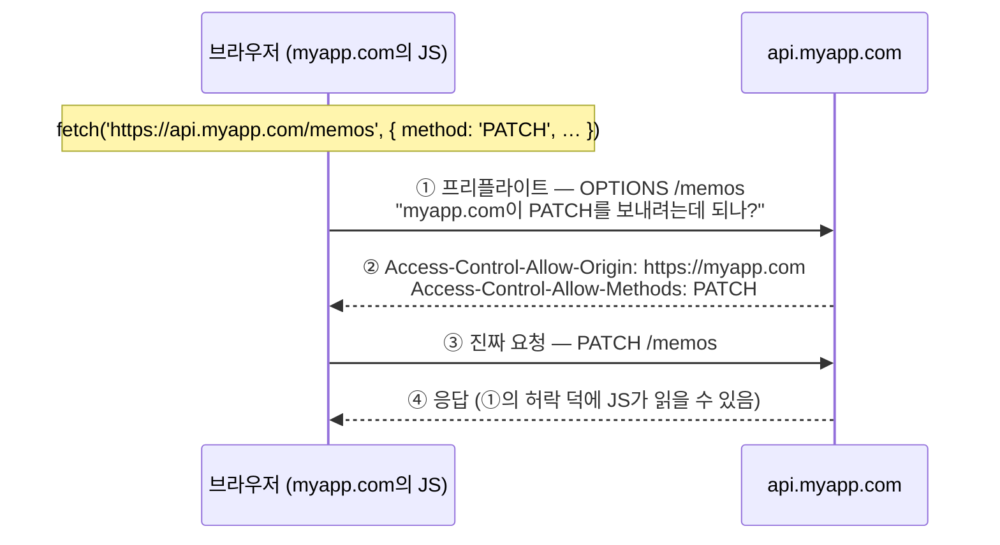
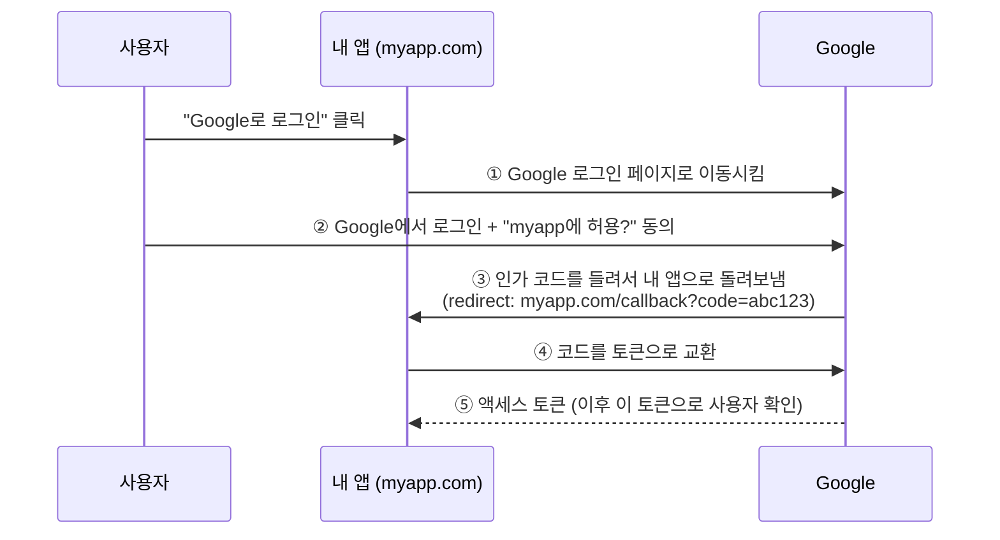

import { Tabs, TabItem, LinkCard } from '@astrojs/starlight/components';
import TermIntro from '../../../components/docs/TermIntro.astro';

> "CORS 에러 났어요"는 웹 개발자의 통과의례다 — 브라우저가 **왜** 막는지 알면 절반은 풀린다

<TermIntro
  terms={[
    ['출처', 'Origin', '`프로토콜 + 도메인 + 포트`의 묶음 (`https://myapp.com:443`). 브라우저 보안의 기본 단위 — 셋 중 하나만 달라도 "다른 출처"다.'],
    ['SOP', 'Same-Origin Policy', '"다른 출처의 응답은 스크립트가 읽을 수 없다"는 브라우저의 기본 규칙. 웹 보안 전체가 이 위에 서 있다.'],
    ['CORS', 'Cross-Origin Resource Sharing', 'SOP를 서버의 허락 하에 푸는 표준. 서버가 응답 헤더로 "이 출처는 읽어도 됨"을 선언한다.'],
    ['OAuth', 'Open Authorization', '비밀번호를 넘기지 않고 권한만 위임하는 표준. "Google로 로그인"이 이것이다.'],
    ['PKCE', 'Proof Key for Code Exchange', 'OAuth 흐름에서 인가 코드를 가로채여도 쓸모없게 만드는 장치. "픽시"라고 읽는다.'],
  ]}
/>

## 왜 브라우저에만 이런 규칙이 있는가

curl이나 서버 코드로는 아무 API나 호출해도 CORS 에러 같은 건 없다. 브라우저만 막는다.
이유는 브라우저의 특수한 사정 하나 때문이다 —

**브라우저는 남의 코드를 내 자격으로 실행하는 공간이다.**
아무 사이트나 여는 순간 그 사이트의 JS가 내 브라우저에서 돌고, 내 브라우저에는
은행·회사 메일의 로그인 쿠키가 들어 있다. 아무 규칙이 없다면 —

```js
// evil.com의 스크립트가, evil.com에 접속한 내 브라우저 안에서
const res = await fetch('https://mybank.com/api/accounts');
// 쿠키가 자동으로 딸려 가고, 내 계좌 목록이 evil.com 손에 들어간다
```

이걸 막는 게 같은 출처 정책(SOP)이다 — **다른 출처로 보낸 요청의 응답은 스크립트가 읽을 수 없다.**
브라우저 밖(서버 간 통신)에는 "남의 코드 + 내 쿠키"라는 조합이 없으니 이 규칙도 없다.

:::tip[핵심]
SOP와 CORS는 **브라우저 안의 규칙**이다. 이 한 문장에서 실무 결론이 줄줄이 나온다 —
curl로는 재현이 안 되고, 서버끼리는 CORS가 없고, "CORS 우회"란 결국
브라우저 밖(서버)을 경유시키는 것이다.
:::

## CORS — 허락받고 여는 문

내 프론트(`https://myapp.com`)가 내 API 서버(`https://api.myapp.com`)를 부르는 건
정당한 요청인데, 도메인이 달라서 SOP에 걸린다. 그래서 **서버가 허락을 선언하는** 표준이
CORS다.



- 단순한 요청(GET, 일반 POST)은 프리플라이트 없이 바로 가고, 응답 헤더만 검사한다.
  PATCH/DELETE나 커스텀 헤더가 붙으면 ①의 사전 확인(프리플라이트)이 먼저 나간다
- 허락의 주체는 **응답하는 서버**다. `Access-Control-Allow-Origin` 헤더에
  요청한 출처가 없으면 브라우저가 응답을 버린다 — 그게 콘솔의 CORS 에러다

### CORS 에러를 만났을 때

| 증상 | 실체 | 처방 |
|---|---|---|
| 콘솔에 CORS 에러 | **프론트 코드 잘못이 아니다** — 서버가 내 출처를 허용 안 함 | API 서버의 CORS 설정에 프론트 출처 추가 |
| 로컬에서만 남 | `localhost:5173`은 배포 도메인과 다른 출처다 | dev 서버 프록시 (Vite의 `server.proxy`) — 브라우저 입장에선 같은 출처가 된다 |
| 남의 공개 API에서 남 | 그 API가 브라우저 직접 호출을 허용 안 한 것 | 내 서버(Route Handler)를 경유 — 서버 간에는 CORS가 없다 (+ API 키도 숨겨진다) |
| OPTIONS 요청이 404 | 서버가 프리플라이트를 처리 안 함 | 프레임워크의 CORS 미들웨어를 쓴다 — 손으로 만들지 않는다 |

:::caution[함정]
검색하면 나오는 "CORS 끄는 브라우저 확장", `Access-Control-Allow-Origin: *` 전체 허용은
처방이 아니라 **보안 장치 해체**다. 특히 쿠키 인증을 쓰는 API의 전체 허용은
위의 evil.com 시나리오를 다시 여는 것과 같다. 허용 출처는 명시적으로 나열한다.
:::

한 가지 흔한 오해 — CORS는 **읽기를 막는 장치지, 쓰기를 막는 장치가 아니다.**
전통적인 폼 제출은 CORS와 무관하게 다른 출처로 날아간다(응답을 못 읽을 뿐, 요청은 도착한다).
"로그인된 사용자의 브라우저를 속여 원치 않는 쓰기를 보내는" 공격이 CSRF(Cross-Site Request
Forgery)이고, 쿠키의 `SameSite` 속성(요즘은 기본 `Lax`)과 CSRF 토큰이 그 방어선이다.
서버 검증(10장)과 마찬가지로 — 프레임워크·인증 라이브러리가 주는 방어를 끄지 않는 게 첫째 규칙이다.

## OAuth — 비밀번호 대신 권한 위임

"Google로 로그인"의 목표는 하나다 — **내 서비스가 사용자의 Google 비밀번호를
만지지 않고**, "이 사람이 이 Google 계정의 주인"이라는 확인만 받는 것.

흐름의 뼈대(인가 코드 방식)는 이렇다 —



비밀번호는 ②에서 Google 화면에만 입력된다 — 내 앱은 구경도 못 한다.
대신 ③의 **인가 코드가 리다이렉트 URL에 실려 돌아오는** 구조라, 여기에 약점이 하나 생긴다.

## PKCE — 코드를 주워도 쓸 수 없게

③의 코드는 브라우저 주소창·히스토리·리다이렉트 경로를 지나간다. 누군가 이 코드를
가로채면(악성 확장, 로그 유출 등) ④를 대신 실행해 토큰을 가져갈 수 있다.

전통적 방어는 ④에서 **클라이언트 비밀 키**(client secret)를 함께 내는 것이었다 —
서버에서 도는 전통 웹 앱은 비밀을 지킬 수 있으니까. 그런데 SPA와 모바일 앱은
코드가 통째로 사용자 손에 있어서(6장에서 봤듯 번들은 열어 볼 수 있다)
**비밀을 숨길 곳이 없다.** 이 구멍을 메우는 게 PKCE다.

<Tabs>
<TabItem label="원리 — 일회용 자물쇠">

시작할 때마다 임의의 비밀 문자열을 새로 만들고, 그 **지문**을 먼저 보낸다.

1. 앱이 임의 문자열 `verifier`를 생성하고, 해시한 `challenge`를 ①에 실어 보낸다
2. Google은 코드를 발급하며 challenge를 기억해 둔다
3. ④의 토큰 교환에서 앱이 원본 `verifier`를 내면, Google이 해시해서 대조한다

코드를 가로챈 공격자는 `verifier`가 없다 — 해시(challenge)에서 원본을 역산할 수 없으므로
**주운 코드는 쓸모가 없다.** 매번 새로 만드는 일회용이라 재사용도 안 된다.

</TabItem>
<TabItem label="실무 — 어디서 만나는가">

직접 구현할 일은 거의 없다 — 하지만 이 단어는 계속 만난다.

- **Supabase Auth, Auth.js, Clerk** 등의 로그인 흐름 설정에 `flowType: 'pkce'` 같은
  옵션이 있고, 요즘은 이게 기본값이다
- OAuth 최신 권고는 **모든 클라이언트에 PKCE**다 — 비밀을 지킬 수 있는 서버 앱도
  겹으로 쓰는 것이 표준이 됐다
- CLI 도구의 `gh auth login` 같은 브라우저 열리는 로그인도 같은 장치다

설정 문서에서 "PKCE"를 보면 — "**인가 코드 가로채기 방어가 켜져 있구나**"로 읽으면 된다.

</TabItem>
</Tabs>

:::tip[핵심]
CORS와 PKCE는 뿌리가 같다 — **브라우저는 공개된 공간**이라는 사실이다.
남의 코드가 도니까 응답 읽기를 막고(SOP/CORS), 비밀을 못 숨기니까
비밀 없이도 안전한 교환 방식을 쓴다(PKCE). 이 감각 하나면 웹 보안 장치 대부분의
"왜"가 풀린다.
:::

## 11장 요약

- 브라우저의 특수 사정 — **남의 코드가 내 자격(쿠키)으로 도는 공간**이라 규칙이 필요하다
- SOP: 다른 출처의 응답은 못 읽는다. CORS: **응답하는 서버가** 헤더로 허락을 선언한다
- CORS 에러는 프론트 코드 잘못이 아니다 — 서버 설정이거나, 프록시/서버 경유가 처방이다
- 전체 허용(`*`)과 "CORS 끄기"는 처방이 아니라 보안 해체다
- OAuth는 비밀번호 대신 **권한 위임** — 인가 코드가 리다이렉트로 돌아오는 구조
- PKCE는 그 코드를 주워도 쓸모없게 만드는 일회용 자물쇠 — SPA·모바일의 표준이자 요즘 기본값

<LinkCard
  title="12. 배포 — 코드가 서비스가 되기까지"
  description="정적 호스팅부터 serverless, 컨테이너까지 — git push 뒤에 일어나는 일."
  href="/web/12-deploy/"
/>
