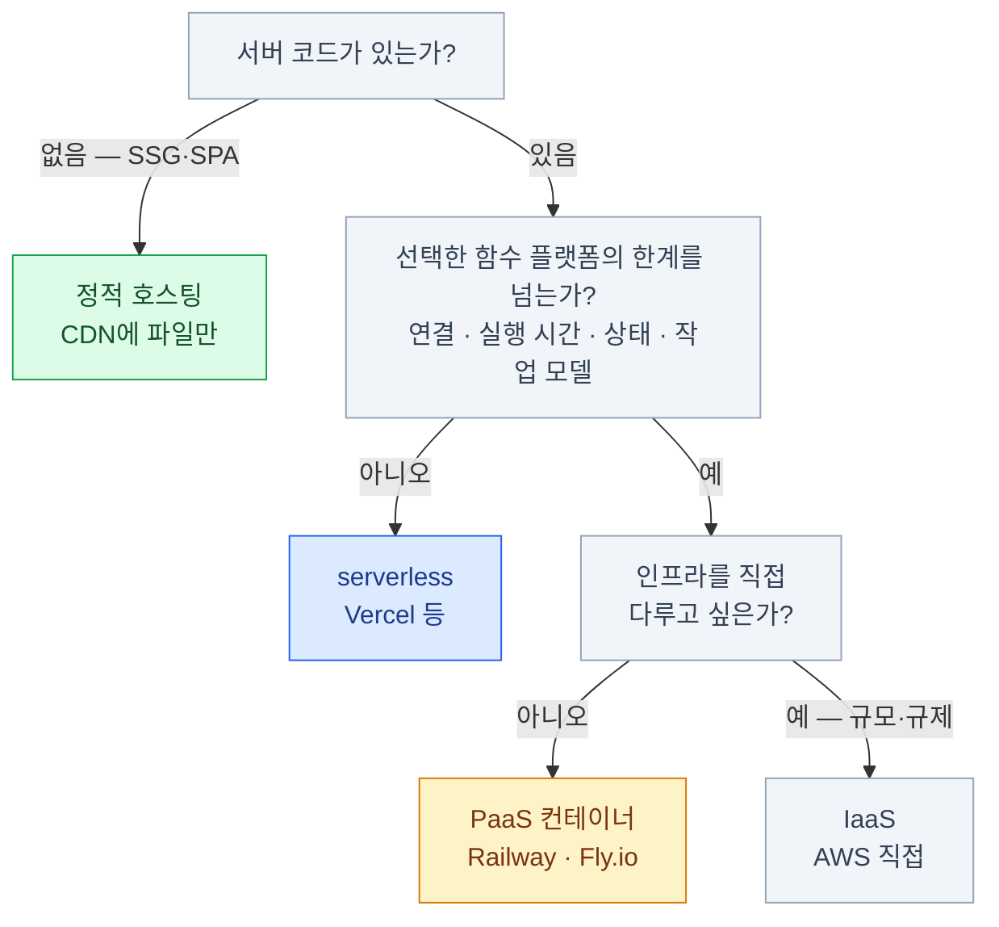

import { Steps, LinkCard } from '@astrojs/starlight/components';
import TermIntro from '../../../components/docs/TermIntro.astro';

> "어디에 올리지?"는 사실 "**내 앱은 언제 실행되는가?**"라는 질문이다

<TermIntro
  terms={[
    ['serverless', 'Serverless', '서버 인스턴스를 직접 운영하지 않고 플랫폼이 실행 환경과 확장을 관리하는 모델. 요청 단위 함수뿐 아니라 상태형 제품도 있다.'],
    ['콜드 스타트', 'Cold Start', '유휴 실행 환경을 새로 준비할 때 생길 수 있는 첫 요청 지연. 정도와 발생 조건은 플랫폼마다 다르다.'],
    ['PaaS', 'Platform as a Service', '"코드를 주면 돌려 준다" 수준의 추상화 (Railway, Fly.io). VM부터 직접 만지는 IaaS(AWS EC2)와의 구분이다.'],
    ['프리뷰 배포', 'Preview Deployment', 'PR마다 고유 URL로 자동 배포되는 임시 환경. "머지 전에 실물을 보고" 리뷰하게 만든다.'],
  ]}
/>

## 배포의 네 가지 형태

빌드 결과물(6장의 `dist/`)이 무엇이냐에 따라 올릴 곳의 형태가 갈린다.
축은 하나 — **내 코드는 언제 실행되는가.**

| 형태 | 실행 시점 | 무엇을 올리나 | 대표 서비스 | 비용 구조 |
|---|---|---|---|---|
| 정적 호스팅 | 실행 없음 — 빌드 때 끝 | HTML/JS/CSS 파일 | Cloudflare Pages, GitHub Pages | 거의 무료 |
| serverless 함수 | 요청마다 깨어남 | 함수 코드 | Vercel, Netlify | 호출량 과금 |
| 컨테이너 / 상시 서버 | 항상 떠 있음 | Docker 이미지 등 | Railway, Fly.io | 시간 과금 |
| IaaS | 항상 (전부 내 몫) | VM부터 직접 | AWS EC2 | 시간 과금 + 인건비 |

한 서비스가 여러 형태를 섞는 게 보통이다 — Next.js를 Vercel에 올리면 정적 자산과
함수로 나뉠 수 있다. 함수의 실행·연결·상태 모델에 맞지 않는 작업만 컨테이너나
상태형 serverless 제품 등 다른 실행 환경으로 분리한다.

:::caution[함정]
serverless의 제약은 **제품마다 다르다.** 실행 시간·CPU·동시성·연결·로컬 상태·DB 커넥션
제한을 배포처 문서에서 확인한다. 예를 들어 일반 Vercel Functions는 WebSocket 구독 서버에
맞지 않지만 NestJS 자체는 배포할 수 있고, Cloudflare Durable Objects는 WebSocket을 유지하면서
유휴 시 hibernate할 수 있다. "serverless라서 무조건 된다/안 된다"로 판단하지 않는다.
:::

## git 연결형 배포 — 흔한 워크플로

Vercel·Netlify·Cloudflare가 표준으로 만든 흐름이다.

<Steps>

1. GitHub 저장소를 서비스에 연결한다 — 설정은 처음 한 번

2. 브랜치를 푸시하고 PR을 열면 **프리뷰 배포**가 자동으로 생긴다 —
   고유 URL에서 실물로 리뷰한다

3. main에 머지하면 **프로덕션 배포**가 자동으로 나간다

4. 문제가 생기면 **롤백** — 이전 불변 배포를 보존하는 플랫폼이라면 빠르게 되돌린다

</Steps>

CI(8장)와 잇대면 완성이다 — 검사를 통과해야 머지되고, 머지되면 배포된다.
**사람 손이 개입하는 지점이 코드 리뷰뿐**인 상태가 목표다.

:::caution[함정]
코드 배포 롤백은 **DB 스키마·데이터·외부 시스템 변경까지 되돌리지 않는다.**
하위 호환 마이그레이션과 별도 복구 계획이 없으면 이전 코드로 돌아가도 서비스가 복구되지 않을 수 있다.
:::

## 환경 변수 — 코드에 넣지 않는 것들

DB 접속 정보, API 키처럼 **환경마다 다르거나 비밀인 값**은 코드가 아니라
환경 변수로 주입한다.

- 로컬 비밀은 `.env.local` 같은 gitignored 파일에 둔다. `.env.example`에는 키 이름과 빈 값만 커밋한다
- 배포 환경은 호스팅 서비스의 설정 화면에서 넣는다 — 프리뷰/프로덕션을 다르게 줄 수 있다
- **접두사 규칙**을 조심한다 — `NEXT_PUBLIC_`(Next.js)이나 `VITE_`(Vite)가 붙은 변수는
  **브라우저 번들에 박제된다.** 비밀 키에 이 접두사를 붙이는 순간 공개다

:::caution[함정]
"빌드는 됐는데 배포하니 안 돼요"의 최다 원인이 환경 변수다 — 로컬 `.env`에는 있는데
배포 환경에 안 넣은 것. 8장의 "빌드도 검사다"에 하나 더하면, **배포 환경의 변수 목록도
코드 리뷰 대상**이라는 감각이 필요하다.
:::

## 도메인과 HTTPS

1장의 DNS가 여기서 실전이 된다 — "커스텀 도메인 연결"이란 결국
**내 도메인의 DNS 레코드가 호스팅 서비스를 가리키게** 하는 것이다.

- 도메인 등록기관에서 도메인을 사고, 호스팅 서비스가 알려 주는 레코드(A 또는 CNAME)를 넣는다
- HTTPS 인증서는 요즘 호스팅 서비스가 **자동 발급·갱신**한다(Let's Encrypt).
  직접 만질 일이 없어진 대표적인 영역이다

## 모니터링 — 배포가 끝이 아니다

깊게는 안 들어가고, 세 겹의 이름만 —

| 겹 | 질문 | 대표 도구 |
|---|---|---|
| 에러 추적 | 사용자가 겪은 에러가 뭐였나 | Sentry |
| 실사용 성능 | 실제 사용자의 Core Web Vitals는 | Vercel Analytics 같은 RUM 도구 |
| 실험실 성능 | 통제된 환경에서 무엇이 느린가 | Lighthouse |
| 로그 | 서버에서 무슨 일이 있었나 | 호스팅 내장 로그 |

최소한 에러 추적 하나는 붙이고 시작한다 — 없으면 **사용자가 겪는 에러를 서비스 주인만 모른다.**

## 12장 요약

- 형태의 축은 **"내 코드는 언제 실행되는가"** — 실행 없음(정적) / 요청 시(serverless) / 상시(컨테이너)
- 한 서비스가 형태를 섞는다 — 정적 자산·함수·상태형 실행 환경을 요구에 맞게 조합한다
- serverless의 작은 글씨는 제품마다 다르다 — 실행·연결·상태·커넥션 제한을 확인한다
- 흔한 워크플로는 **git 연결형 배포** — 프리뷰로 리뷰하고, 불변 배포로 빠르게 롤백한다
- 비밀은 환경 변수로 — 단, `NEXT_PUBLIC_`/`VITE_` 접두사는 **공개 선언**이다
- 에러 추적 없이 배포하지 않는다

## 참고 자료

- [Vercel Backends](https://vercel.com/docs/frameworks/backend) — Functions의 WebSocket·DB 연결 모델과 지원 백엔드
- [NestJS on Vercel](https://vercel.com/docs/frameworks/backend/nestjs) — NestJS를 단일 Function으로 배포하는 현재 방식
- [Cloudflare Durable Objects WebSockets](https://developers.cloudflare.com/durable-objects/best-practices/websockets/) — 상태형 serverless의 장기 연결과 hibernation 예

<LinkCard
  title="13. 용어 사전"
  description="이 덱에 나온 용어 전부 — 약어를 만나면 여기로."
  href="/web/13-glossary/"
/>
