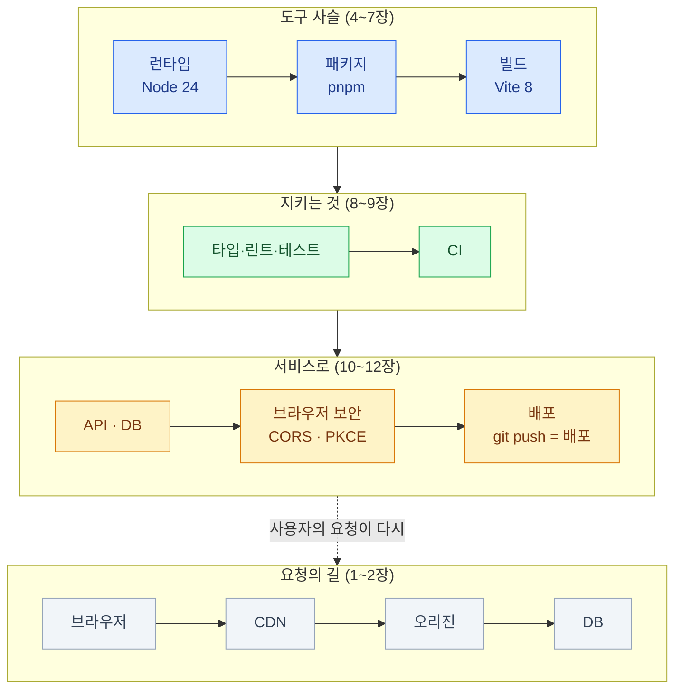

import { Card, CardGrid, LinkCard } from '@astrojs/starlight/components';

> 이제 "요즘 뭘로 만들어요?"에 지도를 갖고 답할 수 있다

## 전체 지도 — 한 번에 접기

## 장별 한 문장

| 장 | 한 문장 |
|---|---|
| [1. 요청의 일생](/web/01-request/) | 성능 질문은 전부 "이 요청은 어디까지 갔다 오는가"로 환원된다 |
| [2. 렌더링](/web/02-rendering/) | HTML을 누가 언제 만드는가 — 자주 바뀌는가, 사용자마다 다른가로 고른다 |
| [3. 지형도](/web/03-landscape/) | 도구는 층에 꽂아 이해한다 — 층이 다르면 경쟁하지 않는다 |
| [4. 런타임](/web/04-runtime/) | 런타임 = 엔진 + API. 기본값은 Node LTS, TypeScript는 검사와 제거의 분업 |
| [5. pnpm](/web/05-package/) | 잠금 파일은 커밋, pnpm의 가치는 속도가 아니라 엄격함 |
| [6. 번들러](/web/06-bundler/) | 그래프 · 변환 · 묶기 · 다이어트 — dev는 안 묶고 배포용은 묶는다 |
| [7. Vite](/web/07-vite/) | dev 서버 + 빌드 명령의 묶음. Vite 8부터 Rolldown 단일 엔진 |
| [8. 품질](/web/08-quality/) | 네 겹의 그물 — 사람의 주의력을 믿지 않는다. 빌드도 검사다 |
| [9. 모노레포](/web/09-monorepo/) | 타입 공유가 시작 신호 — API 변경이 한 커밋에 담긴다 |
| [10. 백엔드](/web/10-backend/) | 보안 규칙은 서버·DB의 신뢰 경계에서 강제하고, DB 기본 선택은 Postgres다 |
| [11. 브라우저 보안](/web/11-security/) | 브라우저는 남의 코드가 내 자격으로 도는 공간 — 그래서 CORS도 PKCE도 있다 |
| [12. 배포](/web/12-deploy/) | 축은 "언제 실행되는가" — 정적 / 요청 시 / 상시 |

## 이 덱이 심으려 한 습관

- **새 도구를 만나면** — 어느 층인가, 무슨 통증을 풀었는가, 기존 것과 무엇이 다른가 (0장)
- **느리다는 말을 들으면** — 어느 구간인지부터 가른다: HTML? 리소스? API? (1장)
- **자료를 읽을 때** — 작성 시점부터 확인한다. 이 생태계의 유통기한은 짧다 (0장)
- **에러를 만나면** — 코드의 문제인가, 도구 사슬 어느 층의 문제인가 (4~7장)

## 다음에 갈 곳

이 덱은 지도였다. 각 대륙의 본편은 따로 있다.

<CardGrid>
<Card title="프론트엔드 덱" icon="laptop">
3장의 "조합 ①"을 실제로 만든다 — Next.js의 서버 컴포넌트와 캐싱,
Tailwind, shadcn/ui, 디자인 시스템까지.

[시작하기 →](/frontend/)
</Card>
<Card title="Supabase 덱" icon="seti:db">
10장의 "경로 ①"을 깊게 판다 — Postgres, 인증, 그리고
브라우저 직접 쿼리를 안전하게 만드는 RLS.

[시작하기 →](/supabase/)
</Card>
<Card title="shadcn/ui 덱" icon="puzzle">
컴포넌트와 테마를 리소스 관점으로 — 용어를 전부 풀어 쓴
가장 진입 장벽 낮은 덱.

[시작하기 →](/shadcn/)
</Card>
</CardGrid>

### 이 덱이 다루지 않은 것들 (이름만)

필요해지는 순서대로 찾아보면 된다 — 백그라운드 작업(큐·크론), 결제 연동(웹훅 처리),
이메일 발송, WebSocket 직접 구현, 웹 보안 심화(XSS·CSP·보안 헤더), 프로덕트 분석,
AI 기능 통합(스트리밍 UI), 컨테이너와 Docker, 성능 계측(Core Web Vitals) 심화.

<LinkCard
  title="처음으로 — 개요"
  description="덱 전체 구성과 읽는 법으로 돌아간다."
  href="/web/"
/>
