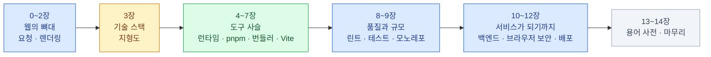

import { Card, CardGrid, LinkCard, LinkButton } from '@astrojs/starlight/components';

> 프레임워크를 배우기 전에 — **지도**부터

Next.js 튜토리얼은 따라 했는데 `pnpm install`이 정확히 뭘 하는지는 모르는 사람,
`vite dev`가 뜨는 건 봤는데 Vite가 무슨 물건인지는 설명 못 하는 사람,
"요즘 뭘로 만들어요?"라는 질문에 지도 없이 단어만 주워섬기게 되는 사람을 위한 자료다.

특정 프레임워크를 가르치지 않는다. 그건 [프론트엔드 덱](/frontend/)과 [Supabase 덱](/supabase/)의 몫이고,
이 덱은 그 아래에 깔린 **공통 기반** — 요청이 오가는 길, 도구 사슬, 배포 — 을 다룬다.

**2026년 8월 기준**으로 쓰였다 — Node 24 LTS · pnpm 11 · Vite 8 · TypeScript 5.x.

<LinkButton href="/web/00-intro/" icon="right-arrow">첫 장부터 읽기</LinkButton>

## 구성

| 장 | 주제 | 답하는 질문 |
|---|---|---|
| [0](/web/00-intro/)–[2](/web/02-rendering/) | 요청의 일생 · 렌더링 전략 | 브라우저에 주소를 치면 무슨 일이 일어나는가 |
| [3](/web/03-landscape/) | 기술 스택 지형도 | 요즘 뭘 많이 쓰고, 각각 어느 층의 물건인가 |
| [4](/web/04-runtime/)–[7](/web/07-vite/) | 런타임 · 패키지 매니저 · 번들러 · Vite | `pnpm dev` 한 줄 뒤에서 무엇이 도는가 |
| [8](/web/08-quality/)–[9](/web/09-monorepo/) | 품질 도구 · 모노레포 | 코드가 커져도 무너지지 않게 하는 장치들 |
| [10](/web/10-backend/)–[12](/web/12-deploy/) | 백엔드와 데이터 · 브라우저 보안(CORS·PKCE) · 배포 | 내 코드는 어떻게 서비스가 되는가 |
| [13](/web/13-glossary/)–[14](/web/14-wrapup/) | 용어 사전 · 마무리 | — |

## 전체를 관통하는 두 질문

**"이 요청은 어디까지 갔다 오는가?"** — 브라우저에서 멈추는가, CDN에서 끝나는가,
오리진 서버까지 가는가, DB까지 내려가는가. 성능 문제와 아키텍처 결정의 대부분이
이 질문 하나로 풀린다. (1·2·12장)

**"이 도구는 무슨 통증에서 나왔는가?"** — pnpm도 Vite도 TypeScript도
누가 멋으로 만든 게 아니라 실제로 아팠던 문제의 해법이다.
통증을 알면 도구가 왜 이렇게 생겼는지가 보이고, 다음 도구가 나와도 놀라지 않는다. (4~9장)

## 읽는 법

<CardGrid>
<Card title="표시 약속" icon="information">
`:::tip` 박스는 **핵심 원칙**,
`:::caution` 박스는 **자주 겪는 함정**이다.
장 첫머리의 "처음 나오는 말" 상자에서 새 용어를 먼저 푼다.
</Card>
<Card title="급하면 세 장만" icon="star">
[1장 요청의 일생](/web/01-request/) ·
[5장 pnpm](/web/05-package/) ·
[7장 Vite](/web/07-vite/).
이 셋이 이 덱의 알맹이다.
</Card>
<Card title="깊이는 다른 덱에" icon="right-arrow">
Next.js·Tailwind·shadcn/ui는 [프론트엔드 덱](/frontend/),
DB·인증·RLS는 [Supabase 덱](/supabase/)이 이어받는다.
이 덱은 그 앞의 지도다.
</Card>
<Card title="버전에 민감하다" icon="warning">
이 생태계는 빠르다. 검색으로 찾은 글이 이미 낡았을 수 있다 —
webpack 설정법, `npm install`의 느린 속도 불평, "Vite는 dev만 빠르다" 같은 이야기는
전부 한 세대 이전의 것이다.
</Card>
</CardGrid>

<LinkCard
  title="0. 시작하기 전에"
  description="이 덱의 대상과 범위 — 무엇을 다루고 무엇을 다른 덱에 넘기는가."
  href="/web/00-intro/"
/>
